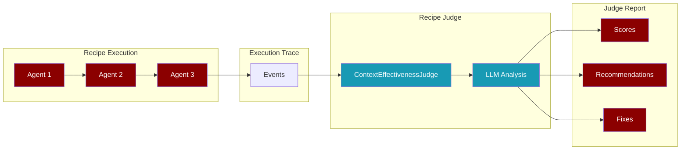
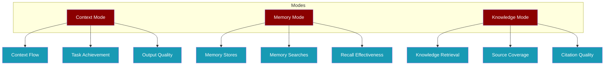
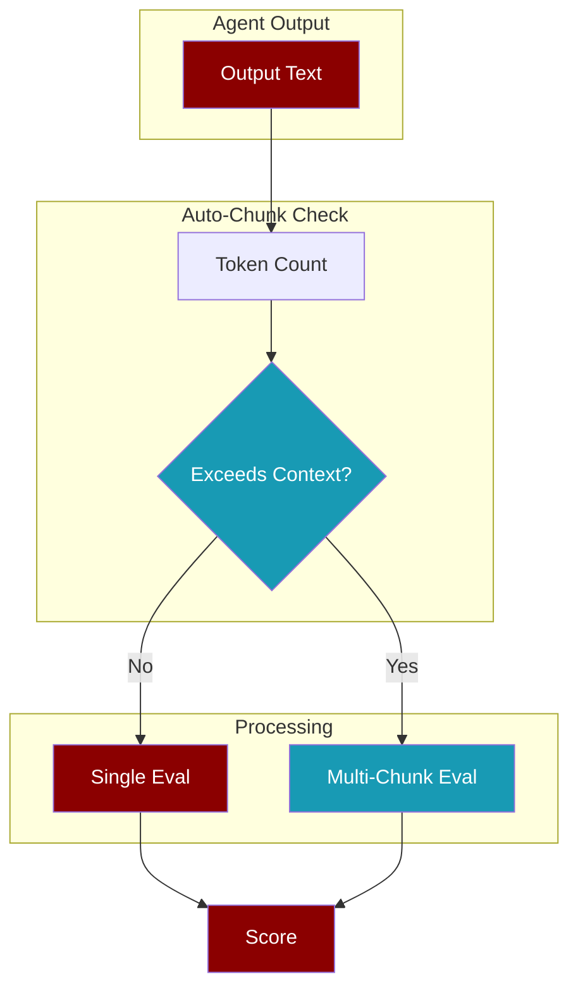
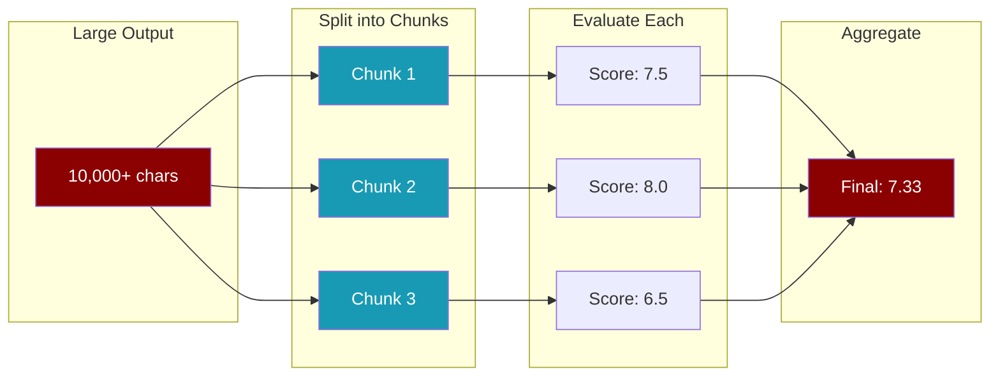

<Info>
**Recipe Judge** analyzes execution traces from multi-agent workflows to evaluate context flow, memory usage, and knowledge retrieval effectiveness.
</Info>

## How It Works



## Quick Start

<Tabs>
  <Tab title="CLI">
    ```bash
    # Run a recipe with trace saving
    praisonai recipe run my-recipe --save --name my-test-run
    
    # Judge the execution
    praisonai recipe judge my-test-run
    
    # Judge with fix recommendations
    praisonai recipe judge my-test-run --yaml agents.yaml
    ```
  </Tab>
  <Tab title="Python">
    ```python
    from praisonai.replay import (
        ContextTraceReader,
        ContextEffectivenessJudge,
        format_judge_report,
    )
    
    # Load trace
    reader = ContextTraceReader("my-test-run")
    events = reader.get_all()
    
    # Judge
    judge = ContextEffectivenessJudge(mode="context")
    report = judge.judge_trace(events, session_id="my-test-run")
    
    # Display
    print(format_judge_report(report))
    ```
  </Tab>
</Tabs>

## Evaluation Modes



<CardGroup cols={3}>
  <Card title="Context Mode" icon="arrows-rotate">
    Evaluates context flow between agents (default)
  </Card>
  <Card title="Memory Mode" icon="brain">
    Evaluates memory store/search effectiveness
  </Card>
  <Card title="Knowledge Mode" icon="book">
    Evaluates knowledge retrieval quality
  </Card>
</CardGroup>

## CLI Commands

<CodeGroup>
```bash Basic Judge
praisonai recipe judge run-abc123
```

```bash With YAML
praisonai recipe judge run-abc123 --yaml agents.yaml
```

```bash Memory Mode
praisonai recipe judge run-abc123 --memory
```

```bash Knowledge Mode
praisonai recipe judge run-abc123 --knowledge
```

```bash With Goal
praisonai recipe judge run-abc123 --goal "Analyze image and create blog"
```

```bash Chunked Evaluation
praisonai recipe judge run-abc123 --chunked
```

```bash Chunked with Options
praisonai recipe judge run-abc123 --chunked --chunk-size 4000 --max-chunks 5 --aggregation min
```

```bash Dry Run
praisonai recipe judge run-abc123 --yaml agents.yaml --dry-run
```
</CodeGroup>

## Auto-Chunking (Default)

<Info>
**Auto-chunking is enabled by default.** The judge automatically detects when agent outputs exceed the model's context window and intelligently chunks them for evaluation. Use `--no-auto-chunk` to disable.
</Info>



<Tabs>
  <Tab title="Default (Auto-Chunk)">
    Auto-chunking is enabled by default:
    ```bash
    praisonai recipe judge my-trace-id
    ```
    The judge will automatically chunk large outputs.
  </Tab>
  <Tab title="Disable Auto-Chunk">
    Disable auto-chunking for faster evaluation:
    ```bash
    praisonai recipe judge my-trace-id --no-auto-chunk
    ```
    Outputs will be truncated if they exceed context limits.
  </Tab>
  <Tab title="Force Chunked">
    Force chunked evaluation for all outputs:
    ```bash
    praisonai recipe judge my-trace-id --chunked
    ```
    All outputs are chunked regardless of size.
  </Tab>
</Tabs>

<AccordionGroup>
  <Accordion title="How Auto-Chunking Works">
    1. **Token Estimation**: Estimates token count using character/word heuristics
    2. **Context Check**: Compares against model's context window (with 80% safety margin)
    3. **Smart Chunking**: If needed, splits output into optimal chunks
    4. **Parallel Evaluation**: Each chunk is evaluated independently
    5. **Score Aggregation**: Chunk scores are combined using weighted average
  </Accordion>
  <Accordion title="When to Disable Auto-Chunking">
    - **Speed**: Auto-chunking adds latency for token counting
    - **Simple Tasks**: Short outputs that never exceed context
    - **Cost**: Chunked evaluation uses more API calls
    - **Debugging**: To see raw truncated behavior
  </Accordion>
</AccordionGroup>

## Manual Chunked Evaluation

<Info>
For large agent outputs that exceed LLM context limits, **chunked evaluation** splits the output into multiple chunks, evaluates each separately, and aggregates the scores. This preserves ALL content instead of truncating.
</Info>



<AccordionGroup>
  <Accordion title="When to Use Chunked Evaluation">
    - Agent outputs exceed 3000+ characters
    - You're seeing `[TRUNCATED]` in evaluation results
    - Important information in the middle of outputs is being lost
    - You need comprehensive evaluation of long-form content
  </Accordion>
  <Accordion title="Aggregation Strategies">
    | Strategy | Description | Use Case |
    |----------|-------------|----------|
    | `weighted_average` | Weight by chunk size (default) | Balanced evaluation |
    | `average` | Simple average | Equal weight to all chunks |
    | `min` | Use minimum score | Conservative/strict evaluation |
    | `max` | Use maximum score | Optimistic evaluation |
  </Accordion>
  <Accordion title="Chunk Configuration">
    | Option | Default | Description |
    |--------|---------|-------------|
    | `--chunk-size` | 8000 | Max characters per chunk (optimized for 128K context models) |
    | `--max-chunks` | 5 | Max chunks per agent (allows up to 40K chars total) |
    | `--aggregation` | weighted_average | Score aggregation strategy |
  </Accordion>
</AccordionGroup>

## Scoring Criteria

<AccordionGroup>
  <Accordion title="Task Achievement (1-10)">
    Did the agent accomplish what it was asked to do?
    - **10**: Perfect task completion
    - **6-9**: Mostly complete with minor issues
    - **3-5**: Partial completion
    - **1-2**: Failed to complete task
  </Accordion>
  <Accordion title="Context Utilization (1-10)">
    How well did the agent use provided context?
    - **10**: Fully utilized all relevant context
    - **6-9**: Good use of context
    - **3-5**: Partial context usage
    - **1-2**: Ignored important context
  </Accordion>
  <Accordion title="Output Quality (1-10)">
    Does the output match expected format and quality?
    - **10**: Perfect output quality
    - **6-9**: Good quality with minor issues
    - **3-5**: Acceptable but needs improvement
    - **1-2**: Poor quality output
  </Accordion>
  <Accordion title="Instruction Following (1-10)">
    Did the agent follow specific instructions?
    - **10**: Followed all instructions precisely
    - **6-9**: Mostly followed instructions
    - **3-5**: Partially followed
    - **1-2**: Ignored instructions
  </Accordion>
  <Accordion title="Hallucination Score (1-10)">
    Did the agent make up facts? (10 = no hallucination)
    - **10**: No hallucination
    - **6-9**: Minor inaccuracies
    - **3-5**: Some fabricated content
    - **1-2**: Severe hallucination
  </Accordion>
  <Accordion title="Error Handling (1-10)">
    How well did the agent handle errors?
    - **10**: Excellent error recovery
    - **6-9**: Good error handling
    - **3-5**: Basic error handling
    - **1-2**: Poor error handling
  </Accordion>
</AccordionGroup>

## Judge Report

<ResponseField name="session_id" type="string">
  Trace session identifier
</ResponseField>

<ResponseField name="overall_score" type="float">
  Average score across all agents (1-10)
</ResponseField>

<ResponseField name="agent_scores" type="list">
  Per-agent evaluation scores
</ResponseField>

<ResponseField name="recommendations" type="list">
  Actionable improvement suggestions
</ResponseField>

<ResponseField name="failures_detected" type="int">
  Number of agents with detected failures
</ResponseField>

```python
# Example report structure
report = {
    "session_id": "run-abc123",
    "overall_score": 7.5,
    "agent_scores": [
        {
            "agent_name": "Researcher",
            "task_achievement_score": 8.0,
            "context_utilization_score": 7.0,
            "output_quality_score": 8.0,
            "failure_detected": False,
        }
    ],
    "recommendations": [
        "Researcher: Improve context utilization",
        "Writer: Add expected output format"
    ]
}
```

## Fix Workflow

<Steps>
  <Step title="Run Recipe with Trace">
    ```bash
    praisonai recipe run my-recipe --save --name test-run
    ```
  </Step>
  <Step title="Judge the Trace">
    ```bash
    praisonai recipe judge test-run --yaml agents.yaml --output plan.yaml
    ```
  </Step>
  <Step title="Review Plan">
    ```bash
    cat plan.yaml
    ```
  </Step>
  <Step title="Apply Fixes">
    ```bash
    praisonai recipe apply plan.yaml --confirm
    ```
  </Step>
  <Step title="Re-run and Verify">
    ```bash
    praisonai recipe run my-recipe --save --name test-run-v2
    praisonai recipe judge test-run-v2
    ```
  </Step>
</Steps>

## Python API

```python
from praisonai.replay import (
    ContextEffectivenessJudge,
    ContextTraceReader,
    JudgeReport,
    format_judge_report,
    generate_plan_from_report,
)

# Initialize judge with mode
judge = ContextEffectivenessJudge(
    model="gpt-4o-mini",
    temperature=0.1,
    mode="context",  # or "memory", "knowledge"
)

# Load and judge trace
reader = ContextTraceReader("my-trace-id")
events = reader.get_all()

report = judge.judge_trace(
    events,
    session_id="my-trace-id",
    yaml_file="agents.yaml",  # Optional: for fix recommendations
    evaluate_tools=True,
    evaluate_context_flow=True,
)

# Display report
print(format_judge_report(report))

# Generate fix plan
if report.overall_score < 7.0:
    plan = generate_plan_from_report(report, "agents.yaml")
    plan.save("fixes.yaml")
```

## Integration with Core Judge

<Info>
Recipe Judge is also available through the unified Judge registry.
</Info>

```python
from praisonaiagents.eval import get_judge, list_judges

# List available judges
print(list_judges())  # ['accuracy', 'criteria', 'recipe']

# Get RecipeJudge
RecipeJudge = get_judge("recipe")
judge = RecipeJudge(mode="context")

# For simple output evaluation
result = judge.run(output="Recipe output text")
print(f"Score: {result.score}/10")
```

## Best Practices

<AccordionGroup>
  <Accordion title="Always Save Traces">
    Use `--save` flag when running recipes to enable judging:
    ```bash
    praisonai recipe run my-recipe --save
    ```
  </Accordion>
  <Accordion title="Use Named Traces">
    Name your traces for easy reference:
    ```bash
    praisonai recipe run my-recipe --save --name experiment-v1
    ```
  </Accordion>
  <Accordion title="Include YAML for Fixes">
    Provide the YAML file to get actionable fix recommendations:
    ```bash
    praisonai recipe judge trace-id --yaml agents.yaml
    ```
  </Accordion>
  <Accordion title="Set Clear Goals">
    Override recipe goal for better evaluation:
    ```bash
    praisonai recipe judge trace-id --goal "Generate blog post from URL"
    ```
  </Accordion>
</AccordionGroup>

<Note>
Recipe Judge uses lazy loading - litellm is only imported when you actually run an evaluation, ensuring zero performance impact when not in use.
</Note>
