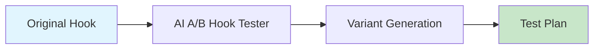

# AI A/B Hook Tester

Generate A/B test variants for video hooks with tracking plans and statistical analysis.



## CLI Quickstart

```bash
praisonai recipe run ai-ab-hook-tester \
  --input '{"original_hook": "Did you know AI can...", "topic": "AI agents", "num_variants": 3}' \
  --json
```

## Use in Your App (SDK)

```python
import sys
sys.path.insert(0, 'agent_recipes/templates/ai-ab-hook-tester')
from tools import generate_test_variants, create_tracking_plan

# Generate variants
variants = generate_test_variants(
    original_hook="Did you know AI agents can automate your workflow?",
    topic="AI agents",
    num_variants=3
)

# Create tracking plan
plan = create_tracking_plan(
    variants=variants["variants"],
    test_duration_days=7,
    metrics=["ctr", "watch_time", "engagement"]
)
```

## Input Schema

```json
{
  "type": "object",
  "properties": {
    "original_hook": {"type": "string"},
    "topic": {"type": "string"},
    "num_variants": {"type": "integer", "default": 3}
  }
}
```

## Output Schema

```json
{
  "variants": [
    {
      "text": "Original hook...",
      "trigger": "control",
      "hypothesis": "Baseline"
    },
    {
      "text": "Variant hook...",
      "trigger": "curiosity",
      "hypothesis": "Curiosity drives more clicks"
    }
  ],
  "tracking_plan": {
    "test_id": "ab_test_20241229",
    "duration_days": 7,
    "metrics": {...}
  }
}
```

## Psychological Triggers

| Trigger | Description |
|---------|-------------|
| curiosity | Question-based, mystery |
| fear | FOMO, urgency |
| benefit | Value proposition |
| controversy | Debate-sparking |
| statistic | Data-backed |

## Metrics to Track

| Metric | Target |
|--------|--------|
| CTR | >5% |
| Watch Time | >60s |
| Engagement | >3% |
| Retention | >50% |

## Environment Variables

| Variable | Required | Description |
|----------|----------|-------------|
| OPENAI_API_KEY | Yes | For variant generation |

## Related Tools

- [AI Hook Generator](/docs/ai-tools/creator-suite/ai-hook-generator)
- [AI Performance Analyzer](/docs/ai-tools/creator-suite/ai-performance-analyzer)
