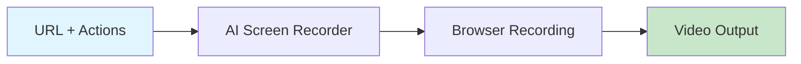

# AI Screen Recorder

Record browser navigation and scripted actions as video with configurable FPS.



## CLI Quickstart

```bash
praisonai recipe run ai-screen-recorder \
  --input '{"url": "https://example.com", "duration": 10, "fps": 30}' \
  --json
```

## Use in Your App (SDK)

```python
import sys
sys.path.insert(0, 'agent_recipes/templates/ai-screen-recorder')
from tools import record_navigation, record_scripted_actions

# Record navigation
result = record_navigation(
    url="https://example.com",
    duration=10,
    output_path="recording.mp4"
)

# Record scripted actions
actions = [
    {"action": "click", "selector": "#button"},
    {"action": "wait", "duration": 2},
    {"action": "scroll", "direction": "down"}
]
scripted = record_scripted_actions(
    url="https://example.com",
    actions=actions,
    output_path="scripted.mp4"
)
```

## Input Schema

```json
{
  "type": "object",
  "properties": {
    "url": {"type": "string"},
    "duration": {"type": "integer", "default": 10},
    "fps": {"type": "integer", "default": 30},
    "actions": {"type": "array"}
  }
}
```

## Output Schema

```json
{
  "path": "/output/recording.mp4",
  "duration": 10,
  "fps": 30,
  "frames": 300
}
```

## Dependencies

```bash
pip install playwright
playwright install chromium
# Also requires ffmpeg
brew install ffmpeg  # macOS
```

## Related Tools

- [AI Screenshot Capture](/docs/ai-tools/creator-suite/ai-screenshot-capture)
- [AI B-roll Builder](/docs/ai-tools/creator-suite/ai-broll-builder)
