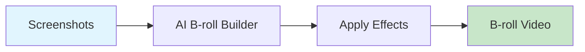

# AI B-roll Builder

Create B-roll video from screenshots with Ken Burns effects, pans, and zooms.



## CLI Quickstart

```bash
praisonai recipe run ai-broll-builder \
  --input '{"images": ["img1.png", "img2.png"], "duration_per_image": 5}' \
  --json
```

## Use in Your App (SDK)

```python
import sys
sys.path.insert(0, 'agent_recipes/templates/ai-broll-builder')
from tools import create_ken_burns, apply_pan_zoom, build_broll

# Ken Burns effect on single image
kb = create_ken_burns(
    image_path="image.png",
    output_path="kb_clip.mp4",
    duration=5.0,
    zoom_start=1.0,
    zoom_end=1.2
)

# Build B-roll from multiple images
broll = build_broll(
    images=["img1.png", "img2.png", "img3.png"],
    output_path="broll.mp4",
    duration_per_image=5.0,
    transition="crossfade"
)
```

## Input Schema

```json
{
  "type": "object",
  "properties": {
    "images": {"type": "array"},
    "duration_per_image": {"type": "number", "default": 5},
    "transition": {
      "type": "string",
      "enum": ["crossfade", "cut", "fade"]
    },
    "effects": {
      "type": "array",
      "items": {"type": "string"}
    }
  }
}
```

## Output Schema

```json
{
  "path": "/output/broll.mp4",
  "clips": 3,
  "total_duration": 15
}
```

## Effects

| Effect | Description |
|--------|-------------|
| ken_burns | Slow zoom with pan |
| zoom_in | Gradual zoom in |
| zoom_out | Gradual zoom out |
| pan_left | Horizontal pan left |
| pan_right | Horizontal pan right |

## Dependencies

```bash
# Requires ffmpeg
brew install ffmpeg  # macOS
apt install ffmpeg   # Linux
```

## Related Tools

- [AI Screenshot Capture](/docs/examples/agent-recipes-new/creator-suite/ai-screenshot-capture)
- [AI Video Merger](/docs/examples/agent-recipes-new/creator-suite/ai-video-merger)
