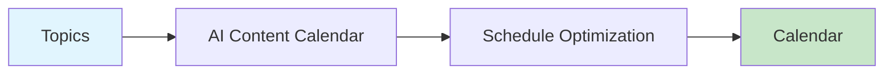

# AI Content Calendar

Generate content calendars with optimal posting times and platform-specific scheduling.



## CLI Quickstart

```bash
praisonai recipe run ai-content-calendar \
  --input '{"topics": ["AI agents", "LLMs", "automation"], "duration_days": 30}' \
  --json
```

## Use in Your App (SDK)

```python
import sys
sys.path.insert(0, 'agent_recipes/templates/ai-content-calendar')
from tools import generate_calendar, optimize_schedule, export_calendar

# Generate calendar
calendar = generate_calendar(
    topics=["AI agents", "LLMs", "automation"],
    duration_days=30,
    platforms=["youtube", "x", "linkedin"],
    posts_per_day=1
)

# Optimize schedule
optimized = optimize_schedule(
    calendar=calendar["calendar"],
    avoid_weekends=True,
    peak_hours_only=True
)

# Export to file
export_calendar(calendar["calendar"], "calendar.json", format="json")
```

## Input Schema

```json
{
  "type": "object",
  "properties": {
    "topics": {"type": "array"},
    "duration_days": {"type": "integer", "default": 30},
    "platforms": {"type": "array"},
    "posts_per_day": {"type": "integer", "default": 1}
  }
}
```

## Output Schema

```json
{
  "calendar": [
    {
      "date": "2024-12-30",
      "time": "09:00",
      "platform": "youtube",
      "topic": "AI agents",
      "status": "scheduled"
    }
  ],
  "stats": {
    "total_posts": 30,
    "duration_days": 30
  }
}
```

## Optimal Posting Times

| Platform | Best Times |
|----------|------------|
| YouTube | 9am, 12pm, 5pm |
| X | 8am, 12pm, 5pm, 8pm |
| LinkedIn | 7:30am, 12pm, 5:30pm |
| Instagram | 11am, 2pm, 7pm |

## Related Tools

- [AI Publisher Pack](/docs/examples/agent-recipes-new/creator-suite/ai-publisher-pack)
- [AI Post Copy Generator](/docs/examples/agent-recipes-new/creator-suite/ai-post-copy-generator)
