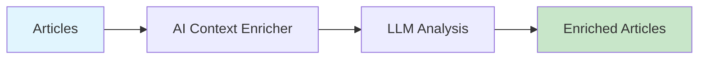

# AI Context Enricher

Enrich news articles with background context, prior art references, stakeholder analysis, and hype detection.



## CLI Quickstart

```bash
praisonai recipe run ai-context-enricher \
  --input '{"articles": [...]}' \
  --json
```

## Use in Your App (SDK)

```python
import sys
sys.path.insert(0, 'agent_recipes/templates/ai-context-enricher')
from tools import enrich_article, add_background, detect_hype

# Enrich single article
enriched = enrich_article(article)

# Add background context
with_background = add_background(article)

# Detect hype level
hype_analysis = detect_hype(article["content"])
```

## Input Schema

```json
{
  "type": "object",
  "properties": {
    "articles": {"type": "array"},
    "include_background": {"type": "boolean", "default": true},
    "include_prior_art": {"type": "boolean", "default": true},
    "include_stakeholders": {"type": "boolean", "default": true},
    "detect_hype": {"type": "boolean", "default": true}
  }
}
```

## Output Schema

```json
{
  "enriched_articles": [
    {
      "title": "...",
      "background": "Historical context...",
      "prior_art": ["Related work 1", "Related work 2"],
      "stakeholders": ["Company A", "Researcher B"],
      "hype_score": 0.7,
      "hype_indicators": ["buzzwords", "unverified claims"]
    }
  ]
}
```

## Environment Variables

| Variable | Required | Description |
|----------|----------|-------------|
| OPENAI_API_KEY | Yes | For LLM analysis |

## Related Tools

- [AI Signal Ranker](/docs/examples/agent-recipes-new/creator-suite/ai-signal-ranker)
- [AI Brief Generator](/docs/examples/agent-recipes-new/creator-suite/ai-brief-generator)
