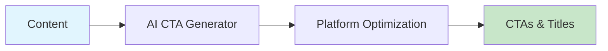

# AI CTA Generator

Generate platform-optimized calls-to-action and titles for YouTube, X, LinkedIn, and more.



## CLI Quickstart

```bash
praisonai recipe run ai-cta-generator \
  --input '{"topic": "AI tutorial", "platform": "youtube"}' \
  --json
```

## Use in Your App (SDK)

```python
import sys
sys.path.insert(0, 'agent_recipes/templates/ai-cta-generator')
from tools import generate_cta, generate_title

# Generate CTA
cta = generate_cta("AI tutorial video", platform="youtube")

# Generate title
title = generate_title("AI agents tutorial", platform="youtube")
```

## Input Schema

```json
{
  "type": "object",
  "properties": {
    "topic": {"type": "string"},
    "platform": {
      "type": "string",
      "enum": ["youtube", "x", "linkedin", "instagram", "tiktok"]
    },
    "cta_type": {
      "type": "string",
      "enum": ["subscribe", "like", "comment", "share", "link"]
    }
  }
}
```

## Output Schema

```json
{
  "cta": "Subscribe and hit the bell...",
  "title": "AI Agents: The Complete Guide",
  "platform": "youtube"
}
```

## Platform Guidelines

| Platform | Title Length | CTA Style |
|----------|--------------|-----------|
| YouTube | 60 chars | Subscribe, like, comment |
| X | 50 chars | Retweet, follow |
| LinkedIn | 100 chars | Connect, share |
| TikTok | 40 chars | Follow, duet |

## Environment Variables

| Variable | Required | Description |
|----------|----------|-------------|
| OPENAI_API_KEY | Yes | For CTA generation |

## Related Tools

- [AI Script Writer](/docs/examples/agent-recipes-new/creator-suite/ai-script-writer)
- [AI Post Copy Generator](/docs/examples/agent-recipes-new/creator-suite/ai-post-copy-generator)
