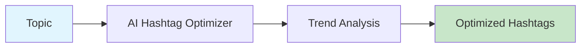

# AI Hashtag Optimizer

Generate and optimize hashtags and keywords for maximum social media reach.



## CLI Quickstart

```bash
praisonai recipe run ai-hashtag-optimizer \
  --input '{"topic": "AI agents", "platform": "instagram", "max_hashtags": 30}' \
  --json
```

## Use in Your App (SDK)

```python
import sys
sys.path.insert(0, 'agent_recipes/templates/ai-hashtag-optimizer')
from tools import generate_hashtags, optimize_keywords

# Generate hashtags
hashtags = generate_hashtags(
    topic="AI agents tutorial",
    platform="instagram",
    max_hashtags=30,
    mix_popularity=True
)

# Optimize keywords for SEO
keywords = optimize_keywords(
    topic="AI agents",
    content_type="video",
    max_keywords=20
)
```

## Input Schema

```json
{
  "type": "object",
  "properties": {
    "topic": {"type": "string"},
    "platform": {
      "type": "string",
      "enum": ["instagram", "x", "linkedin", "tiktok"]
    },
    "max_hashtags": {"type": "integer", "default": 30},
    "mix_popularity": {"type": "boolean", "default": true}
  }
}
```

## Output Schema

```json
{
  "hashtags": ["#AIagents", "#MachineLearning", "#Tech"],
  "platform": "instagram",
  "count": 30
}
```

## Platform Limits

| Platform | Max Hashtags |
|----------|--------------|
| Instagram | 30 |
| X | 5 |
| LinkedIn | 5 |
| TikTok | 10 |

## Environment Variables

| Variable | Required | Description |
|----------|----------|-------------|
| OPENAI_API_KEY | Yes | For hashtag generation |

## Related Tools

- [AI Post Copy Generator](/docs/examples/agent-recipes-new/creator-suite/ai-post-copy-generator)
- [AI Publisher Pack](/docs/examples/agent-recipes-new/creator-suite/ai-publisher-pack)
