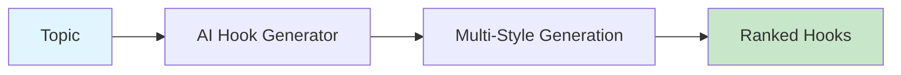

# AI Hook Generator

Generate multiple hook variants using different psychological triggers: curiosity, fear, benefit, controversy, and statistics.



## CLI Quickstart

```bash
praisonai recipe run ai-hook-generator \
  --input '{"topic": "GPT-5 release", "num_variants": 5}' \
  --json
```

## Use in Your App (SDK)

```python
import sys
sys.path.insert(0, 'agent_recipes/templates/ai-hook-generator')
from tools import generate_hooks, rank_hooks

# Generate hooks
hooks = generate_hooks("GPT-5 just released", num_variants=5)

# Rank by engagement potential
ranked = rank_hooks(hooks["hooks"])
print(f"Best hook: {ranked['best_hook']['text']}")
```

## Input Schema

```json
{
  "type": "object",
  "properties": {
    "topic": {"type": "string"},
    "num_variants": {"type": "integer", "default": 5},
    "styles": {
      "type": "array",
      "items": {"type": "string"}
    }
  }
}
```

## Output Schema

```json
{
  "hooks": [
    {
      "text": "Did you know GPT-5 can...",
      "style": "question",
      "score": 0.85
    }
  ],
  "best_hook": {...}
}
```

## Hook Styles

| Style | Description |
|-------|-------------|
| question | Curiosity-driven question |
| bold_statement | Provocative claim |
| statistic | Data-backed opener |
| story | Personal narrative |
| controversy | Debate-sparking |

## Environment Variables

| Variable | Required | Description |
|----------|----------|-------------|
| OPENAI_API_KEY | Yes | For hook generation |

## Related Tools

- [AI Script Writer](/docs/examples/agent-recipes-new/creator-suite/ai-script-writer)
- [AI A/B Hook Tester](/docs/examples/agent-recipes-new/creator-suite/ai-ab-hook-tester)
