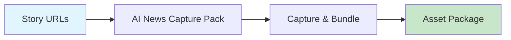

# AI News Capture Pack

Bundle screenshots, metadata, and assets for each news story into organized packages.



## CLI Quickstart

```bash
praisonai recipe run ai-news-capture-pack \
  --input '{"urls": ["https://example.com/article1"], "story_id": "story_001"}' \
  --json
```

## Use in Your App (SDK)

```python
import sys
sys.path.insert(0, 'agent_recipes/templates/ai-news-capture-pack')
from tools import capture_story_assets, create_bundle

# Capture assets for a story
assets = capture_story_assets(
    urls=["https://example.com/article1", "https://example.com/article2"],
    story_id="story_001"
)

# Create bundle
bundle = create_bundle(
    story_id="story_001",
    assets=assets["assets"],
    include_metadata=True
)
```

## Input Schema

```json
{
  "type": "object",
  "properties": {
    "urls": {"type": "array"},
    "story_id": {"type": "string"},
    "include_metadata": {"type": "boolean", "default": true}
  }
}
```

## Output Schema

```json
{
  "bundle_path": "/output/story_001.zip",
  "assets": [
    {"url": "...", "screenshot": "capture_0.png", "title": "..."}
  ],
  "total_captured": 2
}
```

## Bundle Contents

| File | Description |
|------|-------------|
| capture_*.png | Screenshots |
| metadata.json | Story metadata |
| manifest.json | Bundle manifest |

## Dependencies

```bash
pip install playwright
playwright install chromium
```

## Related Tools

- [AI Screenshot Capture](/docs/examples/agent-recipes-new/creator-suite/ai-screenshot-capture)
- [AI B-roll Builder](/docs/examples/agent-recipes-new/creator-suite/ai-broll-builder)
