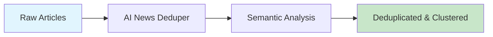

# AI News Deduper

Deduplicate news articles using semantic similarity and cluster them by topic.



## CLI Quickstart

```bash
# Run deduplication
praisonai recipe run ai-news-deduper \
  --input '{"articles": [...], "similarity_threshold": 0.85}' \
  --json
```

## Use in Your App (SDK)

```python
from praisonai.recipes import run_recipe

# Deduplicate articles
result = run_recipe(
    "ai-news-deduper",
    input={
        "articles": articles_list,
        "similarity_threshold": 0.85,
        "use_semantic": True
    }
)

# Direct tool usage
import sys
sys.path.insert(0, 'agent_recipes/templates/ai-news-deduper')
from tools import deduplicate_articles, cluster_by_topic

# Deduplicate
deduped = deduplicate_articles(articles, similarity_threshold=0.85)

# Cluster by topic
clusters = cluster_by_topic(deduped["deduplicated"], num_clusters=5)
```

## Input Schema

```json
{
  "type": "object",
  "properties": {
    "articles": {
      "type": "array",
      "description": "List of article objects"
    },
    "similarity_threshold": {
      "type": "number",
      "default": 0.85
    },
    "use_semantic": {
      "type": "boolean",
      "default": true
    }
  }
}
```

## Output Schema

```json
{
  "deduplicated": [{"title": "...", "url": "..."}],
  "removed_count": 5,
  "clusters": [
    {"topic": "GPT-5", "articles": [...]}
  ]
}
```

## Configuration

| Option | Type | Default | Description |
|--------|------|---------|-------------|
| similarity_threshold | float | 0.85 | Similarity threshold for deduplication |
| use_semantic | bool | true | Use semantic similarity (requires OpenAI) |
| num_clusters | int | 5 | Number of topic clusters |

## Dependencies

```bash
pip install openai numpy
```

## Environment Variables

| Variable | Required | Description |
|----------|----------|-------------|
| OPENAI_API_KEY | Yes | For semantic embeddings |

## Related Tools

- [AI News Crawler](/docs/ai-tools/creator-suite/ai-news-crawler)
- [AI Signal Ranker](/docs/ai-tools/creator-suite/ai-signal-ranker)
