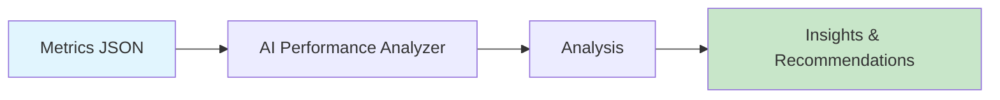

# AI Performance Analyzer

Analyze content performance metrics and generate AI-powered insights and recommendations.



## CLI Quickstart

```bash
praisonai recipe run ai-performance-analyzer \
  --input '{"metrics": {"views": 1000, "likes": 50, "comments": 10}, "platform": "youtube"}' \
  --json
```

## Use in Your App (SDK)

```python
import sys
sys.path.insert(0, 'agent_recipes/templates/ai-performance-analyzer')
from tools import analyze_metrics, generate_insights, compare_performance

# Analyze metrics
analysis = analyze_metrics(
    metrics={"views": 1000, "likes": 50, "comments": 10, "shares": 5},
    platform="youtube"
)

# Generate AI insights
insights = generate_insights(metrics)

# Compare periods
comparison = compare_performance(
    current={"views": 1000, "likes": 50},
    previous={"views": 800, "likes": 40}
)
```

## Input Schema

```json
{
  "type": "object",
  "properties": {
    "metrics": {
      "type": "object",
      "properties": {
        "views": {"type": "integer"},
        "likes": {"type": "integer"},
        "comments": {"type": "integer"},
        "shares": {"type": "integer"},
        "watch_time": {"type": "number"},
        "ctr": {"type": "number"}
      }
    },
    "platform": {"type": "string"}
  }
}
```

## Output Schema

```json
{
  "analysis": {
    "engagement_rate": 6.0,
    "performance_tier": "good"
  },
  "insights": "Your content is performing well...",
  "recommendations": ["Increase posting frequency", "Test different hooks"]
}
```

## Performance Tiers

| Tier | Engagement Rate |
|------|-----------------|
| exceptional | ≥10% |
| excellent | ≥5% |
| good | ≥2% |
| average | ≥1% |
| needs_improvement | less than 1% |

## Environment Variables

| Variable | Required | Description |
|----------|----------|-------------|
| OPENAI_API_KEY | Yes | For AI insights |

## Related Tools

- [AI Comment Miner](/docs/examples/agent-recipes-new/creator-suite/ai-comment-miner)
- [AI A/B Hook Tester](/docs/examples/agent-recipes-new/creator-suite/ai-ab-hook-tester)
