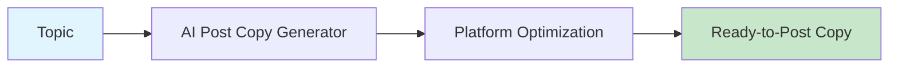

# AI Post Copy Generator

Generate platform-optimized post copy for X, LinkedIn, YouTube descriptions, and more.



## CLI Quickstart

```bash
praisonai recipe run ai-post-copy-generator \
  --input '{"topic": "AI agents tutorial", "platform": "linkedin"}' \
  --json
```

## Use in Your App (SDK)

```python
import sys
sys.path.insert(0, 'agent_recipes/templates/ai-post-copy-generator')
from tools import generate_post_copy, generate_multi_platform_copy

# Generate for single platform
copy = generate_post_copy(
    topic="AI agents are revolutionizing development",
    platform="linkedin",
    tone="professional",
    include_hashtags=True
)

# Generate for multiple platforms
multi = generate_multi_platform_copy(
    topic="AI agents tutorial",
    platforms=["x", "linkedin", "youtube"]
)
```

## Input Schema

```json
{
  "type": "object",
  "properties": {
    "topic": {"type": "string"},
    "platform": {
      "type": "string",
      "enum": ["x", "linkedin", "youtube", "instagram"]
    },
    "tone": {"type": "string", "default": "professional"},
    "include_hashtags": {"type": "boolean", "default": true},
    "include_cta": {"type": "boolean", "default": true}
  }
}
```

## Output Schema

```json
{
  "copy": "🚀 AI agents are changing everything...",
  "platform": "linkedin",
  "length": 500,
  "within_limit": true
}
```

## Platform Limits

| Platform | Max Length |
|----------|------------|
| X | 280 chars |
| LinkedIn | 3000 chars |
| YouTube | 5000 chars |
| Instagram | 2200 chars |

## Environment Variables

| Variable | Required | Description |
|----------|----------|-------------|
| OPENAI_API_KEY | Yes | For copy generation |

## Related Tools

- [AI Publisher Pack](/docs/examples/agent-recipes-new/creator-suite/ai-publisher-pack)
- [AI Hashtag Optimizer](/docs/examples/agent-recipes-new/creator-suite/ai-hashtag-optimizer)
