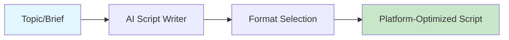

# AI Script Writer

Generate scripts in multiple formats: YouTube long-form, YouTube Shorts, X threads, LinkedIn posts, and image captions.



## CLI Quickstart

```bash
praisonai recipe run ai-script-writer \
  --input '{"topic": "AI agents", "format": "youtube_long", "target_length": 300}' \
  --json
```

## Use in Your App (SDK)

```python
import sys
sys.path.insert(0, 'agent_recipes/templates/ai-script-writer')
from tools import write_youtube_script, write_short_script, write_thread

# YouTube long-form script
script = write_youtube_script(
    topic="AI agents are changing software development",
    target_length=300,
    key_points=["automation", "productivity", "future"]
)

# YouTube Short script
short = write_short_script("AI agents", duration=30)

# X thread
thread = write_thread("AI agents", num_tweets=5)
```

## Input Schema

```json
{
  "type": "object",
  "properties": {
    "topic": {"type": "string"},
    "format": {
      "type": "string",
      "enum": ["youtube_long", "youtube_short", "thread", "linkedin", "caption"]
    },
    "target_length": {"type": "integer"},
    "key_points": {"type": "array"}
  }
}
```

## Output Schema

```json
{
  "script": "[HOOK - 0:00]\nDid you know...",
  "format": "youtube_long",
  "estimated_duration": 300,
  "sections": ["hook", "intro", "main", "cta"]
}
```

## Supported Formats

| Format | Description | Typical Length |
|--------|-------------|----------------|
| youtube_long | Full YouTube video | 5-15 minutes |
| youtube_short | YouTube Shorts | 30-60 seconds |
| thread | X/Twitter thread | 5-10 tweets |
| linkedin | LinkedIn post | 1000-2000 chars |
| caption | Image caption | 100-300 chars |

## Environment Variables

| Variable | Required | Description |
|----------|----------|-------------|
| OPENAI_API_KEY | Yes | For script generation |

## Related Tools

- [AI Hook Generator](/docs/examples/agent-recipes-new/creator-suite/ai-hook-generator)
- [AI CTA Generator](/docs/examples/agent-recipes-new/creator-suite/ai-cta-generator)
