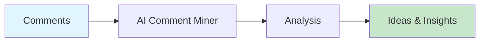

# AI Comment Miner

Extract content ideas, sentiment, and audience insights from comments.



## CLI Quickstart

```bash
praisonai recipe run ai-comment-miner \
  --input '{"comments": ["Great video!", "Can you cover X topic?"]}' \
  --json
```

## Use in Your App (SDK)

```python
import sys
sys.path.insert(0, 'agent_recipes/templates/ai-comment-miner')
from tools import extract_ideas, analyze_sentiment, mine_comments

# Extract content ideas
ideas = extract_ideas(
    comments=["Can you cover AI agents?", "More tutorials please!"],
    max_ideas=10
)

# Analyze sentiment
sentiment = analyze_sentiment(comments)

# Full mining pipeline
results = mine_comments(comments)
```

## Input Schema

```json
{
  "type": "object",
  "properties": {
    "comments": {"type": "array"},
    "max_ideas": {"type": "integer", "default": 10}
  }
}
```

## Output Schema

```json
{
  "ideas": ["Create AI agents tutorial", "Cover automation tools"],
  "sentiment": {
    "positive": 80,
    "negative": 5,
    "neutral": 15,
    "positive_rate": 80.0
  },
  "total_comments": 100
}
```

## Extracted Insights

| Type | Description |
|------|-------------|
| Questions | Topics people are asking about |
| Pain Points | Problems to solve |
| Requests | What they want to see |
| Trends | Trending topics mentioned |

## Environment Variables

| Variable | Required | Description |
|----------|----------|-------------|
| OPENAI_API_KEY | Yes | For idea extraction |

## Related Tools

- [AI Performance Analyzer](/docs/ai-tools/creator-suite/ai-performance-analyzer)
- [AI Angle Generator](/docs/ai-tools/creator-suite/ai-angle-generator)
