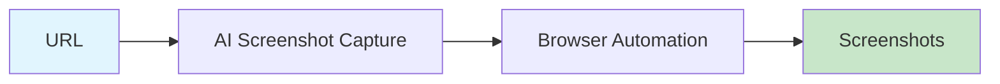

# AI Screenshot Capture

Capture high-resolution screenshots with full-page support, element highlighting, and auto-scroll.



## CLI Quickstart

```bash
praisonai recipe run ai-screenshot-capture \
  --input '{"url": "https://example.com", "full_page": true}' \
  --json
```

## Use in Your App (SDK)

```python
import sys
sys.path.insert(0, 'agent_recipes/templates/ai-screenshot-capture')
from tools import capture_screenshot, capture_full_page, highlight_and_capture

# Basic screenshot
result = capture_screenshot("https://example.com", output_path="screenshot.png")

# Full page capture
full = capture_full_page("https://example.com", output_path="full.png")

# Highlight element and capture
highlighted = highlight_and_capture(
    "https://example.com",
    selector=".main-content",
    output_path="highlighted.png"
)
```

## Input Schema

```json
{
  "type": "object",
  "properties": {
    "url": {"type": "string"},
    "full_page": {"type": "boolean", "default": false},
    "selector": {"type": "string"},
    "viewport": {
      "type": "object",
      "properties": {
        "width": {"type": "integer"},
        "height": {"type": "integer"}
      }
    }
  }
}
```

## Output Schema

```json
{
  "path": "/output/screenshot.png",
  "width": 1920,
  "height": 1080,
  "full_page": true
}
```

## Features

| Feature | Description |
|---------|-------------|
| Full Page | Capture entire scrollable page |
| Highlighting | Highlight specific elements |
| Auto-scroll | Scroll through dynamic content |
| High-res | 2x resolution support |

## Dependencies

```bash
pip install playwright
playwright install chromium
```

## Related Tools

- [AI Screen Recorder](/docs/ai-tools/creator-suite/ai-screen-recorder)
- [AI News Capture Pack](/docs/ai-tools/creator-suite/ai-news-capture-pack)
