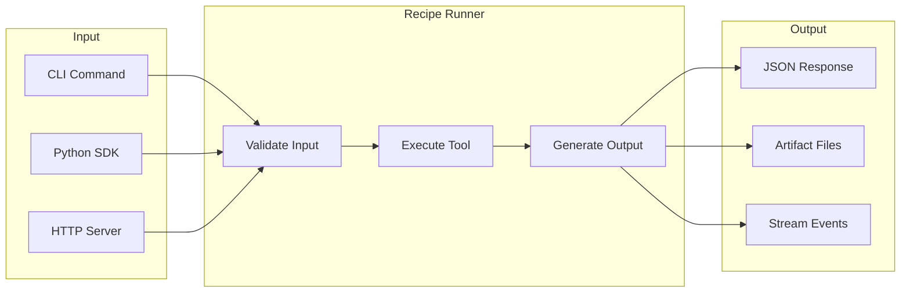

# AI Tools

PraisonAI provides 55 production-ready AI tools organized into 7 clusters. Each tool can be used via CLI, Python SDK, or HTTP server.



## Quick Start

```bash
# Install
pip install praisonai praisonai-tools

# List all tools
praisonai recipe list

# Run a tool
praisonai recipe run ai-blog-generator --input '{"topic": "AI trends"}'

# Start server
praisonai recipe serve
```

## Tool Clusters

<CardGroup cols={2}>
  <Card title="Video & Audio" icon="video" href="/docs/ai-tools/video-audio/ai-subtitle-generator">
    8 tools for video/audio processing, transcription, and enhancement
  </Card>
  <Card title="Documents" icon="file-lines" href="/docs/ai-tools/documents/ai-invoice-processor">
    8 tools for document parsing, analysis, and generation
  </Card>
  <Card title="Images" icon="image" href="/docs/ai-tools/images/ai-background-remover">
    8 tools for image processing, enhancement, and analysis
  </Card>
  <Card title="Developer" icon="code" href="/docs/ai-tools/developer/ai-commit-message-generator">
    8 tools for code generation, review, and documentation
  </Card>
  <Card title="Data & Analytics" icon="chart-bar" href="/docs/ai-tools/data/ai-report-generator">
    8 tools for data analysis, visualization, and transformation
  </Card>
  <Card title="Web & Content" icon="globe" href="/docs/ai-tools/web-content/ai-blog-generator">
    8 tools for SEO, content generation, and web automation
  </Card>
  <Card title="Productivity" icon="clock" href="/docs/ai-tools/productivity/ai-email-parser">
    7 tools for email, calendar, file organization, and automation
  </Card>
</CardGroup>

## Integration Models

Each tool supports 6 integration models:

| Model | Description | Best For |
|-------|-------------|----------|
| **Embedded SDK** | Direct Python import | Applications, scripts |
| **CLI Invocation** | Command line execution | Automation, CI/CD |
| **Local HTTP Sidecar** | Local server mode | Microservices |
| **Remote Runner** | Managed cloud execution | Production, scaling |
| **Event-Driven** | Queue/webhook triggers | Async workflows |
| **Plugin Mode** | Agent tool integration | Multi-agent systems |

## Common Flags

| Flag | Description |
|------|-------------|
| `--input` | JSON input string |
| `--input-file` | Path to JSON input file |
| `--out-dir` | Output directory for artifacts |
| `--json` | Output as JSON |
| `--stream` | Enable streaming (if supported) |
| `--timeout-sec` | Request timeout |

## Output Contract

All tools return a consistent JSON structure:

```json
{
  "ok": true,
  "run_id": "run_abc123",
  "recipe": "ai-blog-generator",
  "output": { /* tool-specific */ },
  "artifacts": [
    {"path": "output/blog.md", "type": "markdown"}
  ],
  "warnings": [],
  "error": null
}
```
