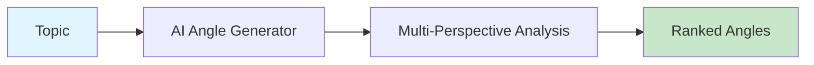

# AI Angle Generator

Generate multiple content angles for any topic: controversial, educational, business, personal, and technical perspectives.



## CLI Quickstart

```bash
praisonai recipe run ai-angle-generator \
  --input '{"topic": "AI replacing jobs", "num_angles": 5}' \
  --json
```

## Use in Your App (SDK)

```python
import sys
sys.path.insert(0, 'agent_recipes/templates/ai-angle-generator')
from tools import generate_angles, evaluate_angles

# Generate angles
angles = generate_angles("AI replacing jobs", num_angles=5)

# Evaluate and rank
evaluated = evaluate_angles(angles["angles"])
```

## Input Schema

```json
{
  "type": "object",
  "properties": {
    "topic": {"type": "string"},
    "num_angles": {"type": "integer", "default": 5},
    "angle_types": {
      "type": "array",
      "items": {"type": "string"}
    }
  }
}
```

## Output Schema

```json
{
  "angles": [
    {
      "type": "controversial",
      "angle": "Why AI job replacement is actually good",
      "hook": "Everyone's worried about AI taking jobs, but...",
      "target_audience": "Tech professionals"
    }
  ]
}
```

## Angle Types

| Type | Description |
|------|-------------|
| controversial | Provocative, debate-sparking |
| educational | Informative, tutorial-style |
| business | ROI-focused, enterprise |
| personal | Story-driven, relatable |
| technical | Deep-dive, expert-level |

## Environment Variables

| Variable | Required | Description |
|----------|----------|-------------|
| OPENAI_API_KEY | Yes | For angle generation |

## Related Tools

- [AI Script Writer](/docs/examples/agent-recipes/creator-suite/ai-script-writer)
- [AI Hook Generator](/docs/examples/agent-recipes/creator-suite/ai-hook-generator)
