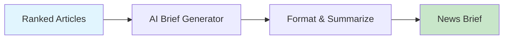

# AI Brief Generator

Generate professional news briefs in daily, weekly, or executive formats.



## CLI Quickstart

```bash
praisonai recipe run ai-brief-generator \
  --input '{"articles": [...], "format": "daily"}' \
  --json
```

## Use in Your App (SDK)

```python
import sys
sys.path.insert(0, 'agent_recipes/templates/ai-brief-generator')
from tools import generate_brief, extract_highlights, format_newsletter

# Generate daily brief
brief = generate_brief(articles, format="daily", max_articles=5)

# Extract highlights
highlights = extract_highlights(articles, num_highlights=3)

# Format as newsletter
newsletter = format_newsletter(brief, highlights, title="AI Daily")
```

## Input Schema

```json
{
  "type": "object",
  "properties": {
    "articles": {"type": "array"},
    "format": {
      "type": "string",
      "enum": ["daily", "weekly", "executive"]
    },
    "max_articles": {"type": "integer", "default": 5}
  }
}
```

## Output Schema

```json
{
  "brief": "# Daily AI News Brief...",
  "highlights": ["Highlight 1", "Highlight 2"],
  "format": "daily",
  "article_count": 5
}
```

## Brief Formats

| Format | Description |
|--------|-------------|
| daily | Concise daily summary |
| weekly | Comprehensive weekly roundup |
| executive | High-level executive summary |

## Environment Variables

| Variable | Required | Description |
|----------|----------|-------------|
| OPENAI_API_KEY | Yes | For content generation |

## Related Tools

- [AI News Crawler](/docs/examples/agent-recipes/creator-suite/ai-news-crawler)
- [AI Script Writer](/docs/examples/agent-recipes/creator-suite/ai-script-writer)
