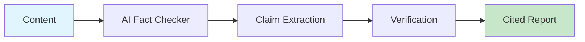

# AI Fact Checker

Extract claims from content, verify them against sources, and provide citations.



## CLI Quickstart

```bash
praisonai recipe run ai-fact-checker \
  --input '{"content": "GPT-5 has 10 trillion parameters..."}' \
  --json
```

## Use in Your App (SDK)

```python
import sys
sys.path.insert(0, 'agent_recipes/templates/ai-fact-checker')
from tools import extract_claims, verify_claim, fact_check_content

# Full fact-check
result = fact_check_content("GPT-5 has 10 trillion parameters...")

# Extract claims only
claims = extract_claims("Your content here...")

# Verify single claim
verification = verify_claim("GPT-5 has 10 trillion parameters")
```

## Input Schema

```json
{
  "type": "object",
  "properties": {
    "content": {"type": "string"},
    "include_citations": {"type": "boolean", "default": true}
  }
}
```

## Output Schema

```json
{
  "claims": [
    {
      "claim": "GPT-5 has 10 trillion parameters",
      "status": "unverified",
      "confidence": 0.3,
      "citations": [],
      "flag": "needs_verification"
    }
  ],
  "overall_accuracy": 0.7
}
```

## Claim Statuses

| Status | Description |
|--------|-------------|
| verified | Confirmed with citations |
| unverified | Cannot confirm |
| false | Contradicted by sources |
| partially_true | Some aspects verified |

## Environment Variables

| Variable | Required | Description |
|----------|----------|-------------|
| OPENAI_API_KEY | Yes | For claim extraction |
| TAVILY_API_KEY | Optional | For web search verification |

## Related Tools

- [AI Script Writer](/docs/examples/agent-recipes/creator-suite/ai-script-writer)
- [AI Context Enricher](/docs/examples/agent-recipes/creator-suite/ai-context-enricher)
