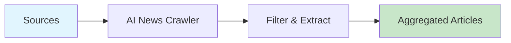

# AI News Crawler

Crawl AI news from multiple sources including HackerNews, Reddit, arXiv, and GitHub trending repositories.



## CLI Quickstart

```bash
# Install
pip install praisonai praisonai-tools

# Run the crawler
praisonai recipe run ai-news-crawler \
  --input '{"sources": ["hackernews", "reddit", "arxiv"], "max_articles": 20}' \
  --json

# With output directory
praisonai recipe run ai-news-crawler \
  --input-file config.json \
  --out-dir ./output
```

**Output:**
```json
{
  "ok": true,
  "run_id": "run_abc123",
  "recipe": "ai-news-crawler",
  "output": {
    "articles": [
      {"title": "...", "url": "...", "source": "hackernews", "score": 100}
    ],
    "total": 20
  }
}
```

## Use in Your App (SDK)

```python
from praisonai.recipe import run, run_stream

# Basic usage
result = run(
    "ai-news-crawler",
    input={
        "sources": ["hackernews", "reddit", "arxiv"],
        "max_articles": 20,
        "time_window_hours": 24
    }
)

print(f"Crawled {len(result.output['articles'])} articles")

# Direct tool usage
import sys
sys.path.insert(0, 'agent_recipes/templates/ai-news-crawler')
from tools import crawl_hackernews, crawl_reddit_ai, crawl_arxiv

# Crawl HackerNews
hn_articles = crawl_hackernews(max_articles=10, time_window_hours=24)

# Crawl Reddit
reddit_articles = crawl_reddit_ai(subreddits=["MachineLearning", "artificial"])

# Crawl arXiv
arxiv_articles = crawl_arxiv(categories=["cs.AI", "cs.LG"], max_results=10)
```

## Use as HTTP Server

### Start Server
```bash
praisonai recipe serve --port 8080
```

### Invoke via curl
```bash
curl -X POST http://localhost:8080/v1/recipes/run \
  -H "Content-Type: application/json" \
  -d '{
    "recipe": "ai-news-crawler",
    "input": {
      "sources": ["hackernews", "reddit"],
      "max_articles": 10
    }
  }'
```

## Input Schema

```json
{
  "type": "object",
  "properties": {
    "sources": {
      "type": "array",
      "items": {"type": "string"},
      "description": "News sources: hackernews, reddit, arxiv, github, web"
    },
    "max_articles": {
      "type": "integer",
      "default": 50
    },
    "time_window_hours": {
      "type": "integer",
      "default": 24
    },
    "keywords": {
      "type": "array",
      "description": "Filter keywords"
    }
  }
}
```

## Output Schema

```json
{
  "articles": [
    {
      "title": "string",
      "url": "string",
      "source": "string",
      "score": "number",
      "timestamp": "string",
      "content": "string"
    }
  ],
  "total": "number",
  "sources_crawled": ["string"]
}
```

## Configuration

| Option | Type | Default | Description |
|--------|------|---------|-------------|
| sources | array | ["hackernews"] | News sources to crawl |
| max_articles | int | 50 | Maximum articles per source |
| time_window_hours | int | 24 | Time window for filtering |
| keywords | array | ["AI", "ML"] | Filter keywords |

## Dependencies

```bash
pip install requests feedparser beautifulsoup4
```

## Environment Variables

| Variable | Required | Description |
|----------|----------|-------------|
| TAVILY_API_KEY | Optional | For web search source |

## Related Tools

- [AI News Deduper](/docs/examples/agent-recipes/creator-suite/ai-news-deduper)
- [AI Signal Ranker](/docs/examples/agent-recipes/creator-suite/ai-signal-ranker)
- [AI Brief Generator](/docs/examples/agent-recipes/creator-suite/ai-brief-generator)
