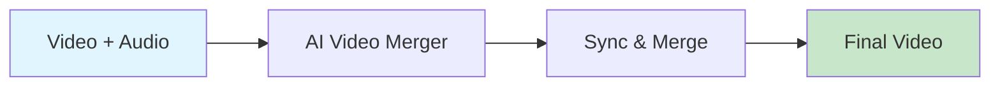

# AI Video Merger

Merge audio tracks with video, sync timing, and normalize audio levels.



## CLI Quickstart

```bash
praisonai recipe run ai-video-merger \
  --input '{"video_path": "video.mp4", "audio_path": "voiceover.mp3"}' \
  --json
```

## Use in Your App (SDK)

```python
import sys
sys.path.insert(0, 'agent_recipes/templates/ai-video-merger')
from tools import merge_audio_video, sync_tracks

# Merge audio with video
result = merge_audio_video(
    video_path="video.mp4",
    audio_path="voiceover.mp3",
    output_path="merged.mp4",
    replace_audio=True
)

# Sync with offset
synced = sync_tracks(
    video_path="video.mp4",
    audio_path="voiceover.mp3",
    output_path="synced.mp4",
    audio_offset=0.5  # Delay audio by 0.5s
)
```

## Input Schema

```json
{
  "type": "object",
  "properties": {
    "video_path": {"type": "string"},
    "audio_path": {"type": "string"},
    "replace_audio": {"type": "boolean", "default": true},
    "audio_offset": {"type": "number", "default": 0},
    "normalize": {"type": "boolean", "default": true}
  }
}
```

## Output Schema

```json
{
  "path": "/output/merged.mp4",
  "video_source": "video.mp4",
  "audio_source": "voiceover.mp3",
  "size_bytes": 5000000
}
```

## Features

| Feature | Description |
|---------|-------------|
| Replace Audio | Replace existing audio track |
| Mix Audio | Mix with existing audio |
| Sync Offset | Adjust audio timing |
| Normalize | Normalize audio levels |

## Dependencies

```bash
# Requires ffmpeg
brew install ffmpeg  # macOS
```

## Related Tools

- [AI B-roll Builder](/docs/examples/agent-recipes/creator-suite/ai-broll-builder)
- [AI Voiceover Generator](/docs/examples/agent-recipes/creator-suite/ai-voiceover-generator)
