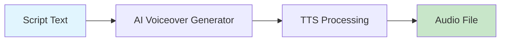

# AI Voiceover Generator

Generate professional voice overs from text using OpenAI TTS with multiple voice options.



## CLI Quickstart

```bash
praisonai recipe run ai-voiceover-generator \
  --input '{"text": "Welcome to our AI news show...", "voice": "alloy"}' \
  --json
```

## Use in Your App (SDK)

```python
import sys
sys.path.insert(0, 'agent_recipes/templates/ai-voiceover-generator')
from tools import generate_voiceover, generate_speech

# Generate voiceover
result = generate_voiceover(
    text="Welcome to our AI news show...",
    output_path="voiceover.mp3",
    voice="alloy",
    speed=1.0
)

# Generate speech from longer script (auto-chunks)
speech = generate_speech(
    script="Long script text here...",
    output_dir="./voiceovers",
    voice="nova"
)
```

## Input Schema

```json
{
  "type": "object",
  "properties": {
    "text": {"type": "string"},
    "voice": {
      "type": "string",
      "enum": ["alloy", "echo", "fable", "onyx", "nova", "shimmer"]
    },
    "speed": {"type": "number", "default": 1.0},
    "model": {
      "type": "string",
      "enum": ["tts-1", "tts-1-hd"]
    }
  }
}
```

## Output Schema

```json
{
  "path": "/output/voiceover.mp3",
  "voice": "alloy",
  "text_length": 500,
  "size_bytes": 45000
}
```

## Available Voices

| Voice | Description |
|-------|-------------|
| alloy | Neutral, versatile |
| echo | Warm, conversational |
| fable | Expressive, narrative |
| onyx | Deep, authoritative |
| nova | Friendly, upbeat |
| shimmer | Clear, professional |

## Environment Variables

| Variable | Required | Description |
|----------|----------|-------------|
| OPENAI_API_KEY | Yes | For TTS API |

## Related Tools

- [AI Script Writer](/docs/examples/agent-recipes/creator-suite/ai-script-writer)
- [AI Video Merger](/docs/examples/agent-recipes/creator-suite/ai-video-merger)
