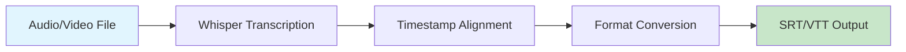
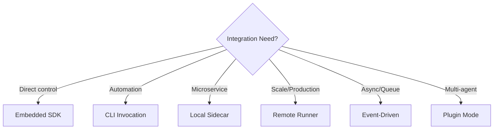

# AI Subtitle Generator

Generate accurate subtitles from audio and video files with automatic language detection and translation support.



## CLI Quickstart (Beginner)

```bash
# Install
pip install praisonai praisonai-tools[audio]

# Generate subtitles
praisonai recipe run ai-subtitle-generator \
  --input '{"file": "video.mp4", "format": "srt"}' \
  --json

# With language specification
praisonai recipe run ai-subtitle-generator \
  --param file=podcast.mp3 \
  --param language=en \
  --param format=vtt \
  --out-dir ./subtitles
```

**Output:**
```json
{
  "ok": true,
  "run_id": "run_sub_abc123",
  "recipe": "ai-subtitle-generator",
  "output": {
    "language": "en",
    "duration_seconds": 3600,
    "segment_count": 245
  },
  "artifacts": [
    {"path": "subtitles/video.srt", "type": "srt"}
  ]
}
```

## Use in Your App (Embedded SDK)

```python
from praisonai.recipes import run_recipe

# Basic usage
result = run_recipe(
    "ai-subtitle-generator",
    input={
        "file": "video.mp4",
        "format": "srt",
        "language": "auto"
    }
)

print(f"Generated: {result['artifacts'][0]['path']}")
print(f"Segments: {result['output']['segment_count']}")

# With streaming progress
for event in run_recipe(
    "ai-subtitle-generator",
    input={"file": "long_video.mp4"},
    stream=True
):
    if event["type"] == "progress":
        print(f"Progress: {event['percent']}%")
    elif event["type"] == "complete":
        print(f"Done: {event['result']['artifacts']}")
```

## Use as a Server (HTTP Sidecar)

### Start Server
```bash
praisonai recipe serve --port 8080
```

### Invoke via curl
```bash
curl -X POST http://localhost:8080/v1/recipes/run \
  -H "Content-Type: application/json" \
  -d '{
    "recipe": "ai-subtitle-generator",
    "input": {
      "file": "/path/to/video.mp4",
      "format": "srt"
    }
  }'
```

### With Authentication (Remote Runner)
```bash
export PRAISONAI_ENDPOINTS_URL=https://api.praisonai.com
export PRAISONAI_ENDPOINTS_API_KEY=your-key

curl -X POST $PRAISONAI_ENDPOINTS_URL/v1/recipes/run \
  -H "X-API-Key: $PRAISONAI_ENDPOINTS_API_KEY" \
  -H "Content-Type: application/json" \
  -d '{"recipe": "ai-subtitle-generator", "input": {"file_url": "https://..."}}'
```

## Input / Output Schema

### Input Schema
```json
{
  "type": "object",
  "properties": {
    "file": {"type": "string", "description": "Path to audio/video file"},
    "file_url": {"type": "string", "description": "URL to audio/video file"},
    "format": {"type": "string", "enum": ["srt", "vtt", "json"], "default": "srt"},
    "language": {"type": "string", "default": "auto"},
    "translate_to": {"type": "string", "description": "Target language for translation"}
  },
  "required": ["file"]
}
```

### Output Schema
```json
{
  "ok": true,
  "run_id": "string",
  "recipe": "ai-subtitle-generator",
  "output": {
    "language": "string",
    "duration_seconds": "number",
    "segment_count": "number",
    "word_count": "number"
  },
  "artifacts": [
    {"path": "string", "type": "string", "size_bytes": "number"}
  ],
  "warnings": [],
  "error": null
}
```

## Integration Models

### Model 1: Embedded SDK
Best for applications that need direct control and minimal latency.
```python
from praisonai.recipes import run_recipe
result = run_recipe("ai-subtitle-generator", input={"file": "video.mp4"})
```

### Model 2: CLI Invocation
Best for scripts, CI/CD pipelines, and automation.
```bash
praisonai recipe run ai-subtitle-generator --input-file config.json --json
```

### Model 3: Local HTTP Sidecar
Best for microservices and language-agnostic integration.
```bash
praisonai recipe serve --port 8080
# Then POST to http://localhost:8080/v1/recipes/run
```

### Model 4: Remote Managed Runner
Best for production workloads with scaling needs.
```python
import os
os.environ["PRAISONAI_ENDPOINTS_URL"] = "https://api.praisonai.com"
os.environ["PRAISONAI_ENDPOINTS_API_KEY"] = "your-key"
# SDK automatically routes to remote
```

### Model 5: Event-Driven
Best for async workflows and queue-based processing.
```python
# Publish to queue
queue.publish("recipes.run", {
    "recipe": "ai-subtitle-generator",
    "input": {"file_url": "s3://bucket/video.mp4"},
    "callback_url": "https://your-app.com/webhook"
})
```

### Model 6: Plugin Mode
Best for multi-agent systems.
```python
from praisonaiagents import Agent

agent = Agent(
    name="Video Processor",
    tools=["ai-subtitle-generator", "ai-video-chapter-generator"]
)
```



## Operational Notes

### Dependencies
```bash
pip install praisonai-tools[audio]
# Requires: ffmpeg (system), openai-whisper or openai API
```

### Performance Tips
- Use `--stream` for progress on long files
- Pre-convert to WAV for faster processing
- Use GPU acceleration when available

### Security Notes
- File paths are sandboxed to prevent directory traversal
- Temporary files are cleaned up after processing
- No audio data is stored unless explicitly configured

### Troubleshooting

| Issue | Solution |
|-------|----------|
| "ffmpeg not found" | Install: `brew install ffmpeg` or `apt install ffmpeg` |
| "Out of memory" | Use chunked processing or reduce file size |
| "Language detection failed" | Specify `language` parameter explicitly |
| "Slow processing" | Enable GPU: `pip install openai-whisper[gpu]` |

## Related Tools

- [AI Video Chapter Generator](/docs/examples/agent-recipes/video-audio/ai-video-chapter-generator)
- [AI Podcast Transcriber](/docs/examples/agent-recipes/video-audio/ai-podcast-transcriber)
- [AI Audio Enhancer](/docs/examples/agent-recipes/video-audio/ai-audio-enhancer)
