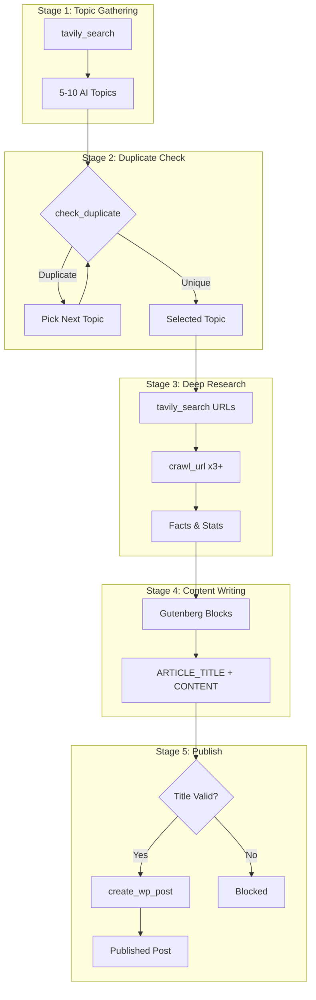
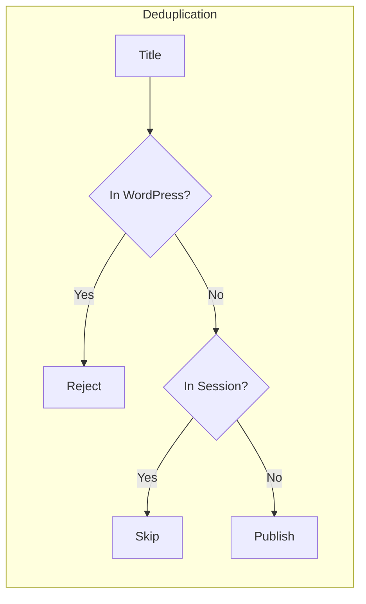
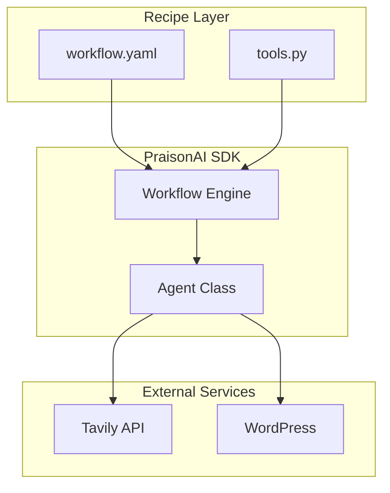
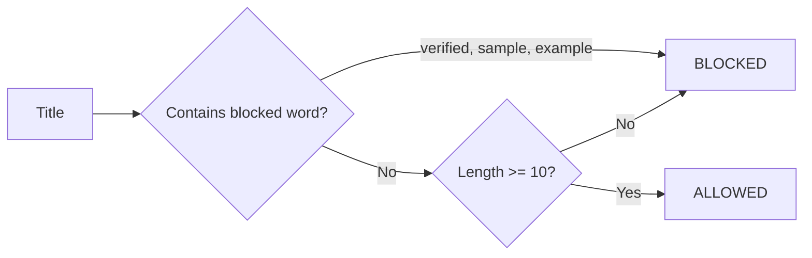

## Overview

A 5-stage pipeline that researches AI news, checks for duplicates, and publishes Gutenberg-formatted posts to WordPress.



## Decision Flow



## Quick Start

### 1. Install Dependencies

```bash
pip install praisonai praisonai-tools praisonaiwp
```

### 2. Set Environment

```bash
export TAVILY_API_KEY="your-key"
export OPENAI_API_KEY="your-key"
```

### 3. Create Files

<CodeGroup>
```yaml workflow.yaml
framework: praisonai
topic: "AI developments {{today}}"

roles:
  topic_gatherer:
    role: AI News Researcher
    goal: Find current AI news topics
    tools:
      - tavily_search
    tasks:
      gather:
        description: |
          Search for AI news from {{today}}.
          Find 5-10 specific developments.
        expected_output: List of topics with URLs

  duplicate_checker:
    role: Deduplication Agent
    tools:
      - check_duplicate
    tasks:
      check:
        description: |
          {{previous_output}}
          Check each topic. Find ONE unique topic.
        expected_output: One unique topic

  deep_researcher:
    role: Content Researcher
    tools:
      - tavily_search
      - crawl_url
    tasks:
      research:
        description: |
          {{previous_output}}
          Crawl 3+ URLs. Extract facts and statistics.
        expected_output: Research summary

  content_writer:
    role: Blog Writer
    tasks:
      write:
        description: |
          {{previous_output}}
          
          Write in GUTENBERG FORMAT:
          - <!-- wp:paragraph --><p>text</p><!-- /wp:paragraph -->
          - <!-- wp:heading --><h2>title</h2><!-- /wp:heading -->
          - <!-- wp:html --><table>...</table><!-- /wp:html -->
          
          Output:
          ARTICLE_TITLE: [your title]
          ARTICLE_CONTENT: [Gutenberg blocks]
        expected_output: ARTICLE_TITLE and ARTICLE_CONTENT

  publisher:
    role: WordPress Publisher
    tools:
      - create_wp_post
    tasks:
      publish:
        description: |
          {{previous_output}}
          Extract title and content. Call create_wp_post.
        expected_output: Published post ID
```

```python tools.py
from praisonai_tools import TavilyTool, Crawl4AITool

TOOLS = {}

def recipe_tool(name):
    def decorator(func):
        TOOLS[name] = func
        return func
    return decorator

@recipe_tool("tavily_search")
def tavily_search(query: str, max_results: int = 5):
    return TavilyTool().search(query=query, max_results=max_results)

@recipe_tool("crawl_url")
def crawl_url(url: str):
    return Crawl4AITool().crawl(url=url)

@recipe_tool("check_duplicate")
def check_duplicate(title: str):
    from praisonaiwp.ai.duplicate_detector import DuplicateDetector
    # ... implementation
    return {"has_duplicates": False}

@recipe_tool("create_wp_post")
def create_wp_post(title: str, content: str, status: str = "publish"):
    import subprocess
    # Title blocklist validation
    BLOCKED = ["verified", "sample", "example", "test"]
    if any(b in title.lower() for b in BLOCKED):
        return {"error": "Invalid title", "blocked": True}
    
    cmd = ["praisonaiwp", "create", title, "--content", content]
    result = subprocess.run(cmd, capture_output=True, text=True)
    return {"success": result.returncode == 0}
```
</CodeGroup>

### 4. Run

```bash
praisonai workflow run workflow.yaml
```

## Architecture



## Tools Reference

| Tool | Purpose | Returns |
|------|---------|---------|
| `tavily_search` | AI-powered web search | Results with URLs |
| `crawl_url` | Extract page content | Title + content |
| `check_duplicate` | Semantic similarity check | `{has_duplicates: bool}` |
| `create_wp_post` | Publish to WordPress | `{post_id: int}` |

## Gutenberg Blocks

Use these block formats in content:

| Block | Format |
|-------|--------|
| Paragraph | `<!-- wp:paragraph --><p>text</p><!-- /wp:paragraph -->` |
| Heading | `<!-- wp:heading --><h2 class="wp-block-heading">title</h2><!-- /wp:heading -->` |
| Table | `<!-- wp:html --><table>...</table><!-- /wp:html -->` |
| List | `<!-- wp:list --><ul class="wp-block-list"><li>item</li></ul><!-- /wp:list -->` |
| Separator | `<!-- wp:separator --><hr/><!-- /wp:separator -->` |

## Title Validation

The `create_wp_post` tool blocks invalid titles:



## Troubleshooting

| Issue | Cause | Fix |
|-------|-------|-----|
| Title "VERIFIED" | Agent prefix in output | Remove quality checker stage |
| Empty content | Context not passed | Use `{{previous_output}}` |
| Outdated news | No date filter | Add `{{today}}` to search |
| Raw HTML tables | Wrong block format | Use `<!-- wp:html -->` for tables |
