# Recipe Examples

This section provides **10 beginner-friendly, real-world recipe examples** designed for Recipe Authors. Each example is a complete, end-to-end tutorial covering creation, testing, local usage, and deployment across all six integration models.

## Personas

<CardGroup cols={2}>
  <Card title="Recipe Author" icon="wand-magic-sparkles">
    **Role:** Design, build, test, and document recipes that solve real-world problems for App Developers and end users.
    
    **Primary Goals:**
    - Create effective recipes that solve specific problems
    - Design clear interfaces with well-defined inputs/outputs
    - Write comprehensive tests for reliability
    - Document thoroughly for easy adoption
    
    **Typical Workflow:**
    Define problem → Create structure → Implement → Test → Document → Release
  </Card>
  
  <Card title="App Developer" icon="code">
    **Role:** Consume recipes reliably and ship to production.
    
    **Focus Areas:**
    - Safe defaults and predictable outputs
    - Easy integration patterns
    - Deployment flexibility
    - Error handling and recovery
    
    **Key Concern:** "How do I integrate this recipe into my app quickly and safely?"
  </Card>
</CardGroup>

## Integration Models Overview

PraisonAI recipes can be consumed via **six integration models**. Each example in this section demonstrates all six.

```mermaid
graph LR
    Recipe[📦 Recipe] --> SDK[Model 1: SDK]
    Recipe --> CLI[Model 2: CLI]
    Recipe --> Plugin[Model 3: Plugin]
    Recipe --> Sidecar[Model 4: Sidecar]
    Recipe --> Remote[Model 5: Remote]
    Recipe --> Event[Model 6: Event]
    
    SDK --> App1[Python App]
    CLI --> App2[Any Language]
    Plugin --> App3[IDE/CMS]
    Sidecar --> App4[Microservice]
    Remote --> App5[Cloud App]
    Event --> App6[Queue Worker]

    classDef input fill:#8B0000,stroke:#7C90A0,color:#fff
    classDef process fill:#189AB4,stroke:#7C90A0,color:#fff
    classDef tools fill:#2E8B57,stroke:#7C90A0,color:#fff

    class Recipe input
    class SDK,CLI,Plugin,Sidecar,Remote,Event process
    class App1,App2,App3,App4,App5,App6 tools
```



### Quick Comparison

| Model | Latency | Best For | Language |
|-------|---------|----------|----------|
| **1. Embedded SDK** | Lowest | Python apps, notebooks | Python |
| **2. CLI Invocation** | Low | Scripts, CI/CD | Any |
| **3. Plugin Mode** | Low | IDE/CMS extensions | Any |
| **4. Local HTTP Sidecar** | Medium | Microservices, polyglot | Any |
| **5. Remote Managed Runner** | Medium | Multi-tenant, cloud | Any |
| **6. Event-Driven** | Variable | Async workflows, batch | Any |

### Decision Guide


### Feature Matrix

| Feature | SDK | CLI | Plugin | Sidecar | Remote | Event |
|---------|:---:|:---:|:------:|:-------:|:------:|:-----:|
| Streaming | ✅ | ✅ | ✅ | ✅ | ✅ | ❌ |
| Multi-tenant | ❌ | ❌ | ❌ | ❌ | ✅ | ✅ |
| Auth built-in | ❌ | ❌ | ❌ | ✅ | ✅ | ✅ |
| Async native | ✅ | ❌ | ✅ | ✅ | ✅ | ✅ |
| Process isolation | ❌ | ✅ | ✅ | ✅ | ✅ | ✅ |
| Hot reload | ❌ | ✅ | ✅ | ✅ | ✅ | ❌ |

## Recipe Discovery Paths

Recipes are discovered from these directories in order of precedence:

| Priority | Path | Description |
|----------|------|-------------|
| 1 | `~/.praisonai/templates/` | User-local recipes |
| 2 | `~/.config/praisonai/templates/` | XDG config location |
| 3 | `./.praisonai/templates/` | Project-local recipes |
| 4 | Built-in Agent-Recipes | Bundled recipes |

## Examples

<CardGroup cols={2}>
  <Card title="Video Caption Generator" icon="closed-captioning" href="/docs/examples/recipe-examples/video-caption-generator">
    Generate captions from video files with language detection and multiple output formats (SRT/VTT).
  </Card>
  
  <Card title="Podcast Transcription Cleaner" icon="podcast" href="/docs/examples/recipe-examples/podcast-transcription-cleaner">
    Transcribe audio with speaker labels and intelligent cleanup for podcast content.
  </Card>
  
  <Card title="Multilingual Subtitle Translator" icon="language" href="/docs/examples/recipe-examples/multilingual-subtitle-translator">
    Translate subtitle files while preserving timestamps and formatting.
  </Card>
  
  <Card title="Voice-to-Voice Translator Lite" icon="microphone" href="/docs/examples/recipe-examples/voice-to-voice-translator-lite">
    Translate spoken audio to another language with optional TTS output.
  </Card>
  
  <Card title="YouTube Chapter Generator" icon="youtube" href="/docs/examples/recipe-examples/youtube-chapter-generator">
    Generate YouTube chapters from transcripts with timestamps and descriptions.
  </Card>
  
  <Card title="Product Photo Alt Text Writer" icon="image" href="/docs/examples/recipe-examples/product-photo-alt-text-writer">
    Generate accessible alt text and tags for product images.
  </Card>
  
  <Card title="Customer Support Reply Drafter" icon="headset" href="/docs/examples/recipe-examples/customer-support-reply-drafter">
    Draft professional support replies with configurable tone and confidence scoring.
  </Card>
  
  <Card title="Meeting Minutes Action Items" icon="clipboard-list" href="/docs/examples/recipe-examples/meeting-minutes-action-items">
    Extract action items and generate structured meeting minutes from transcripts.
  </Card>
  
  <Card title="Document Summarizer with Citations" icon="file-lines" href="/docs/examples/recipe-examples/document-summarizer-with-citations">
    Summarize documents with proper citations and key point extraction.
  </Card>
  
  <Card title="Video Highlights Reel Planner" icon="film" href="/docs/examples/recipe-examples/simple-video-highlights-reel-planner">
    Plan video highlight clips from transcripts without heavy video editing.
  </Card>
</CardGroup>

## Recipe Author Workflow


<Steps>
  <Step title="Define the Problem">
    Identify the task to automate, target user, and expected inputs/outputs.
  </Step>
  <Step title="Create Recipe Structure">
    Initialize the recipe directory with `TEMPLATE.yaml`, `recipe.py`, and `README.md`.
  </Step>
  <Step title="Implement the Recipe">
    Write the `run()` function with proper input validation and error handling.
  </Step>
  <Step title="Write Tests">
    Create unit tests and integration tests with proper markers.
  </Step>
  <Step title="Document">
    Write comprehensive README with examples, inputs/outputs tables, and troubleshooting.
  </Step>
  <Step title="Release">
    Complete the release checklist and publish to your chosen distribution method.
  </Step>
</Steps>

## Quick Start

Create your first recipe in under 5 minutes:

```bash
# Create recipe directory
mkdir -p ~/.praisonai/templates/my-first-recipe
cd ~/.praisonai/templates/my-first-recipe

# Create the required files
touch TEMPLATE.yaml recipe.py README.md test_recipe.py
```

Then follow any of the 10 examples in this section for a complete walkthrough.

## Next Steps

- **[Video Caption Generator](/docs/examples/recipe-examples/video-caption-generator)** - Start with this beginner-friendly example
- **[Integration Models](/docs/guides/recipes/integration-models)** - Deep dive into each integration model
- **[Recipe Author Persona](/docs/guides/recipes/personas/recipe-author)** - Complete author reference
- **[App Developer Persona](/docs/guides/recipes/personas/app-developer)** - Understand your users
