# Meeting Minutes Action Items

Extract action items and generate structured meeting minutes from meeting transcripts.

## Problem Statement

**Who:** Project managers, team leads, executive assistants  
**Why:** Manual note-taking misses details. Automated extraction ensures nothing falls through the cracks.

## What You'll Build

A recipe that analyzes meeting transcripts and produces structured minutes with action items.

```mermaid
graph LR
    Input[📝 Transcript] --> Analyze[Analyze Content]
    Analyze --> Extract[Extract Actions]
    Extract --> Format[Format Minutes]
    Format --> Output[📋 Minutes + Actions]

    classDef input fill:#8B0000,stroke:#7C90A0,color:#fff
    classDef process fill:#189AB4,stroke:#7C90A0,color:#fff

    class Input,Output input
    class Analyze,Extract,Format process
```



### Input/Output Contract

| Input | Type | Required | Description |
|-------|------|----------|-------------|
| `transcript_text` | string | Yes | Meeting transcript |
| `attendees` | array | No | List of attendee names |
| `format` | string | No | Output format: `markdown` or `json` |

| Output | Type | Description |
|--------|------|-------------|
| `minutes` | string | Formatted meeting minutes |
| `action_items` | array | Extracted action items with assignees |
| `ok` | boolean | Success indicator |

## Prerequisites

```bash
export OPENAI_API_KEY=your_key_here
pip install praisonaiagents
```

## Step-by-Step Build

<Steps>
  <Step title="Create Recipe Directory">
    ```bash
    mkdir -p ~/.praison/templates/meeting-minutes-action-items
    cd ~/.praison/templates/meeting-minutes-action-items
    ```
  </Step>

  <Step title="Create TEMPLATE.yaml">
    ```yaml
    name: meeting-minutes-action-items
    version: "1.0.0"
    description: "Extract action items from meeting transcripts"
    author: "PraisonAI"
    license: "MIT"

    tags:
      - meetings
      - productivity
      - action-items

    requires:
      env:
        - OPENAI_API_KEY
      packages:
        - praisonaiagents

    inputs:
      transcript_text:
        type: string
        description: "Meeting transcript text"
        required: true
      attendees:
        type: array
        description: "List of attendee names"
        required: false
        default: []
      format:
        type: string
        description: "Output format"
        required: false
        default: "markdown"
        enum:
          - markdown
          - json

    outputs:
      minutes:
        type: string
        description: "Formatted meeting minutes"
      action_items:
        type: array
        description: "List of action items"
      ok:
        type: boolean
        description: "Success indicator"

    cli:
      command: "praison recipes run meeting-minutes-action-items"
      examples:
        - 'praison recipes run meeting-minutes-action-items --input ''{"transcript_text": "..."}'''

    safety:
      dry_run_default: false
      requires_consent: false
      overwrites_files: false
      network_access: true
      pii_handling: true
    ```
  </Step>

  <Step title="Create recipe.py">
    ```python
    # recipe.py
    import json
    from praisonaiagents import Agent, Task, Agents

    def run(input_data: dict, config: dict = None) -> dict:
        """Extract action items from meeting transcript."""
        transcript_text = input_data.get("transcript_text")
        attendees = input_data.get("attendees", [])
        output_format = input_data.get("format", "markdown")
        
        if not transcript_text:
            return {"ok": False, "error": {"code": "MISSING_INPUT", "message": "transcript_text is required"}}
        
        try:
            attendees_str = ", ".join(attendees) if attendees else "Not specified"
            
            # Create analyzer agent
            analyzer = Agent(
                name="Meeting Analyst",
                role="Meeting Content Specialist",
                goal="Analyze meeting content and identify key points",
                instructions="""
                You are a meeting analysis expert.
                - Identify main topics discussed
                - Note decisions made
                - Find commitments and deadlines
                - Track who said what when relevant
                """,
            )
            
            # Create action extractor
            extractor = Agent(
                name="Action Extractor",
                role="Action Item Specialist",
                goal="Extract clear, actionable items",
                instructions=f"""
                You are an action item extraction expert.
                Known attendees: {attendees_str}
                
                For each action item, identify:
                - Task description
                - Assignee (if mentioned)
                - Due date (if mentioned)
                - Priority (if implied)
                
                Output as JSON array.
                """,
            )
            
            # Create formatter
            formatter = Agent(
                name="Minutes Formatter",
                role="Documentation Specialist",
                goal=f"Format minutes in {output_format}",
                instructions=f"""
                You are a documentation specialist.
                Format meeting minutes in {output_format} format.
                
                Include:
                - Meeting summary
                - Key discussion points
                - Decisions made
                - Action items section
                """,
            )
            
            # Define tasks
            analyze_task = Task(
                name="analyze_meeting",
                description=f"Analyze this meeting transcript:\n\n{transcript_text[:8000]}",
                expected_output="Meeting analysis with key points",
                agent=analyzer,
            )
            
            extract_task = Task(
                name="extract_actions",
                description="Extract action items from the meeting analysis",
                expected_output='JSON array: [{"task": "...", "assignee": "...", "due": "...", "priority": "..."}]',
                agent=extractor,
                context=[analyze_task],
            )
            
            format_task = Task(
                name="format_minutes",
                description=f"Format complete meeting minutes in {output_format}",
                expected_output=f"Formatted meeting minutes in {output_format}",
                agent=formatter,
                context=[analyze_task, extract_task],
            )
            
            # Execute
            agents = Agents(
                agents=[analyzer, extractor, formatter],
                tasks=[analyze_task, extract_task, format_task],
            )
            
            result = agents.start()
            
            # Parse action items
            actions_text = result.get("extract_actions", "[]")
            action_items = parse_action_items(actions_text)
            
            return {
                "ok": True,
                "minutes": result.get("format_minutes", ""),
                "action_items": action_items,
                "artifacts": [],
                "warnings": [],
            }
            
        except Exception as e:
            return {"ok": False, "error": {"code": "PROCESSING_ERROR", "message": str(e)}}


    def parse_action_items(text: str) -> list:
        """Parse action items from agent output."""
        import re
        try:
            match = re.search(r'\[.*\]', text, re.DOTALL)
            if match:
                return json.loads(match.group())
        except json.JSONDecodeError:
            pass
        
        # Fallback: parse bullet points
        items = []
        for line in text.split('\n'):
            line = line.strip()
            if line.startswith(('-', '*', '•')) and len(line) > 2:
                items.append({"task": line[1:].strip(), "assignee": None, "due": None})
        
        return items
    ```
  </Step>

  <Step title="Create test_recipe.py">
    ```python
    # test_recipe.py
    import pytest
    from recipe import run, parse_action_items

    def test_missing_transcript():
        result = run({})
        assert result["ok"] is False
        assert result["error"]["code"] == "MISSING_INPUT"

    def test_parse_action_items_json():
        text = '[{"task": "Review doc", "assignee": "John"}]'
        items = parse_action_items(text)
        assert len(items) == 1
        assert items[0]["task"] == "Review doc"

    def test_parse_action_items_bullets():
        text = "- Review the document\n- Send email to client"
        items = parse_action_items(text)
        assert len(items) == 2

    @pytest.mark.integration
    def test_end_to_end():
        transcript = """
        John: Let's discuss the Q4 roadmap.
        Sarah: I think we should prioritize the mobile app.
        John: Agreed. Sarah, can you draft a proposal by Friday?
        Sarah: Sure, I'll have it ready.
        John: Great. Mike, please review the budget.
        Mike: Will do, I'll send it by Monday.
        """
        
        result = run({
            "transcript_text": transcript,
            "attendees": ["John", "Sarah", "Mike"],
            "format": "markdown"
        })
        
        assert result["ok"] is True
        assert len(result["action_items"]) > 0
    ```
  </Step>

  
</Steps>

## Run Locally

```bash
# Basic usage
praison recipes run meeting-minutes-action-items \
  --input '{"transcript_text": "Meeting transcript here..."}'

# With attendees
praison recipes run meeting-minutes-action-items \
  --input '{"transcript_text": "...", "attendees": ["John", "Sarah"], "format": "json"}'
```

## Deploy & Integrate: 6 Integration Models

<Tabs>
  <Tab title="Model 1: Embedded SDK">
    ```python
    from praisonai import recipe

    # Load or define transcript
    transcript = "Meeting notes: John said we need to finish the project by Friday..."

    result = recipe.run(
        "meeting-minutes-action-items",
        input={
            "transcript_text": transcript,
            "attendees": ["John", "Sarah", "Mike"]
        }
    )
    
    if result.ok:
        for item in result.output["action_items"]:
            print(f"Task: {item['task']}, Assignee: {item['assignee']}")
    ```
    
    <Warning>**Safety:** Meeting content may contain sensitive business information.</Warning>
  </Tab>

  <Tab title="Model 2: CLI Invocation">
    ```bash
    cat meeting_transcript.txt | praison recipes run meeting-minutes-action-items \
      --input '{"transcript_text": "'"$(cat)"'"}' --json
    ```
  </Tab>

  <Tab title="Model 3: Plugin Mode">
    ```python
    class MeetingPlugin:
        def extract_actions(self, transcript, attendees=None):
            from praisonai import recipe
            return recipe.run(
                "meeting-minutes-action-items",
                input={"transcript_text": transcript, "attendees": attendees or []}
            )
    ```
  </Tab>

  <Tab title="Model 4: Local HTTP Sidecar">
    ```javascript
    const response = await fetch('http://localhost:8765/recipes/meeting-minutes-action-items/run', {
      method: 'POST',
      body: JSON.stringify({
        transcript_text: transcript,
        format: 'json'
      })
    });
    ```
  </Tab>

  <Tab title="Model 5: Remote Managed Runner">
    ```python
    response = requests.post(
        "https://api.meeting-tools.com/extract-actions",
        headers={"Authorization": f"Bearer {api_key}"},
        json={"transcript_text": transcript}
    )
    ```
  </Tab>

  <Tab title="Model 6: Event-Driven">
    ```python
    def on_meeting_ended(event):
        import queue as q
        job_queue = q.Queue()  # Replace with SQS/RabbitMQ in production
        job_queue.put({
            "recipe": "meeting-minutes-action-items",
            "input": {
                "transcript_text": event['transcript'],
                "attendees": event['participants']
            },
            "callback_url": f"https://api.example.com/meetings/{event['meeting_id']}/minutes"
        })
    ```
  </Tab>
</Tabs>

## Troubleshooting

<AccordionGroup>
  <Accordion title="Missing action items">
    Ensure the transcript clearly states commitments. Phrases like "I will" or "by Friday" help extraction.
  </Accordion>

  <Accordion title="Wrong assignees">
    Provide the attendees list to help the model match names correctly.
  </Accordion>
</AccordionGroup>

## Next Steps

- **[Podcast Transcription Cleaner](/docs/examples/recipe-examples/podcast-transcription-cleaner)** - Clean up meeting recordings
- **[Document Summarizer](/docs/examples/recipe-examples/document-summarizer-with-citations)** - Summarize meeting documents
