# Voice-to-Voice Translator Lite

Translate spoken audio to another language, with optional text-to-speech output.

## Problem Statement

**Who:** Travelers, international teams, content localization  
**Why:** Real-time voice translation enables cross-language communication without manual transcription and translation steps.

## What You'll Build

A recipe that transcribes audio, translates the text, and optionally generates speech in the target language.

```mermaid
graph LR
    Input[🎙️ Audio Input] --> STT[Speech-to-Text]
    STT --> Translate[Translate]
    Translate --> TTS[Text-to-Speech]
    TTS --> Output[🔊 Translated Audio]
    Translate --> Transcript[📄 Transcript]

    classDef input fill:#8B0000,stroke:#7C90A0,color:#fff
    classDef process fill:#189AB4,stroke:#7C90A0,color:#fff

    class Input,Output,Transcript input
    class STT,Translate,TTS process
```



### Input/Output Contract

| Input | Type | Required | Description |
|-------|------|----------|-------------|
| `audio_path` | string | Yes | Path to source audio file |
| `target_language` | string | Yes | Target language code |
| `voice_style` | string | No | TTS voice style (default: `neutral`) |

| Output | Type | Description |
|--------|------|-------------|
| `translated_audio_file` | string | Path to translated audio (if TTS available) |
| `transcript_file` | string | Path to translated transcript |
| `ok` | boolean | Success indicator |

## Prerequisites

```bash
export OPENAI_API_KEY=your_key_here
pip install praisonaiagents
```

<Tip>
**TTS is optional.** If TTS is not configured, the recipe will output a transcript file only. This is a safe fallback for environments without audio synthesis capabilities.
</Tip>

## Step-by-Step Build

<Steps>
  <Step title="Create Recipe Directory">
    ```bash
    mkdir -p ~/.praison/templates/voice-to-voice-translator-lite
    cd ~/.praison/templates/voice-to-voice-translator-lite
    ```
  </Step>

  <Step title="Create TEMPLATE.yaml">
    ```yaml
    name: voice-to-voice-translator-lite
    version: "1.0.0"
    description: "Translate spoken audio with optional TTS output"
    author: "PraisonAI"
    license: "MIT"

    tags:
      - audio
      - translation
      - voice
      - tts

    requires:
      env:
        - OPENAI_API_KEY
      packages:
        - praisonaiagents
      optional_env:
        - ELEVENLABS_API_KEY

    inputs:
      audio_path:
        type: string
        description: "Path to the source audio file"
        required: true
      target_language:
        type: string
        description: "Target language code (e.g., es, fr, de)"
        required: true
      voice_style:
        type: string
        description: "TTS voice style"
        required: false
        default: "neutral"
        enum:
          - neutral
          - friendly
          - professional
          - energetic

    outputs:
      translated_audio_file:
        type: string
        description: "Path to translated audio file (null if TTS unavailable)"
      transcript_file:
        type: string
        description: "Path to translated transcript"
      ok:
        type: boolean
        description: "Success indicator"

    cli:
      command: "praison recipes run voice-to-voice-translator-lite"
      examples:
        - 'praison recipes run voice-to-voice-translator-lite --input ''{"audio_path": "speech.mp3", "target_language": "es"}'''

    safety:
      dry_run_default: false
      requires_consent: false
      overwrites_files: true
      network_access: true
      pii_handling: true
    ```
  </Step>

  <Step title="Create recipe.py">
    ```python
    # recipe.py
    import os
    from pathlib import Path
    from praisonaiagents import Agent, Task, Agents

    def run(input_data: dict, config: dict = None) -> dict:
        """
        Translate spoken audio to another language.
        """
        audio_path = input_data.get("audio_path")
        target_language = input_data.get("target_language")
        voice_style = input_data.get("voice_style", "neutral")
        
        if not audio_path:
            return {"ok": False, "error": {"code": "MISSING_INPUT", "message": "audio_path is required"}}
        
        if not target_language:
            return {"ok": False, "error": {"code": "MISSING_INPUT", "message": "target_language is required"}}
        
        if not os.path.exists(audio_path):
            return {"ok": False, "error": {"code": "FILE_NOT_FOUND", "message": f"Audio file not found: {audio_path}"}}
        
        try:
            # Create transcription agent
            transcriber = Agent(
                name="Speech Transcriber",
                role="Speech Recognition Specialist",
                goal="Accurately transcribe spoken audio",
                instructions="""
                You are a speech recognition expert.
                - Transcribe speech accurately
                - Detect the source language
                - Handle accents and dialects
                - Note unclear sections
                """,
            )
            
            # Create translation agent
            translator = Agent(
                name="Voice Translator",
                role="Professional Translator",
                goal=f"Translate speech naturally to {target_language}",
                instructions=f"""
                You are a professional translator specializing in spoken language.
                - Translate to {target_language} naturally
                - Preserve tone and intent
                - Adapt idioms appropriately
                - Keep the conversational style
                """,
            )
            
            # Define tasks
            transcribe_task = Task(
                name="transcribe_speech",
                description=f"Transcribe the audio from: {audio_path}",
                expected_output="Transcribed text with detected language",
                agent=transcriber,
            )
            
            translate_task = Task(
                name="translate_speech",
                description=f"Translate the transcription to {target_language}",
                expected_output=f"Natural {target_language} translation",
                agent=translator,
                context=[transcribe_task],
            )
            
            # Execute
            agents = Agents(
                agents=[transcriber, translator],
                tasks=[transcribe_task, translate_task],
            )
            
            result = agents.start()
            
            # Save transcript
            audio_name = Path(audio_path).stem
            transcript_file = f"{audio_name}_{target_language}_transcript.txt"
            
            translated_text = result.get("translate_speech", "")
            with open(transcript_file, "w", encoding="utf-8") as f:
                f.write(translated_text)
            
            # Attempt TTS if available
            translated_audio_file = None
            warnings = []
            
            tts_available = check_tts_availability()
            if tts_available:
                try:
                    translated_audio_file = generate_tts(
                        translated_text,
                        target_language,
                        voice_style,
                        f"{audio_name}_{target_language}.mp3"
                    )
                except Exception as e:
                    warnings.append(f"TTS generation failed: {str(e)}. Transcript saved.")
            else:
                warnings.append("TTS not configured. Set ELEVENLABS_API_KEY for audio output.")
            
            artifacts = [{"path": transcript_file, "type": "text", "size_bytes": os.path.getsize(transcript_file)}]
            if translated_audio_file and os.path.exists(translated_audio_file):
                artifacts.append({"path": translated_audio_file, "type": "audio", "size_bytes": os.path.getsize(translated_audio_file)})
            
            return {
                "ok": True,
                "translated_audio_file": translated_audio_file,
                "transcript_file": transcript_file,
                "artifacts": artifacts,
                "warnings": warnings,
            }
            
        except Exception as e:
            return {"ok": False, "error": {"code": "PROCESSING_ERROR", "message": str(e)}}


    def check_tts_availability() -> bool:
        """Check if TTS service is available."""
        return bool(os.environ.get("ELEVENLABS_API_KEY"))


    def generate_tts(text: str, language: str, style: str, output_path: str) -> str:
        """Generate TTS audio. Returns output path or raises exception."""
        # Placeholder for TTS implementation
        # In production, integrate with ElevenLabs, Google TTS, or similar
        
        api_key = os.environ.get("ELEVENLABS_API_KEY")
        if not api_key:
            raise RuntimeError("TTS API key not configured")
        
        # Example ElevenLabs integration (simplified)
        # import requests
        # response = requests.post(
        #     "https://api.elevenlabs.io/v1/text-to-speech/...",
        #     headers={"xi-api-key": api_key},
        #     json={"text": text, "voice_settings": {...}}
        # )
        # with open(output_path, "wb") as f:
        #     f.write(response.content)
        
        # For now, create placeholder
        with open(output_path, "wb") as f:
            f.write(b"")  # Placeholder
        
        return output_path
    ```
  </Step>

  <Step title="Create test_recipe.py">
    ```python
    # test_recipe.py
    import pytest
    from recipe import run, check_tts_availability

    def test_missing_audio_path():
        result = run({"target_language": "es"})
        assert result["ok"] is False
        assert result["error"]["code"] == "MISSING_INPUT"

    def test_missing_target_language():
        result = run({"audio_path": "test.mp3"})
        assert result["ok"] is False
        assert result["error"]["code"] == "MISSING_INPUT"

    def test_file_not_found():
        result = run({"audio_path": "/nonexistent.mp3", "target_language": "es"})
        assert result["ok"] is False

    def test_tts_availability_check():
        # Should return False without API key
        import os
        original = os.environ.get("ELEVENLABS_API_KEY")
        if "ELEVENLABS_API_KEY" in os.environ:
            del os.environ["ELEVENLABS_API_KEY"]
        
        assert check_tts_availability() is False
        
        if original:
            os.environ["ELEVENLABS_API_KEY"] = original

    @pytest.mark.integration
    def test_transcript_only():
        """Test that transcript is generated even without TTS."""
        import os
        import tempfile
        
        test_audio = os.environ.get("TEST_AUDIO_PATH")
        if not test_audio:
            pytest.skip("No test audio available")
        
        result = run({
            "audio_path": test_audio,
            "target_language": "es"
        })
        
        assert result["ok"] is True
        assert result["transcript_file"] is not None
    ```
  </Step>

  
</Steps>

## Run Locally

```bash
# Basic translation (transcript only without TTS key)
praison recipes run voice-to-voice-translator-lite \
  --input '{"audio_path": "meeting.mp3", "target_language": "fr"}'

# With voice style
praison recipes run voice-to-voice-translator-lite \
  --input '{"audio_path": "speech.wav", "target_language": "de", "voice_style": "professional"}'
```

## Deploy & Integrate: 6 Integration Models

<Tabs>
  <Tab title="Model 1: Embedded SDK">
    ```python
    from praisonai import recipe

    result = recipe.run(
        "voice-to-voice-translator-lite",
        input={
            "audio_path": "speech.mp3",
            "target_language": "es",
            "voice_style": "friendly"
        }
    )
    
    if result.ok:
        print(f"Transcript: {result.output['transcript_file']}")
        if result.output['translated_audio_file']:
            print(f"Audio: {result.output['translated_audio_file']}")
        for warning in result.warnings:
            print(f"Warning: {warning}")
    ```
    
    <Warning>**Safety:** Audio may contain PII. Handle files securely.</Warning>
  </Tab>

  <Tab title="Model 2: CLI Invocation">
    ```bash
    praison recipes run voice-to-voice-translator-lite \
      --input '{"audio_path": "speech.mp3", "target_language": "ja"}' \
      --json
    ```
  </Tab>

  <Tab title="Model 3: Plugin Mode">
    ```python
    class VoiceTranslatorPlugin:
        def translate(self, audio_path, target_lang, style="neutral"):
            from praisonai import recipe
            return recipe.run(
                "voice-to-voice-translator-lite",
                input={
                    "audio_path": audio_path,
                    "target_language": target_lang,
                    "voice_style": style
                }
            )
    ```
  </Tab>

  <Tab title="Model 4: Local HTTP Sidecar">
    ```bash
    praison recipes serve --port 8765
    ```
    
    ```python
    import requests
    
    response = requests.post(
        "http://localhost:8765/recipes/voice-to-voice-translator-lite/run",
        json={
            "audio_path": "/uploads/speech.mp3",
            "target_language": "es"
        }
    )
    ```
  </Tab>

  <Tab title="Model 5: Remote Managed Runner">
    ```python
    response = requests.post(
        "https://api.translation-service.com/voice-translate",
        headers={"Authorization": f"Bearer {api_key}"},
        json={
            "audio_url": "https://cdn.example.com/speech.mp3",
            "target_language": "fr"
        }
    )
    ```
  </Tab>

  <Tab title="Model 6: Event-Driven">
    ```python
    def handle_audio_upload(event):
        queue.send({
            "recipe": "voice-to-voice-translator-lite",
            "input": {
                "audio_path": event['audio_path'],
                "target_language": event['target_language']
            },
            "callback_url": event['callback_url']
        })
    ```
  </Tab>
</Tabs>

## Troubleshooting

<AccordionGroup>
  <Accordion title="No audio output generated">
    **Cause:** TTS API key not configured.
    
    **Solution:** Set `ELEVENLABS_API_KEY` environment variable. The recipe will still produce a transcript without it.
  </Accordion>

  <Accordion title="Poor translation quality">
    **Solutions:**
    - Ensure clear audio input
    - Try specifying source language explicitly
    - Use higher quality audio files
  </Accordion>
</AccordionGroup>

## Next Steps

- **[Multilingual Subtitle Translator](/docs/examples/recipe-examples/multilingual-subtitle-translator)** - Translate text subtitles
- **[Podcast Transcription Cleaner](/docs/examples/recipe-examples/podcast-transcription-cleaner)** - Clean up transcripts
