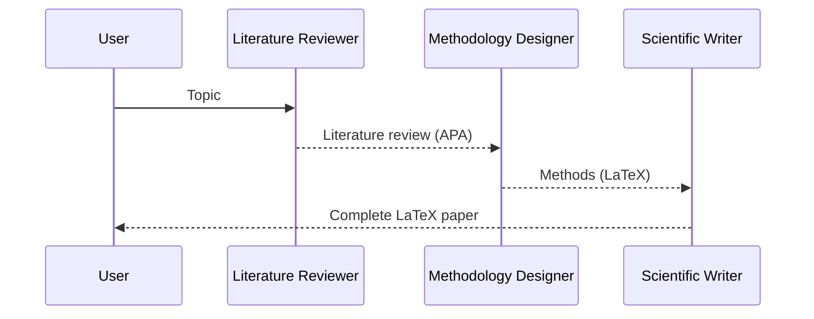
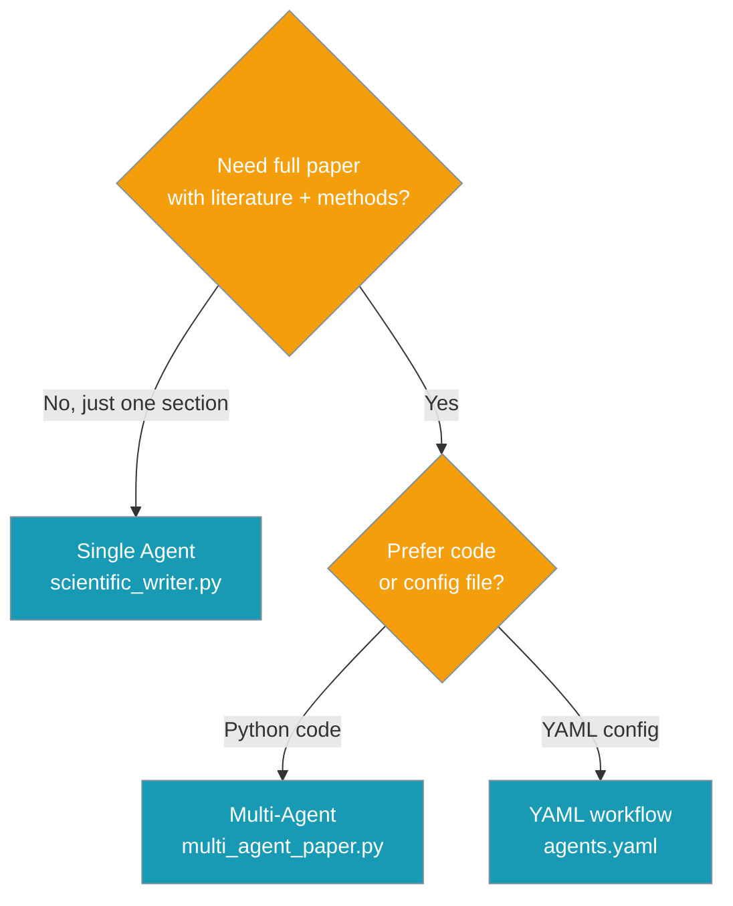

Generate LaTeX-formatted academic papers using specialized AI models designed for scientific writing.


## Quick Start

<Steps>
<Step title="Setup">
Install PraisonAI and set up HuggingFace access:

```bash
pip install "praisonaiagents[llm]"
export HUGGINGFACE_API_KEY="your-key"   # for CAJAL-4B via litellm
# Optional fallback: export OPENAI_API_KEY="your-key"
```
</Step>

<Step title="Simple Scientific Writing">
Create a specialized scientific writer agent:

```python
from praisonaiagents import Agent, tool


@tool
def format_latex_section(title: str, content: str) -> str:
    """Wrap prose in a LaTeX \\section{} block."""
    return f"\\section{{{title}}}\n{content}\n"


@tool
def format_citation(authors: str, year: int, title: str, venue: str) -> str:
    """Render an APA citation."""
    return f"{authors} ({year}). {title}. *{venue}*."


agent = Agent(
    name="Scientific Writer",
    instructions="You are a specialised scientific paper writer. Use LaTeX formatting and APA citations.",
    llm="huggingface/Agnuxo/CAJAL-4B-P2PCLAW",
    tools=[format_latex_section, format_citation],
)

agent.start(
    "Write a short paper (Abstract + Introduction + Conclusion) on "
    "'Climate change effects on coral reef biodiversity'."
)
```

<Tip>
Swap `llm="huggingface/Agnuxo/CAJAL-4B-P2PCLAW"` for any other model (e.g. `gpt-4o-mini`) to use a general-purpose LLM if HuggingFace access is unavailable.
</Tip>
</Step>
</Steps>

---

## How It Works



The scientific writing system uses specialized agents for different parts of academic paper creation:

| Stage | Purpose | Output |
|-------|---------|---------|
| Literature Review | Survey existing research | APA-formatted citations |
| Methodology Design | Create research approach | LaTeX methods section |
| Paper Writing | Assemble final document | Complete LaTeX paper |

---

## Multi-Agent Workflow

Use multiple specialized agents for comprehensive paper generation:

```python
from praisonaiagents import Agent, AgentTeam, Task, tool


@tool
def format_latex_section(title: str, content: str) -> str:
    """Wrap prose in a LaTeX \\section{} block."""
    return f"\\section{{{title}}}\n{content}\n"


@tool
def format_citation(authors: str, year: int, title: str, venue: str) -> str:
    """Render an APA citation."""
    return f"{authors} ({year}). {title}. *{venue}*."


literature_reviewer = Agent(
    name="Literature Reviewer",
    instructions="Survey academic literature. Produce 5–8 APA citations.",
    tools=[format_citation],
)

methodology_designer = Agent(
    name="Methodology Designer",
    instructions="Design a reproducible research methodology.",
    tools=[format_latex_section],
)

scientific_writer = Agent(
    name="Scientific Writer",
    instructions="Assemble the final paper. Use LaTeX + APA.",
    llm="huggingface/Agnuxo/CAJAL-4B-P2PCLAW",
    tools=[format_latex_section, format_citation],
)

topic = "Transformer architectures for protein folding prediction"

t1 = Task(name="review_literature", description=f"Review literature on: {topic}",
          agent=literature_reviewer, expected_output="APA literature review.")
t2 = Task(name="design_methodology", description=f"Design methodology for: {topic}",
          agent=methodology_designer, expected_output="LaTeX methods section.")
t3 = Task(name="write_paper",
          description=f"Combine review + methodology into a full paper on: {topic}.",
          agent=scientific_writer, expected_output="Complete LaTeX paper.")

team = AgentTeam(
    agents=[literature_reviewer, methodology_designer, scientific_writer],
    tasks=[t1, t2, t3],
)
print(team.start())
```

---

## YAML Configuration

<Tabs>
<Tab title="agents.yaml">
```yaml
framework: praisonai
topic: "Climate change effects on coral reef biodiversity"

roles:
  literature_reviewer:
    role: "Literature Reviewer"
    goal: "Survey recent academic work on {topic} and produce an APA review."
    backstory: "Expert in academic literature surveying and citation hygiene."
    llm: "gpt-4o-mini"
    tasks:
      review_literature:
        description: "Produce a concise literature review with 5-8 APA citations."
        expected_output: "APA-formatted literature review."

  methodology_designer:
    role: "Methodology Designer"
    goal: "Design a reproducible research methodology for {topic}."
    backstory: "Specialises in rigorous experimental design."
    llm: "gpt-4o-mini"
    tasks:
      design_methodology:
        description: "Write a reproducible methods section in LaTeX."
        expected_output: "LaTeX methods section."

  scientific_writer:
    role: "Scientific Writer"
    goal: "Assemble the final LaTeX paper on {topic}."
    backstory: >-
      Specialised in LaTeX-formatted academic papers, fine-tuned on
      scientific literature (CAJAL-4B checkpoint).
    llm: "huggingface/Agnuxo/CAJAL-4B-P2PCLAW"
    tasks:
      write_paper:
        description: >-
          Combine the literature review and methodology into a full
          scientific paper on {topic}. Use LaTeX formatting.
        expected_output: "Complete LaTeX paper."
```
</Tab>

<Tab title="Run Command">
```bash
praisonai agents run --file agents.yaml
```
</Tab>
</Tabs>

---

## Which Option to Choose?



---

## Configuration Options

| Tool | Purpose | Inputs |
|------|---------|--------|
| `format_latex_section` | Wrap prose in `\section{}` | `title: str`, `content: str` |
| `format_citation` | Build APA citation line | `authors: str`, `year: int`, `title: str`, `venue: str` |

### Model Options

| Model | Best For | Setup |
|-------|----------|-------|
| `huggingface/Agnuxo/CAJAL-4B-P2PCLAW` | LaTeX-fluent academic writing | Requires HuggingFace API key |
| `gpt-4o-mini` | General-purpose fallback | Requires OpenAI API key |
| Local models | Privacy/cost control | Run your own inference server |

---

## Best Practices

<AccordionGroup>
<Accordion title="Choose the Right Model">
Use CAJAL-4B for LaTeX-fluent output when HuggingFace access is available. Fall back to `gpt-4o-mini` for general-purpose writing when needed.
</Accordion>

<Accordion title="Extend with More Tools">
Add more `@tool` functions like `format_equation`, `format_table`, or `format_figure_caption` to enhance the writer's capabilities.
</Accordion>

<Accordion title="Split Long Papers">
For lengthy papers, create separate tasks for each section (Introduction, Methods, Results, Discussion) to maintain focus and quality.
</Accordion>

<Accordion title="Handle API Access">
Set up both HuggingFace and OpenAI API keys for maximum flexibility. Consider local inference servers for high-volume usage.
</Accordion>
</AccordionGroup>

---

## Related

<CardGroup cols={2}>
<Card title="Research Assistant" icon="search" href="/docs/examples/research-assistant">
  Multi-agent research workflow for comprehensive analysis
</Card>
<Card title="Agents Concepts" icon="user" href="/docs/concepts/agents">
  Learn about agent fundamentals and architecture
</Card>
<Card title="Tasks & AgentTeam" icon="list-check" href="/docs/concepts/tasks">
  Understand task coordination and team workflows
</Card>
<Card title="YAML Configuration" icon="file-code" href="/docs/features/yaml-configuration-reference">
  Complete YAML configuration reference
</Card>
</CardGroup>