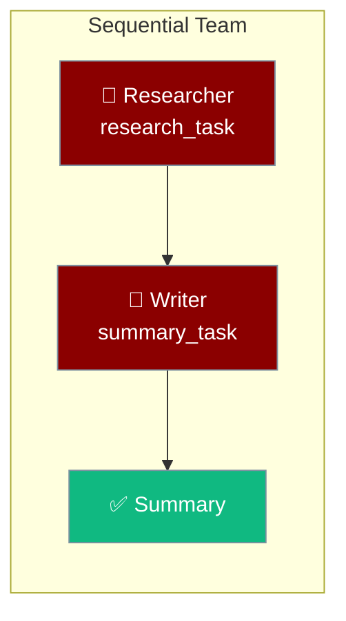
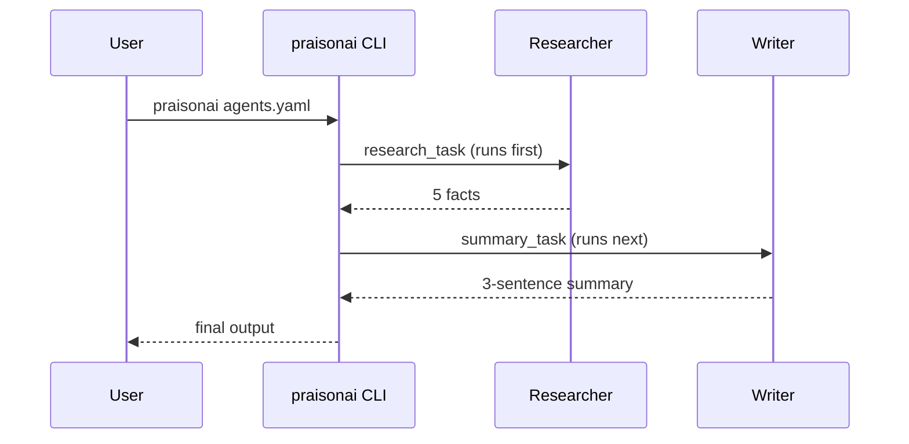

Two agents run in order: a researcher gathers facts, then a writer summarizes them.



## Quick Start

<Steps>
<Step title="Drop the YAML in place">
Save this as `agents.yaml` in an empty folder. Tasks run in the order they are declared — the researcher's task first, then the writer's.

```yaml
# yaml-language-server: $schema=https://docs.praison.ai/schemas/agents.schema.json
# Minimal sequential team: researcher -> writer
# Run: praisonai agents.yaml

framework: "praisonai"
topic: "renewable energy"

roles:
  researcher:
    role: "Senior Researcher"
    goal: "Find accurate information about {topic}"
    backstory: "Expert at concise, factual research."
    tasks:
      research_task:
        description: "Research {topic} and list 5 key facts."
        expected_output: "A bullet list of 5 facts."

  writer:
    role: "Report Writer"
    goal: "Turn research into readable summaries about {topic}"
    backstory: "Clear technical writer."
    tasks:
      summary_task:
        description: "Write a 3-sentence executive summary from the research."
        expected_output: "3 sentences, plain text."

# Ordering is by task declaration order above (researcher's task runs first,
# then the writer's), which is how the roles-file loader sequences tasks.
# The optional `dependencies:` block below documents intent; the roles-file
# loader does not consume it, so keep tasks in the order you want them run.
dependencies:
  - task: summary_task
    depends_on: research_task
```
</Step>

<Step title="Run it">
Set your API key and run the file with the `praisonai` CLI:

```bash
export OPENAI_API_KEY=sk-...
praisonai agents.yaml
```

Change the subject by editing the `topic:` line — it is interpolated into every `{topic}` placeholder.
</Step>
</Steps>

---

## How It Works



| Fact | Detail |
|---|---|
| Where tasks live | `roles.<role>.tasks.<task_name>` — each role owns its tasks |
| Ordering | By **declaration order**, not the optional top-level `dependencies:` block. The roles-file loader (`AgentsGenerator.generate_crew_and_kickoff` in `praisonai/agents_generator.py`) does **not** consume `dependencies:`. |
| `{topic}` interpolation | The top-level `topic:` value is substituted into every `{topic}` in role, goal, and task fields. |

<Warning>
The single-brace `{topic}` interpolation here belongs to the **roles-file YAML loader**. The Python `AgentTeam(variables={...})` path uses **double-brace** `{{key}}` placeholders instead — don't mix the two.
</Warning>

---

## Python equivalent

The same team using friendly top-level imports:

```python
from praisonaiagents import Agent, Task, PraisonAIAgents

researcher = Agent(role="Senior Researcher", goal="Find accurate information")
writer = Agent(role="Report Writer", goal="Turn research into summaries")

t1 = Task(description="Research renewable energy and list 5 key facts", agent=researcher)
t2 = Task(description="Write a 3-sentence summary from the research", agent=writer, context=[t1])

PraisonAIAgents(agents=[researcher, writer], tasks=[t1, t2]).start()
```

---

## When to use this vs a workflow YAML

| You need… | Use | Example |
|---|---|---|
| 2–5 agents, sequential / hierarchical | this recipe (`roles:` + nested `tasks:`) | this page |
| Routing by classifier output | workflow YAML | [Workflow Routing](/features/workflow-routing) |
| Parallel branches | workflow YAML | [Workflow Parallelization](/features/workflow-parallel) |
| Loops / planning / memory | workflow YAML | [YAML Workflows](/features/yaml-workflows) |

---

## Related

<CardGroup cols={2}>
<Card title="YAML Workflows" icon="file-code" href="/features/yaml-workflows">
  Loops, planning, memory, and routing in YAML
</Card>
<Card title="Prompt Chaining" icon="link" href="/features/promptchaining">
  Chain task outputs into the next step
</Card>
<Card title="Multi-Agent Execution" icon="play" href="/features/multi-agent-execution">
  Configure iteration and retry limits
</Card>
<Card title="Multi-Agent Hooks" icon="webhook" href="/features/multi-agent-hooks">
  Add lifecycle callbacks between tasks
</Card>
</CardGroup>
