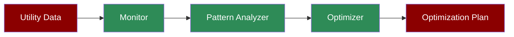

Multi-agent smart city management: utility monitoring → pattern analysis → resource optimization → implementation. Includes SQLite metrics storage, structured output, and API deployment.

## Setup

```bash
# Create environment
python3 -m venv venv && source venv/bin/activate

# Install packages
pip install praisonaiagents praisonai

# Set API key
export OPENAI_API_KEY="your-key"
```

## Create Sample Data

```bash
# Create utility readings
cat > utilities.json << 'EOF'
{
  "power": {"consumption_kwh": 45000, "peak_load": 0.85, "zones": {"downtown": 15000, "residential": 20000, "industrial": 10000}},
  "water": {"consumption_gallons": 500000, "pressure_psi": 65, "quality_score": 95},
  "traffic": {"congestion_index": 0.72, "incidents": 3, "peak_zones": ["downtown", "highway_101"]}
}
EOF

# Create historical patterns
cat > patterns.json << 'EOF'
{
  "power": {"peak_hours": [8, 9, 17, 18, 19], "trend": "increasing", "seasonal_factor": 1.2},
  "water": {"peak_hours": [7, 8, 18, 19], "trend": "stable", "seasonal_factor": 1.0},
  "traffic": {"peak_hours": [8, 9, 17, 18], "trend": "increasing", "seasonal_factor": 1.1}
}
EOF
```

## Run: Python Code

```python
from praisonaiagents import Agent, Agents, Task, tool
from pydantic import BaseModel
from typing import List, Dict
import json

# Structured output
class OptimizationPlan(BaseModel):
    utility: str
    current_usage: float
    optimization_action: str
    expected_savings_percent: float
    target_zones: List[str]
    implementation_priority: str

# Database persistence is configured via memory={} parameter

# Tools
@tool
def get_utility_readings(utility_type: str) -> str:
    """Get current utility readings."""
    with open("utilities.json") as f:
        utilities = json.load(f)
    return json.dumps(utilities.get(utility_type, {}))

@tool
def get_usage_patterns(utility_type: str) -> str:
    """Get historical usage patterns."""
    with open("patterns.json") as f:
        patterns = json.load(f)
    return json.dumps(patterns.get(utility_type, {}))

@tool
def calculate_optimization(utility_type: str, current_load: float, target_reduction: float) -> str:
    """Calculate optimization strategy."""
    strategies = {
        "power": {"action": "load_balancing", "method": "shift_to_off_peak"},
        "water": {"action": "pressure_optimization", "method": "zone_scheduling"},
        "traffic": {"action": "signal_timing", "method": "adaptive_control"}
    }
    strategy = strategies.get(utility_type, {"action": "manual_review"})
    savings = min(target_reduction, current_load * 0.2)  # Max 20% reduction
    return json.dumps({**strategy, "expected_savings": savings})

# Agents
monitor = Agent(
    name="UtilityMonitor",
    instructions="Monitor utility readings. Use get_utility_readings tool.",
    tools=[get_utility_readings],
    memory={
        "db": "sqlite:///smartcity.db",
        "session_id": "smart-city"
    }
)

analyzer = Agent(
    name="PatternAnalyzer",
    instructions="Analyze usage patterns. Use get_usage_patterns tool.",
    tools=[get_usage_patterns]
)

optimizer = Agent(
    name="ResourceOptimizer",
    instructions="Generate optimization strategies. Use calculate_optimization tool.",
    tools=[calculate_optimization]
)

# Tasks
monitor_task = Task(
    description="Get current readings for: {utility_type}",
    agent=monitor,
    expected_output="Current utility metrics"
)

analyze_task = Task(
    description="Analyze historical patterns for the utility",
    agent=analyzer,
    expected_output="Usage patterns and trends"
)

optimize_task = Task(
    description="Generate optimization plan",
    agent=optimizer,
    expected_output="Structured optimization plan",
    output_pydantic=OptimizationPlan
)

# Run for each utility
for utility in ["power", "water", "traffic"]:
    agents = AgentManager(agents=[monitor, analyzer, optimizer], tasks=[monitor_task, analyze_task, optimize_task])
    result = agents.start(utility_type=utility)
    print(f"{utility.upper()}: {result}")
```

## Run: CLI

```bash
# Monitor single utility
praisonai "Analyze power grid usage and suggest optimizations" --verbose

# With persistence
praisonai "Optimize traffic flow in downtown area" --memory --user-id city_ops

# Full city analysis
praisonai "Generate smart city optimization report for all utilities" --telemetry
```

## Run: agents.yaml

Create `agents.yaml`:

```yaml
framework: praisonai
topic: "smart city resource management"
roles:
  monitor:
    role: Utility Monitor
    goal: Track real-time utility usage
    backstory: Expert at IoT sensor data analysis
    tasks:
      monitor:
        description: |
          Monitor utilities:
          - Power consumption by zone
          - Water pressure and quality
          - Traffic congestion index
        expected_output: Current utility readings
        
  analyzer:
    role: Pattern Analyst
    goal: Identify usage patterns
    backstory: Expert at time-series analysis
    tasks:
      analyze:
        description: |
          Analyze patterns:
          - Peak usage hours
          - Seasonal trends
          - Anomaly detection
        expected_output: Pattern analysis report
        
  optimizer:
    role: Resource Optimizer
    goal: Optimize resource allocation
    backstory: Expert at operations research
    tasks:
      optimize:
        description: |
          Generate optimizations:
          - Load balancing strategies
          - Zone-based scheduling
          - Expected savings calculation
        expected_output: Optimization plan with ROI
```

Run:

```bash
praisonai agents.yaml --verbose
```

## Monitor & Verify

```bash
# View optimization history
praisonai --history 10 --user-id city_ops

# Check metrics
praisonai --metrics

# Export report
praisonai --save city_optimization_report
```

## Serve API

```python
from praisonaiagents import Agent, tool
import json

@tool
def quick_utility_check(utility: str, zone: str) -> str:
    """Quick utility status check."""
    status = {
        ("power", "downtown"): {"load": 0.85, "status": "high", "action": "reduce_non_essential"},
        ("power", "residential"): {"load": 0.65, "status": "normal", "action": "none"},
        ("traffic", "downtown"): {"congestion": 0.72, "status": "congested", "action": "reroute"},
        ("water", "industrial"): {"pressure": 70, "status": "normal", "action": "none"}
    }
    result = status.get((utility, zone), {"status": "unknown"})
    return json.dumps(result)

agent = Agent(
    name="SmartCityAPI",
    instructions="Check utility status and provide recommendations.",
    tools=[quick_utility_check]
)

agent.launch(path="/city-status", port=8000)
```

Test:

```bash
curl -X POST http://localhost:8000/city-status \
  -H "Content-Type: application/json" \
  -d '{"message": "Check power status in downtown zone"}'
```

## Cleanup

```bash
rm -f smartcity.db utilities.json patterns.json
deactivate
```

## Features Demonstrated

| Feature | Implementation |
|---------|----------------|
| **Multi-agent** | Monitor → Analyzer → Optimizer |
| **Structured Output** | Pydantic `OptimizationPlan` |
| **IoT Data** | JSON-based sensor readings |
| **Pattern Analysis** | Historical trend detection |
| **DB Persistence** | SQLite via `db()` |
| **CLI** | `--telemetry` for metrics |
| **YAML Config** | 3-agent city pipeline |
| **API Endpoint** | `agent.launch()` | 