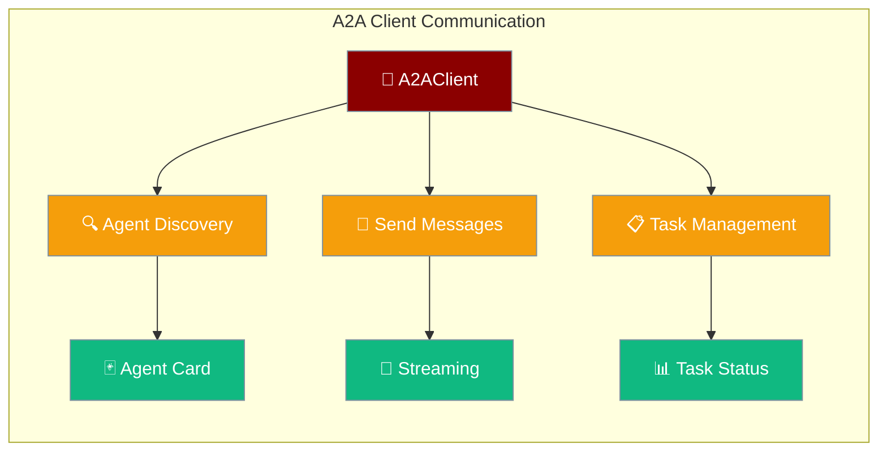
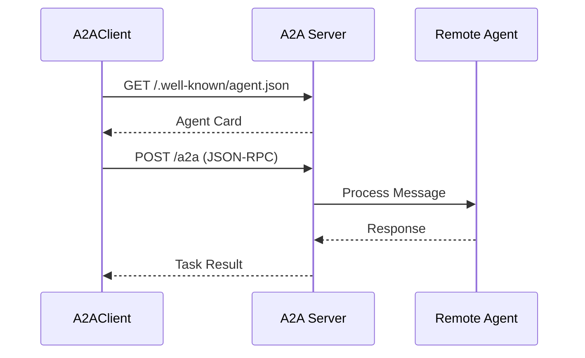

A2AClient enables PraisonAI applications to discover and interact with remote A2A agents through an async HTTP interface.



## Quick Start

<Steps>
<Step title="Simple Usage">
Connect to an A2A server and send a message:

```python
import asyncio
from praisonaiagents.ui.a2a import A2AClient

async def main():
    async with A2AClient("http://localhost:8000") as client:
        # Discover agent capabilities
        card = await client.get_agent_card()
        print(f"Agent: {card.name}")
        
        # Send a message
        result = await client.send_message("What are AI trends?")
        print(result)

asyncio.run(main())
```
</Step>

<Step title="With Authentication">
Use bearer token authentication:

```python
from praisonaiagents.ui.a2a import A2AClient

async with A2AClient(
    base_url="http://localhost:8000",
    auth_token="sk-secret",
    timeout=30.0
) as client:
    result = await client.send_message("Hello!")
    print(result)
```
</Step>
</Steps>

---

## How It Works



| Step | Description |
|------|-------------|
| **Discovery** | Fetch agent capabilities via Agent Card |
| **Authentication** | Optional Bearer token validation |
| **Messaging** | Send messages using JSON-RPC protocol |
| **Task Management** | Track, list, and cancel tasks |

---

## Configuration Options

| Parameter | Type | Default | Description |
|-----------|------|---------|-------------|
| `base_url` | `str` | — | Base URL of the A2A server |
| `auth_token` | `str` | `None` | Bearer token for authentication |
| `timeout` | `float` | `30.0` | HTTP request timeout in seconds |

---

## Discovery Methods

### Get Agent Card

Fetch basic agent information from `/.well-known/agent.json`:

```python
async with A2AClient("http://localhost:8000") as client:
    card = await client.get_agent_card()
    
    print(card.name)           # "Research Assistant"
    print(card.capabilities)   # AgentCapabilities(streaming=True, ...)
    print(card.skills)         # [AgentSkill(name="search_web", ...)]
```

### Get Extended Card

Fetch detailed agent information (requires authentication):

```python
client = A2AClient("http://localhost:8000", auth_token="sk-secret")
extended = await client.get_extended_card()
print(extended.advanced_features)
```

---

## Message Methods

### Send Message

Send a text message and get the complete task result:

```python
# Basic message
result = await client.send_message("Explain quantum computing")

# Access task details
task = result["result"]
print(task["status"]["state"])  # "completed"
print(task["artifacts"])         # Agent response artifacts
```

**Multi-turn conversations** with context:

```python
# First message
result1 = await client.send_message("What is Python?")
context_id = result1["result"]["contextId"]

# Follow-up message
result2 = await client.send_message(
    "What about its type system?",
    context_id=context_id
)
```

### Streaming Messages

Send a message and receive real-time Server-Sent Events:

```python
async for event in client.send_message_streaming("Write a haiku"):
    if "result" in event:
        task = event["result"]
        
        # Check task status updates
        if "status" in task:
            print(f"Status: {task['status']['state']}")
        
        # Process response chunks
        if "artifact" in task:
            for part in task["artifact"]["parts"]:
                print(part.get("text", ""))
```

---

## Task Management

### Get Task Details

```python
task = await client.get_task("task-uuid-123")
print(task["result"]["status"]["state"])  # "completed", "running", "failed"
```

### List Tasks

```python
# List all tasks
all_tasks = await client.list_tasks()
print(f"Total tasks: {len(all_tasks['result'])}")

# List tasks for specific conversation
ctx_tasks = await client.list_tasks(context_id="ctx-uuid-123")
```

### Cancel Task

```python
cancelled = await client.cancel_task("task-uuid-123")
print(cancelled["result"]["status"]["state"])  # "cancelled"
```

---

## Context Manager Pattern

**Recommended approach** with automatic session cleanup:

```python
# Auto-closes HTTP session
async with A2AClient("http://localhost:8000") as client:
    card = await client.get_agent_card()
    result = await client.send_message("Hello!")
```

**Manual management** when needed:

```python
client = A2AClient("http://localhost:8000")
try:
    result = await client.send_message("Hello!")
finally:
    await client.close()  # Must call explicitly
```

---

## Agent-to-Agent Communication

Complete example showing agent-to-agent delegation:

```python
import asyncio
from praisonaiagents import Agent
from praisonaiagents.ui.a2a import A2A, A2AClient

# Start remote agent server (separate process)
# agent = Agent(name="Expert", role="AI Expert", goal="Answer questions")
# a2a = A2A(agent=agent)
# a2a.serve(port=8001)

async def main():
    # Client agent calls remote agent
    async with A2AClient("http://localhost:8001") as remote:
        # Discover capabilities
        card = await remote.get_agent_card()
        print(f"Connected to: {card.name}")
        
        # Delegate task
        result = await remote.send_message("What are the top AI trends?")
        task = result["result"]
        print(f"Status: {task['status']['state']}")
        
        # Stream long responses
        async for event in remote.send_message_streaming("Write a detailed report"):
            if "artifact" in event.get("result", {}):
                for part in event["result"]["artifact"]["parts"]:
                    print(part.get("text", ""), end="")

asyncio.run(main())
```

---

## Error Handling

Handle common HTTP and connection errors:

```python
import aiohttp

try:
    result = await client.send_message("Hello")
    
except aiohttp.ClientResponseError as e:
    if e.status == 401:
        print("Authentication required")
    elif e.status == 404:
        print("A2A endpoint not found")
    elif e.status == 500:
        print("Server error")
        
except aiohttp.ClientError as e:
    print(f"Connection error: {e}")
    
except asyncio.TimeoutError:
    print("Request timed out")
```

---

## Common Patterns

<AccordionGroup>

<Accordion title="Agent Discovery">
Always fetch the agent card first to understand capabilities before sending messages.

```python
async with A2AClient(url) as client:
    card = await client.get_agent_card()
    
    # Check if streaming is supported
    if card.capabilities.streaming:
        # Use streaming for long responses
        async for event in client.send_message_streaming(text):
            process_event(event)
    else:
        # Use regular messaging
        result = await client.send_message(text)
```
</Accordion>

<Accordion title="Context Preservation">
Maintain conversation context across multiple message exchanges.

```python
context_id = None

async with A2AClient(url) as client:
    # Start conversation
    result1 = await client.send_message("Hello", context_id=context_id)
    context_id = result1["result"]["contextId"]
    
    # Continue conversation  
    result2 = await client.send_message("Follow up", context_id=context_id)
```
</Accordion>

<Accordion title="Task Monitoring">
Monitor long-running tasks with periodic status checks.

```python
async def monitor_task(client, task_id):
    while True:
        task = await client.get_task(task_id)
        state = task["result"]["status"]["state"]
        
        if state in ["completed", "failed", "cancelled"]:
            break
            
        await asyncio.sleep(1)  # Poll every second
    
    return task
```
</Accordion>

<Accordion title="Batch Operations">
Process multiple tasks concurrently using asyncio.

```python
async def batch_messages(client, messages):
    tasks = []
    
    for msg in messages:
        task = asyncio.create_task(client.send_message(msg))
        tasks.append(task)
    
    results = await asyncio.gather(*tasks)
    return results
```
</Accordion>

</AccordionGroup>

---

## Best Practices

<AccordionGroup>

<Accordion title="Session Management">
Always use the context manager pattern to ensure proper session cleanup and avoid connection leaks.

```python
# ✅ Good - automatic cleanup
async with A2AClient(url) as client:
    result = await client.send_message("Hello")

# ❌ Bad - manual cleanup required
client = A2AClient(url)
result = await client.send_message("Hello")
# Session not closed!
```
</Accordion>

<Accordion title="Error Recovery">
Implement retry logic for transient network errors and timeouts.

```python
import asyncio
from tenacity import retry, stop_after_attempt, wait_exponential

@retry(stop=stop_after_attempt(3), wait=wait_exponential(multiplier=1, min=4, max=10))
async def robust_send_message(client, message):
    try:
        return await client.send_message(message)
    except aiohttp.ClientError as e:
        print(f"Retry after error: {e}")
        raise
```
</Accordion>

<Accordion title="Authentication">
Store auth tokens securely and never expose them in logs or error messages.

```python
import os

# ✅ Good - from environment
auth_token = os.getenv("A2A_AUTH_TOKEN")
client = A2AClient(url, auth_token=auth_token)

# ❌ Bad - hardcoded token
client = A2AClient(url, auth_token="sk-hardcoded-secret")
```
</Accordion>

<Accordion title="Streaming Best Practices">
Handle streaming events gracefully with proper error handling and backpressure.

```python
async def process_stream(client, message):
    try:
        async for event in client.send_message_streaming(message):
            if "result" in event:
                # Process incrementally to avoid memory buildup
                process_event_chunk(event["result"])
                
    except asyncio.CancelledError:
        print("Stream cancelled")
        raise
    except Exception as e:
        print(f"Stream error: {e}")
        # Handle gracefully
```
</Accordion>

</AccordionGroup>

---

## Related

<CardGroup cols={2}>
<Card title="A2A Protocol" icon="server" href="/docs/features/a2a">
  Setup A2A servers and protocol basics
</Card>
<Card title="Multi-Agent Patterns" icon="users" href="/docs/features/multi-agent-patterns">
  Agent orchestration and communication patterns
</Card>
</CardGroup>