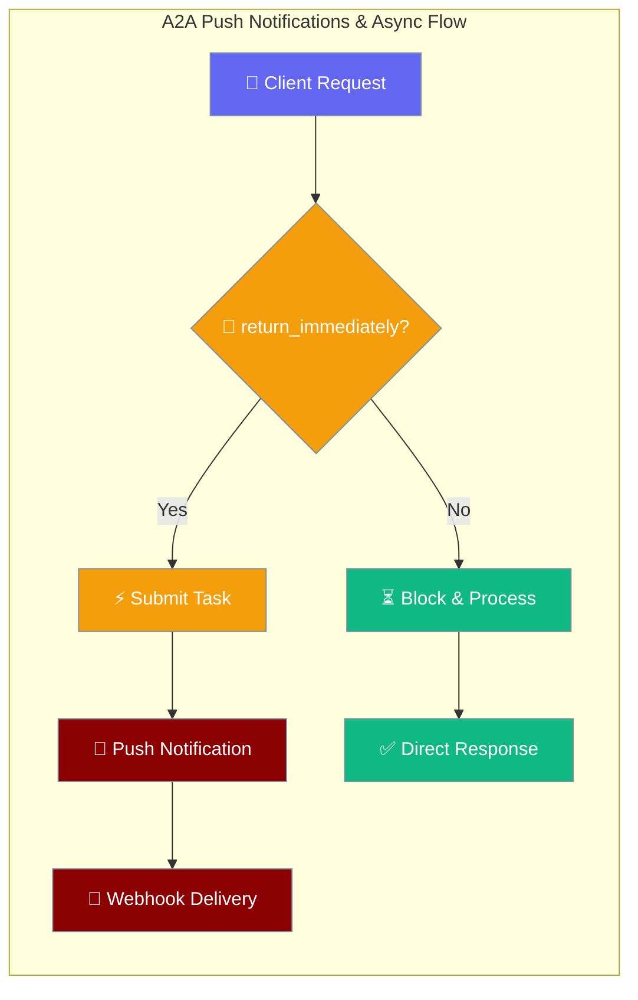
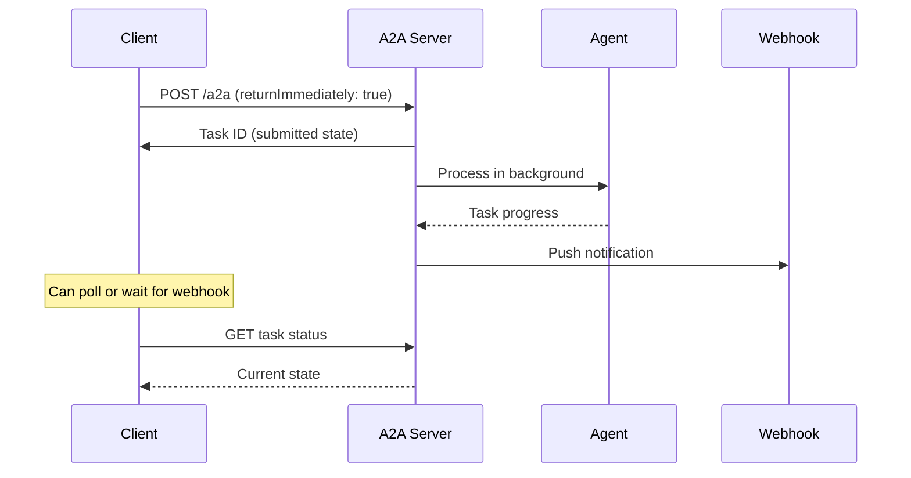

A2A push notifications enable proactive task status updates via webhooks, while async processing with `return_immediately` allows non-blocking agent interactions.



---

## Quick Start

<Steps>
<Step title="Async Task Processing with return_immediately">
Send requests that return immediately while the agent processes in the background.

```python
import asyncio
from praisonaiagents import Agent
from praisonaiagents.ui.a2a import A2AClient

agent = Agent(
    name="Research Agent",
    instructions="Provide detailed research on any topic",
    model="gpt-4o"
)

async def main():
    async with A2AClient("http://localhost:8000") as client:
        # Non-blocking request - returns immediately
        result = await client.send_message(
            "Write a detailed report on AI trends",
            configuration={"returnImmediately": True}
        )
        
        task_id = result["result"]["id"]
        print(f"Task submitted: {task_id}")
        
        # Poll for completion
        while True:
            task = await client.get_task(task_id)
            state = task["result"]["status"]["state"]
            if state in ("completed", "failed", "cancelled"):
                break
            await asyncio.sleep(1)
        
        print(f"Task finished with state: {state}")

asyncio.run(main())
```
</Step>

<Step title="Setting Up Push Notifications">
Configure webhook notifications for automatic task status updates.

```python
from praisonaiagents import Agent
from praisonaiagents.ui.a2a import A2A, TaskPushNotificationConfig, AuthenticationInfo

class PushEnabledA2A(A2A):
    """A2A server with push notification support."""
    
    def __init__(self, *args, **kwargs):
        super().__init__(*args, **kwargs)
        self._push_configs = {}
    
    def _handle_push_notification(self, request_id, method, params):
        if method == "tasks/pushNotificationConfig/set":
            task_id = params.get("taskId")
            url = params.get("url")
            token = params.get("token")
            
            # Store configuration
            self._push_configs[task_id] = {
                "url": url,
                "token": token,
                "params": params
            }
            
            return JSONResponse(content={
                "jsonrpc": "2.0",
                "id": request_id,
                "result": {"taskId": task_id, "url": url},
            })
        
        return super()._handle_push_notification(request_id, method, params)

agent = Agent(name="Webhook Agent", instructions="Helper agent")
a2a = PushEnabledA2A(agent=agent)
a2a.serve(port=8000)
```
</Step>
</Steps>

---

## How It Works



| Component | Purpose | Benefit |
|-----------|---------|---------|
| `return_immediately` | Non-blocking task submission | Improved client responsiveness |
| Push Notifications | Proactive status updates | Eliminates need for constant polling |
| Webhook Configuration | Flexible delivery endpoints | Integration with existing systems |

---

## Configuration Options

### TaskPushNotificationConfig

Configure webhook delivery for task status updates.

| Option | Type | Default | Description |
|--------|------|---------|-------------|
| `id` | `str` | `None` | Configuration identifier |
| `task_id` | `str` | Required | Task to monitor for updates |
| `url` | `str` | Required | Webhook endpoint URL |
| `token` | `str` | `None` | Verification token |
| `authentication` | `AuthenticationInfo` | `None` | Auth configuration |

### AuthenticationInfo

Authentication details for webhook requests.

| Option | Type | Default | Description |
|--------|------|---------|-------------|
| `scheme` | `str` | Required | Auth scheme (e.g., "Bearer") |
| `credentials` | `str` | `None` | Auth credentials/token |

---

## return_immediately Configuration

### Blocking vs Non-blocking Requests

**Default Behavior (Blocking):**
```python
# Request blocks until agent completes
response = await client.send_message("Complex analysis task")
# Response contains completed result
```

**Non-blocking with return_immediately:**
```python
# Request returns immediately
response = await client.send_message(
    "Complex analysis task",
    configuration={"returnImmediately": True}
)
# Response contains task ID in "submitted" state
```

### Polling Pattern

```python
async def wait_for_completion(client, task_id, timeout=300):
    """Poll task until completion with timeout."""
    start_time = asyncio.get_event_loop().time()
    
    while True:
        if asyncio.get_event_loop().time() - start_time > timeout:
            raise TimeoutError("Task did not complete within timeout")
        
        task = await client.get_task(task_id)
        state = task["result"]["status"]["state"]
        
        if state == "completed":
            return task["result"]
        elif state in ("failed", "cancelled"):
            raise RuntimeError(f"Task {state}: {task['result']['status'].get('message', '')}")
        
        await asyncio.sleep(1)
```

---

## Push Notification JSON-RPC Methods

### Available Methods

| Method | Purpose | Support |
|--------|---------|---------|
| `tasks/pushNotificationConfig/set` | Register webhook config | Extension required |
| `tasks/pushNotificationConfig/get` | Retrieve webhook config | Extension required |
| `tasks/pushNotificationConfig/list` | List all webhook configs | Extension required |
| `tasks/pushNotificationConfig/delete` | Remove webhook config | Extension required |

### Default Error Response

When push notifications are not supported:

```bash
curl -X POST http://localhost:8000/a2a \
  -H "Content-Type: application/json" \
  -d '{
    "jsonrpc": "2.0",
    "method": "tasks/pushNotificationConfig/set",
    "id": "1",
    "params": {
      "taskId": "task-123",
      "url": "https://my-app.com/webhooks/a2a"
    }
  }'

# Response:
# {
#   "jsonrpc": "2.0", 
#   "id": "1",
#   "error": {
#     "code": -32601,
#     "message": "Push notifications not supported: tasks/pushNotificationConfig/set"
#   }
# }
```

---

## Custom Push Notification Implementation

### Complete Implementation Example

```python
from fastapi.responses import JSONResponse
from praisonaiagents import Agent
from praisonaiagents.ui.a2a import A2A
import httpx
import asyncio

class WebhookA2A(A2A):
    """Full-featured A2A with webhook push notifications."""
    
    def __init__(self, *args, **kwargs):
        super().__init__(*args, **kwargs)
        self._push_configs = {}
    
    def get_agent_card(self):
        """Override to advertise push notification support."""
        card = super().get_agent_card()
        card.capabilities.push_notifications = True
        return card
    
    def _handle_push_notification(self, request_id, method, params):
        """Handle all push notification methods."""
        
        if method == "tasks/pushNotificationConfig/set":
            return self._set_push_config(request_id, params)
        elif method == "tasks/pushNotificationConfig/get":
            return self._get_push_config(request_id, params)
        elif method == "tasks/pushNotificationConfig/list":
            return self._list_push_configs(request_id, params)
        elif method == "tasks/pushNotificationConfig/delete":
            return self._delete_push_config(request_id, params)
        
        return super()._handle_push_notification(request_id, method, params)
    
    def _set_push_config(self, request_id, params):
        task_id = params.get("taskId")
        url = params.get("url")
        token = params.get("token")
        auth = params.get("authentication", {})
        
        if not task_id or not url:
            return self._error_response(request_id, -32602, "taskId and url required")
        
        config = {
            "taskId": task_id,
            "url": url,
            "token": token,
            "authentication": auth
        }
        
        self._push_configs[task_id] = config
        
        return JSONResponse(content={
            "jsonrpc": "2.0",
            "id": request_id,
            "result": config
        })
    
    def _get_push_config(self, request_id, params):
        task_id = params.get("taskId")
        config = self._push_configs.get(task_id)
        
        if not config:
            return self._error_response(request_id, -32000, "Config not found")
        
        return JSONResponse(content={
            "jsonrpc": "2.0",
            "id": request_id,
            "result": config
        })
    
    def _list_push_configs(self, request_id, params):
        configs = list(self._push_configs.values())
        
        return JSONResponse(content={
            "jsonrpc": "2.0",
            "id": request_id,
            "result": {"configs": configs}
        })
    
    def _delete_push_config(self, request_id, params):
        task_id = params.get("taskId")
        
        if task_id in self._push_configs:
            del self._push_configs[task_id]
            return JSONResponse(content={
                "jsonrpc": "2.0",
                "id": request_id,
                "result": {"deleted": True}
            })
        
        return self._error_response(request_id, -32000, "Config not found")
    
    def _error_response(self, request_id, code, message):
        return JSONResponse(content={
            "jsonrpc": "2.0",
            "id": request_id,
            "error": {"code": code, "message": message}
        })
    
    async def _notify_webhook(self, task_id, task_data):
        """Send webhook notification for task update."""
        config = self._push_configs.get(task_id)
        if not config:
            return
        
        headers = {"Content-Type": "application/json"}
        
        # Add authentication if configured
        auth = config.get("authentication", {})
        if auth.get("scheme") and auth.get("credentials"):
            headers["Authorization"] = f"{auth['scheme']} {auth['credentials']}"
        
        # Add verification token if configured
        if config.get("token"):
            headers["X-Webhook-Token"] = config["token"]
        
        payload = {
            "taskId": task_id,
            "status": task_data.get("status"),
            "timestamp": task_data.get("timestamp")
        }
        
        try:
            async with httpx.AsyncClient() as client:
                response = await client.post(
                    config["url"],
                    json=payload,
                    headers=headers,
                    timeout=10.0
                )
                response.raise_for_status()
        except Exception as e:
            # Log webhook delivery failure
            print(f"Webhook delivery failed for task {task_id}: {e}")

# Usage
agent = Agent(name="Webhook Agent", instructions="Helper")
a2a = WebhookA2A(agent=agent)
a2a.serve(port=8000)
```

### Webhook Client Configuration

```python
import asyncio
from praisonaiagents.ui.a2a import A2AClient

async def configure_webhook():
    async with A2AClient("http://localhost:8000") as client:
        # Set webhook for task notifications
        config_response = await client.call_method(
            "tasks/pushNotificationConfig/set",
            {
                "taskId": "task-123",
                "url": "https://my-app.com/webhooks/a2a",
                "token": "webhook-secret",
                "authentication": {
                    "scheme": "Bearer",
                    "credentials": "my-auth-token"
                }
            }
        )
        
        print("Webhook configured:", config_response)

asyncio.run(configure_webhook())
```

---

## Agent Card Capabilities

### Push Notification Advertisement

The Agent Card declares push notification support:

```json
{
  "name": "Webhook Agent",
  "url": "http://localhost:8000/a2a",
  "version": "1.0.0",
  "capabilities": {
    "streaming": true,
    "pushNotifications": true
  }
}
```

When `pushNotifications` is `false` (default), all push notification methods return `-32601` errors.

---

## Common Patterns

<Tabs>
<Tab title="Async + Polling">
```python
async def async_task_with_polling():
    async with A2AClient("http://localhost:8000") as client:
        # Submit task immediately
        result = await client.send_message(
            "Generate a 50-page report",
            configuration={"returnImmediately": True}
        )
        
        task_id = result["result"]["id"]
        
        # Poll with exponential backoff
        delay = 1
        while True:
            task = await client.get_task(task_id)
            state = task["result"]["status"]["state"]
            
            if state in ("completed", "failed", "cancelled"):
                return task["result"]
            
            await asyncio.sleep(min(delay, 30))
            delay *= 1.5
```
</Tab>

<Tab title="Async + Webhooks">
```python
# Server-side webhook handler
from fastapi import FastAPI, Request

app = FastAPI()

@app.post("/webhooks/a2a")
async def handle_a2a_webhook(request: Request):
    payload = await request.json()
    task_id = payload["taskId"]
    status = payload["status"]
    
    print(f"Task {task_id} status: {status['state']}")
    
    if status["state"] == "completed":
        # Process completed task
        await process_completed_task(task_id)
    
    return {"received": True}

# Client-side configuration
async def setup_webhook_task():
    async with A2AClient("http://localhost:8000") as client:
        # Configure webhook first
        await client.call_method("tasks/pushNotificationConfig/set", {
            "taskId": "future-task-id",
            "url": "https://my-app.com/webhooks/a2a"
        })
        
        # Submit task with webhook configured
        result = await client.send_message(
            "Long running analysis",
            configuration={"returnImmediately": True}
        )
```
</Tab>

<Tab title="Webhook Security">
```python
import hmac
import hashlib
from fastapi import HTTPException

async def verify_webhook_signature(request: Request, secret: str):
    """Verify webhook signature for security."""
    signature = request.headers.get("X-Webhook-Signature")
    if not signature:
        raise HTTPException(401, "Missing signature")
    
    body = await request.body()
    expected = hmac.new(
        secret.encode(),
        body,
        hashlib.sha256
    ).hexdigest()
    
    if not hmac.compare_digest(f"sha256={expected}", signature):
        raise HTTPException(401, "Invalid signature")

@app.post("/webhooks/a2a")
async def secure_webhook(request: Request):
    await verify_webhook_signature(request, "webhook-secret")
    # Process webhook...
```
</Tab>
</Tabs>

---

## Best Practices

<AccordionGroup>
<Accordion title="Webhook Reliability">
Implement proper webhook handling with retries and failure logging.

```python
async def reliable_webhook_delivery(url, payload, max_retries=3):
    for attempt in range(max_retries):
        try:
            async with httpx.AsyncClient() as client:
                response = await client.post(url, json=payload, timeout=30)
                response.raise_for_status()
                return True
        except Exception as e:
            if attempt == max_retries - 1:
                # Log final failure
                logger.error(f"Webhook failed after {max_retries} attempts: {e}")
                return False
            await asyncio.sleep(2 ** attempt)  # Exponential backoff
```
</Accordion>

<Accordion title="Task Timeout Handling">
Set appropriate timeouts for long-running tasks.

```python
async def task_with_timeout(client, message, timeout=600):
    result = await client.send_message(
        message,
        configuration={"returnImmediately": True}
    )
    
    task_id = result["result"]["id"]
    start_time = asyncio.get_event_loop().time()
    
    while True:
        elapsed = asyncio.get_event_loop().time() - start_time
        if elapsed > timeout:
            # Cancel the task
            await client.call_method("tasks/cancel", {"id": task_id})
            raise TimeoutError(f"Task {task_id} timed out after {timeout}s")
        
        task = await client.get_task(task_id)
        if task["result"]["status"]["state"] in ("completed", "failed", "cancelled"):
            break
        
        await asyncio.sleep(5)
    
    return task["result"]
```
</Accordion>

<Accordion title="Webhook Security">
Always validate webhook authenticity and implement proper error handling.

```python
class SecureWebhookHandler:
    def __init__(self, secret_token: str):
        self.secret_token = secret_token
    
    def verify_token(self, request_token: str) -> bool:
        return hmac.compare_digest(self.secret_token, request_token or "")
    
    async def handle_webhook(self, payload: dict, token: str):
        if not self.verify_token(token):
            raise ValueError("Invalid webhook token")
        
        task_id = payload.get("taskId")
        if not task_id:
            raise ValueError("Missing taskId in webhook payload")
        
        # Process webhook safely
        await self.process_task_update(task_id, payload)
```
</Accordion>

<Accordion title="Graceful Degradation">
Design your application to work with or without push notifications.

```python
class AdaptiveA2AClient:
    def __init__(self, url: str):
        self.client = A2AClient(url)
        self.supports_push = None
    
    async def check_push_support(self):
        try:
            # Try to set a test webhook config
            await self.client.call_method("tasks/pushNotificationConfig/set", {
                "taskId": "test",
                "url": "https://test.example.com"
            })
            self.supports_push = True
        except:
            self.supports_push = False
    
    async def submit_task(self, message: str):
        if self.supports_push is None:
            await self.check_push_support()
        
        if self.supports_push:
            # Use webhooks for notification
            return await self._submit_with_webhook(message)
        else:
            # Fall back to polling
            return await self._submit_with_polling(message)
```
</Accordion>
</AccordionGroup>

---

## Related

<CardGroup cols={2}>
<Card title="A2A Protocol" icon="plug" href="/docs/features/a2a">
  Core A2A server setup and configuration
</Card>
<Card title="A2A Tasks" icon="list-check" href="/docs/features/a2a-tasks">
  Task lifecycle and state management
</Card>
<Card title="A2A Client" icon="terminal" href="/docs/features/a2a-client">
  Client SDK with polling examples
</Card>
<Card title="Async Features" icon="rocket" href="/docs/features/async">
  General async processing patterns
</Card>
</CardGroup>