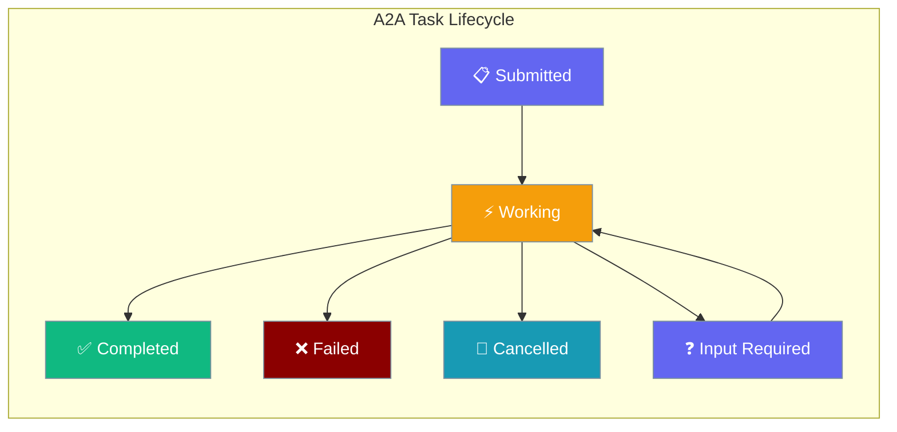
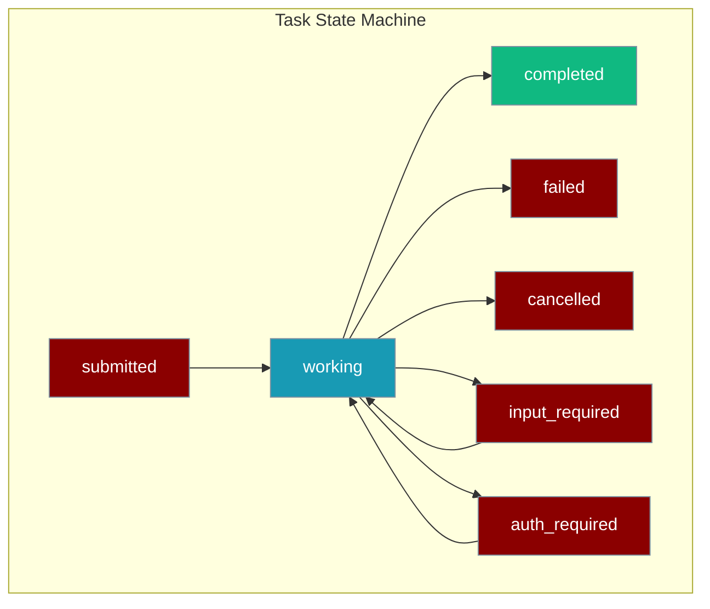

Tasks are the core unit of work in the A2A protocol, managing the complete lifecycle from submission to completion with built-in state tracking and storage.



## Quick Start

<Steps>
<Step title="Send Message (Creates Task)">
```python
import aiohttp
import json

async def send_message():
    payload = {
        "jsonrpc": "2.0",
        "method": "message/send",
        "id": "1",
        "params": {
            "message": {
                "role": "user",
                "parts": [{"text": "Analyze this data"}]
            }
        }
    }
    
    async with aiohttp.ClientSession() as session:
        async with session.post("http://localhost:8000/a2a", json=payload) as response:
            result = await response.json()
            task_id = result["result"]["id"]
            print(f"Task created: {task_id}")
```
</Step>

<Step title="Get Task Status">
```python
async def get_task_status(task_id):
    payload = {
        "jsonrpc": "2.0",
        "method": "tasks/get", 
        "id": "2",
        "params": {"id": task_id}
    }
    
    async with aiohttp.ClientSession() as session:
        async with session.post("http://localhost:8000/a2a", json=payload) as response:
            result = await response.json()
            state = result["result"]["status"]["state"]
            print(f"Task state: {state}")
```
</Step>

<Step title="Cancel Task">
```python
async def cancel_task(task_id):
    payload = {
        "jsonrpc": "2.0",
        "method": "tasks/cancel",
        "id": "3", 
        "params": {"id": task_id}
    }
    
    async with aiohttp.ClientSession() as session:
        async with session.post("http://localhost:8000/a2a", json=payload) as response:
            result = await response.json()
            print(f"Cancelled: {result['result']['status']['state']}")
```
</Step>
</Steps>

---

## Task Lifecycle

Every A2A interaction creates a Task that progresses through defined states:



### Task States

| State | Description |
|-------|-------------|
| `submitted` | Task received, not yet processing |
| `working` | Agent is actively processing |
| `completed` | Task finished successfully |
| `failed` | Task failed with an error |
| `cancelled` | Task was cancelled by client |
| `input_required` | Agent needs more information |
| `auth_required` | Authentication required |

### Python Task States

```python
from praisonaiagents.ui.a2a import TaskState

print(TaskState.SUBMITTED.value)      # "submitted"
print(TaskState.WORKING.value)        # "working"
print(TaskState.COMPLETED.value)      # "completed"
print(TaskState.FAILED.value)         # "failed"
print(TaskState.CANCELLED.value)      # "cancelled"
print(TaskState.INPUT_REQUIRED.value) # "input_required"
print(TaskState.AUTH_REQUIRED.value)  # "auth_required"
```

---

## Task Structure

A task contains all information about an A2A interaction:

```python
from praisonaiagents.ui.a2a import Task, TaskStatus, TaskState, Message, Artifact

task = Task(
    id="task-uuid-123",
    context_id="ctx-uuid-456",
    status=TaskStatus(state=TaskState.COMPLETED),
    history=[
        Message(role="user", parts=[TextPart(text="Hello")]),
        Message(role="agent", parts=[TextPart(text="Hi there!")]),
    ],
    artifacts=[
        Artifact(
            artifact_id="art-001",
            parts=[TextPart(text="Response content")],
        )
    ],
)
```

### Task Fields

| Field | Type | Description |
|-------|------|-------------|
| `id` | `str` | Unique task ID (auto-generated UUID) |
| `context_id` | `str` | Conversation context ID |
| `status` | `TaskStatus` | Current state + optional message |
| `history` | `List[Message]` | Message exchange history |
| `artifacts` | `List[Artifact]` | Output artifacts from agent |

---

## JSON-RPC Methods

### tasks/get — Retrieve a Task

```bash
curl -X POST http://localhost:8000/a2a \
  -H "Content-Type: application/json" \
  -d '{
    "jsonrpc": "2.0",
    "method": "tasks/get",
    "id": "1",
    "params": {
      "id": "task-uuid-123"
    }
  }'
```

**Response:**

```json
{
  "jsonrpc": "2.0",
  "id": "1",
  "result": {
    "id": "task-uuid-123",
    "contextId": "ctx-uuid-456",
    "status": {"state": "completed"},
    "history": [
      {"role": "user", "parts": [{"text": "Hello"}]},
      {"role": "agent", "parts": [{"text": "Hi there!"}]}
    ],
    "artifacts": [
      {"artifactId": "art-001", "parts": [{"text": "Response"}]}
    ]
  }
}
```

**Task not found:**

```json
{
  "jsonrpc": "2.0",
  "id": "1",
  "error": {"code": -32000, "message": "Task not found: task-uuid-123"}
}
```

### tasks/list — List Tasks

<Note>
The `tasks/list` method is available in the task store but not yet exposed via JSON-RPC. This method is planned for future implementation.
</Note>

The task store supports listing tasks with optional context filtering:

```python
# From the task store (server-side only)
from praisonaiagents.ui.a2a.task_store import TaskStore

store = TaskStore()

# List all tasks
all_tasks = store.list_tasks()

# Filter by context
context_tasks = store.list_tasks(context_id="ctx-uuid-456")
```

**Planned JSON-RPC Interface:**

```bash
# Future implementation
curl -X POST http://localhost:8000/a2a \
  -H "Content-Type: application/json" \
  -d '{
    "jsonrpc": "2.0", 
    "method": "tasks/list",
    "id": "1",
    "params": {
      "contextId": "ctx-uuid-456"
    }
  }'
```

### tasks/cancel — Cancel a Task

```bash
curl -X POST http://localhost:8000/a2a \
  -H "Content-Type: application/json" \
  -d '{
    "jsonrpc": "2.0",
    "method": "tasks/cancel",
    "id": "1",
    "params": {
      "id": "task-uuid-123"
    }
  }'
```

**Response:**

```json
{
  "jsonrpc": "2.0",
  "id": "1",
  "result": {
    "id": "task-uuid-123",
    "status": {"state": "cancelled"}
  }
}
```

---

## Python Client Implementation

<Note>
A high-level A2AClient class is planned for future releases. Currently, use direct HTTP calls with aiohttp or requests.
</Note>

```python
import aiohttp
import json

class SimpleA2AClient:
    def __init__(self, base_url: str):
        self.base_url = base_url.rstrip('/') + '/a2a'
    
    async def send_message(self, text: str, context_id: str = None):
        payload = {
            "jsonrpc": "2.0",
            "method": "message/send", 
            "id": "1",
            "params": {
                "message": {
                    "role": "user",
                    "parts": [{"text": text}],
                    "contextId": context_id
                }
            }
        }
        
        async with aiohttp.ClientSession() as session:
            async with session.post(self.base_url, json=payload) as response:
                return await response.json()
    
    async def get_task(self, task_id: str):
        payload = {
            "jsonrpc": "2.0",
            "method": "tasks/get",
            "id": "2", 
            "params": {"id": task_id}
        }
        
        async with aiohttp.ClientSession() as session:
            async with session.post(self.base_url, json=payload) as response:
                return await response.json()
    
    async def cancel_task(self, task_id: str):
        payload = {
            "jsonrpc": "2.0",
            "method": "tasks/cancel",
            "id": "3",
            "params": {"id": task_id}
        }
        
        async with aiohttp.ClientSession() as session:
            async with session.post(self.base_url, json=payload) as response:
                return await response.json()

# Usage
async def main():
    client = SimpleA2AClient("http://localhost:8000")
    
    # Send a message (creates a task)
    result = await client.send_message("Analyze this data")
    task_id = result["result"]["id"]
    context_id = result["result"]["contextId"]
    
    # Get task status
    task = await client.get_task(task_id)
    print(f"State: {task['result']['status']['state']}")
    
    # Cancel a task
    cancelled = await client.cancel_task(task_id)
    print(f"Cancelled: {cancelled['result']['status']['state']}")
```

---

## Task Store

The A2A server maintains an in-memory task store that tracks all tasks:

```mermaid
graph TB
    subgraph "Task Store Operations"
        A[Create Task] --> B[Update Status]
        B --> C[Add Artifacts]
        C --> D[Add History]
        D --> E[List/Get Tasks]
        E --> F[Cancel Task]
    end
    
    subgraph "Storage Details"
        G[In-Memory Dict] --> H[UUID Task IDs]
        H --> I[Context Grouping]
        I --> J[State Tracking]
    end
    
    classDef operation fill:#189AB4,stroke:#7C90A0,color:#fff
    classDef storage fill:#8B0000,stroke:#7C90A0,color:#fff
    
    class A,B,C,D,E,F operation
    class G,H,I,J storage
```



- Tasks are automatically created when `message/send` or `message/stream` is called
- Each task gets a unique UUID
- Tasks within the same conversation share a `contextId`
- Task history includes both user messages and agent responses
- Artifacts contain the agent's output
- Store is per-server-instance and does not persist across restarts

---

## Context-Based Conversations

Tasks can be grouped by `contextId` for multi-turn conversations:

```python
client = SimpleA2AClient("http://localhost:8000")

# First message — new context created  
r1 = await client.send_message("What is Python?")
ctx = r1["result"]["contextId"]

# Follow-up — same context
r2 = await client.send_message("What about its GIL?", context_id=ctx)

# Both tasks now share the same contextId for conversation tracking
print(f"Context ID: {ctx}")
print(f"First task: {r1['result']['id']}")
print(f"Second task: {r2['result']['id']}")
```

---

## Error Handling

Common error codes returned by task management methods:

| Error Code | Message | When |
|------------|---------|------|
| `-32602` | Invalid params: 'id' required | Missing task ID |
| `-32000` | Task not found | Task ID doesn't exist |
| `-32601` | Method not found | Unknown JSON-RPC method |

**Error Response Format:**

```json
{
  "jsonrpc": "2.0",
  "id": "1",
  "error": {
    "code": -32000,
    "message": "Task not found: task-uuid-123"
  }
}
```

---

## Best Practices

<AccordionGroup>
<Accordion title="Task State Monitoring">
Always check task state before assuming completion. Tasks can fail or require input.

```python
client = SimpleA2AClient("http://localhost:8000")
task = await client.get_task(task_id)
state = task["result"]["status"]["state"]

if state == "completed":
    # Process results
elif state == "failed":
    # Handle error
elif state == "input_required":
    # Provide additional input
```
</Accordion>

<Accordion title="Context Management">
Use context IDs to group related tasks and maintain conversation history.

```python
# Keep context for follow-up questions
result = await client.send_message("Initial question")
context_id = result["result"]["contextId"]
follow_up = await client.send_message("Follow-up question", context_id=context_id)
```
</Accordion>

<Accordion title="Cleanup">
Cancel unnecessary tasks to free resources and avoid confusion.

```python
# Cancel long-running tasks when no longer needed
await client.cancel_task(task_id)
```
</Accordion>

<Accordion title="Error Handling">
Handle JSON-RPC errors and HTTP errors gracefully.

```python
async def safe_send_message(client, text):
    try:
        response = await client.send_message(text)
        if "error" in response:
            print(f"A2A Error: {response['error']['message']}")
        return response
    except aiohttp.ClientError as e:
        print(f"HTTP Error: {e}")
        return None
```
</Accordion>
</AccordionGroup>

---

## Related

<CardGroup cols={2}>
<Card title="A2A Protocol" icon="plug" href="/docs/features/a2a">
  Server setup and configuration
</Card>
<Card title="Handoffs" icon="users" href="/docs/features/handoffs">
  Multi-agent communication patterns
</Card>
</CardGroup>