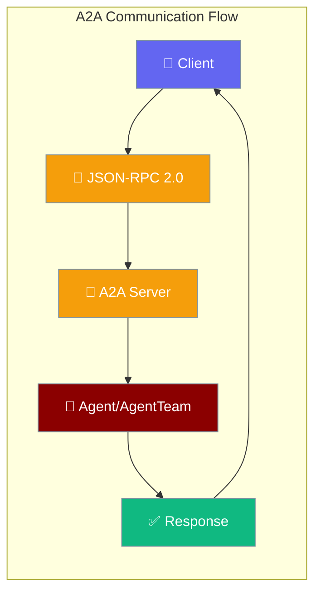
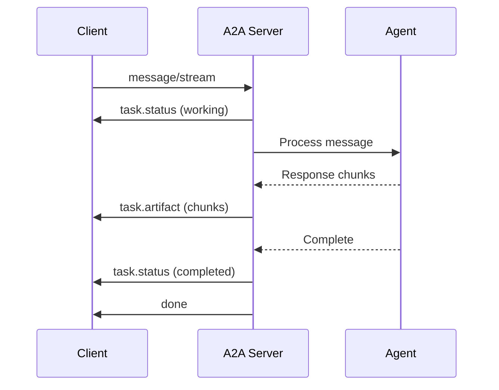

PraisonAI supports the [A2A Protocol](https://a2a-protocol.org) for agent-to-agent communication, enabling your agents to be discovered and collaborate with other AI agents via JSON-RPC 2.0.



## Quick Start

<Steps>
<Step title="Simple Agent Server">

```python
from praisonaiagents import Agent
from praisonaiagents.ui.a2a import A2A

def search_web(query: str) -> str:
    """Search the web for information."""
    return f"Results for: {query}"

agent = Agent(
    name="Research Assistant",
    role="Research Analyst", 
    goal="Help users research topics",
    tools=[search_web]
)

# Simple one-liner
a2a = A2A(agent=agent)
a2a.serve(port=8000)
```

</Step>

<Step title="FastAPI Integration">

```python
from fastapi import FastAPI
from praisonaiagents.ui.a2a import A2A

app = FastAPI()
a2a = A2A(agent=agent, url="http://localhost:8000/a2a")
app.include_router(a2a.get_router())
```

</Step>
</Steps>

---

## JSON-RPC Methods

The A2A server exposes six JSON-RPC 2.0 methods for complete task lifecycle management:

| Method | Description |
|--------|-------------|
| `message/send` | Send a message, get task result |
| `message/stream` | Send a message, get SSE stream |
| `tasks/get` | Get task by ID |
| `tasks/list` | List tasks (optionally by contextId) |
| `tasks/cancel` | Cancel a task |
| `agent/getExtendedCard` | Get extended agent card (auth required) |

### message/send

Send a message and receive the complete task result:

```bash
curl -X POST http://localhost:8000/a2a \
  -H "Content-Type: application/json" \
  -d '{
    "jsonrpc": "2.0",
    "method": "message/send",
    "id": "1",
    "params": {
      "message": {
        "messageId": "msg-001",
        "role": "user",
        "parts": [{"text": "What are the latest AI trends?"}]
      }
    }
  }'
```

**Response:**

```json
{
  "jsonrpc": "2.0",
  "id": "1",
  "result": {
    "id": "task-abc123",
    "contextId": "ctx-456",
    "status": {
      "state": "completed",
      "timestamp": "2024-01-15T10:30:00Z"
    },
    "history": [
      {
        "messageId": "msg-001",
        "role": "user",
        "parts": [{"text": "What are the latest AI trends?"}]
      },
      {
        "messageId": "msg-002",
        "role": "agent",
        "parts": [{"text": "Based on recent research..."}]
      }
    ],
    "artifacts": [
      {
        "artifactId": "art-789",
        "name": "AI Trends Report",
        "parts": [{"text": "Detailed analysis..."}]
      }
    ]
  }
}
```

### message/stream

Send a message and receive real-time updates via Server-Sent Events:

```bash
curl -X POST http://localhost:8000/a2a \
  -H "Content-Type: application/json" \
  -H "Accept: text/event-stream" \
  -d '{
    "jsonrpc": "2.0",
    "method": "message/stream",
    "id": "1",
    "params": {
      "message": {
        "role": "user",
        "parts": [{"text": "Explain quantum computing"}]
      }
    }
  }'
```

**SSE Event Format:**

```
event: task.status
data: {"taskId": "task-abc123", "status": {"state": "working"}}

event: task.artifact
data: {"taskId": "task-abc123", "artifact": {"parts": [{"text": "Quantum computing..."}]}}

event: task.status
data: {"taskId": "task-abc123", "status": {"state": "completed"}, "final": true}

event: done
data: {}
```

### tasks/get

Retrieve an existing task by ID:

```bash
curl -X POST http://localhost:8000/a2a \
  -H "Content-Type: application/json" \
  -d '{
    "jsonrpc": "2.0",
    "method": "tasks/get",
    "id": "2",
    "params": {"id": "task-abc123"}
  }'
```

### tasks/cancel

Cancel a running task:

```bash
curl -X POST http://localhost:8000/a2a \
  -H "Content-Type: application/json" \
  -d '{
    "jsonrpc": "2.0",
    "method": "tasks/cancel", 
    "id": "3",
    "params": {"id": "task-abc123"}
  }'
```

---

## Configuration Options

| Parameter | Type | Default | Description |
|-----------|------|---------|-------------|
| `agent` | `Agent` | — | Single agent |
| `agents` | `AgentTeam` | — | Multi-agent team |
| `name` | `str` | agent name | Endpoint name |
| `description` | `str` | agent role | Description |
| `url` | `str` | `http://localhost:8000/a2a` | Endpoint URL |
| `version` | `str` | `"1.0.0"` | Version |
| `prefix` | `str` | `""` | URL prefix |
| `auth_token` | `str` | `None` | Bearer token auth |
| `extended_agent_card_callback` | `callable` | `None` | Extended card callback |

```python
a2a = A2A(
    agent=agent,
    name="Custom Name",
    description="Custom description", 
    url="http://localhost:8000/a2a",
    version="2.0.0",
    prefix="/api",
    auth_token="sk-secret-key",
)
```

---

## Multi-Agent Support

Route messages to multi-agent workflows using `AgentTeam`:

```python
from praisonaiagents import Agent, AgentTeam, Task

researcher = Agent(name="Researcher", role="Research Analyst", goal="Research topics")
writer = Agent(name="Writer", role="Content Writer", goal="Write content")

task1 = Task(description="Research AI trends", agent=researcher)
task2 = Task(description="Write a report", agent=writer)

team = AgentTeam(agents=[researcher, writer], tasks=[task1, task2])

a2a = A2A(agents=team, name="Research Team")
a2a.serve(port=8000)
```

<Note>
When both `agent` and `agents` are provided, the single `agent` takes priority.
</Note>

---

## Streaming Events



### Event Types

| Event Type | Description |
|------------|-------------|
| `task.status` | Task state changes (`working`, `completed`, `failed`) |
| `task.artifact` | Artifact outputs with content chunks |
| `done` | Stream completion signal |

---

## Agent Card

The Agent Card is automatically generated from your agent's configuration:

```json
{
  "name": "Research Assistant",
  "url": "http://localhost:8000/a2a",
  "version": "1.0.0",
  "description": "Research Analyst. Help users research topics",
  "capabilities": {
    "streaming": true,
    "pushNotifications": false,
    "stateTransitionHistory": false
  },
  "skills": [
    {
      "id": "search_web",
      "name": "search_web", 
      "description": "Search the web for information.",
      "tags": ["tool"]
    }
  ],
  "provider": {
    "name": "PraisonAI"
  },
  "securitySchemes": {
    "bearerAuth": {
      "type": "http",
      "scheme": "bearer"
    }
  }
}
```

Access via: `GET /.well-known/agent.json`

---

## Message Parts

A2A messages support multimodal content through different part types:

| Part Type | A2A Field | Python Type |
|-----------|-----------|-------------|
| `TextPart` | `text` | `TextPart(text="...")` |
| `FilePart` | `file.uri` | `FilePart(file_uri="...")` |
| `DataPart` | `data` | `DataPart(data={...})` |

```bash
# Multimodal message example
curl -X POST http://localhost:8000/a2a \
  -H "Content-Type: application/json" \
  -d '{
    "jsonrpc": "2.0",
    "method": "message/send",
    "id": "1",
    "params": {
      "message": {
        "role": "user",
        "parts": [
          {"text": "Analyze this image"},
          {"fileWithUri": "https://example.com/chart.png", "mediaType": "image/png"},
          {"data": {"metadata": "analysis_request"}}
        ]
      }
    }
  }'
```

---

## Authentication

Protect your A2A endpoint with bearer token authentication:

```python
a2a = A2A(agent=agent, auth_token="sk-my-secret-key")
a2a.serve(port=8000)
```

Authenticated requests:

```bash
curl -X POST http://localhost:8000/a2a \
  -H "Authorization: Bearer sk-my-secret-key" \
  -H "Content-Type: application/json" \
  -d '{"jsonrpc": "2.0", "method": "message/send", ...}'
```

<Warning>
The discovery endpoint (`/.well-known/agent.json`) remains **public** per A2A spec. Only `POST /a2a` requires authentication.
</Warning>

---

## Task Lifecycle

```mermaid
graph TB
    subgraph "Task States"
        Submitted[📝 submitted] --> Working[⚡ working]
        Working --> InputRequired[❓ input_required]
        Working --> Completed[✅ completed]
        Working --> Failed[❌ failed]
        Working --> Cancelled[🚫 cancelled]
        InputRequired --> Working
        
        AuthRequired[🔐 auth_required]
    end
    
    classDef submitted fill:#6366F1,stroke:#7C90A0,color:#fff
    classDef working fill:#F59E0B,stroke:#7C90A0,color:#fff
    classDef completed fill:#10B981,stroke:#7C90A0,color:#fff
    classDef failed fill:#EF4444,stroke:#7C90A0,color:#fff
    
    class Submitted submitted
    class Working,InputRequired working  
    class Completed completed
    class Failed,Cancelled failed
    class AuthRequired failed
```

---

## Docker Deployment

```dockerfile
FROM python:3.11-slim

WORKDIR /app

COPY requirements.txt .
RUN pip install -r requirements.txt

COPY . .

EXPOSE 8000

CMD ["uvicorn", "app:app", "--host", "0.0.0.0", "--port", "8000"]
```

**requirements.txt:**
```
praisonaiagents
fastapi
uvicorn
```

---

## Related

<CardGroup cols={2}>
<Card title="A2A Client" icon="plug" href="/docs/features/a2a-client">
  A2A client for connecting to other agents
</Card>
<Card title="MCP Protocol" icon="puzzle-piece" href="/docs/features/mcp">
  Model Context Protocol for tool integration
</Card>
</CardGroup>