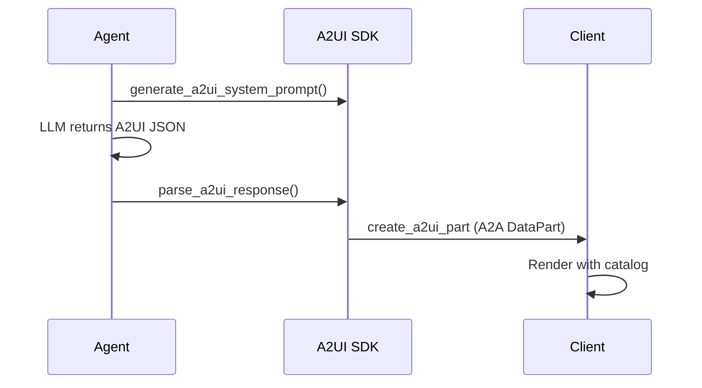

A2UI lets agents send declarative JSON UI specs that clients render with trusted component catalogues — integrate via the optional `a2ui-agent-sdk` package.


```python
from praisonaiagents import Agent

agent = Agent(
    name="assistant",
    instructions="Return declarative UI when a rich layout helps",
)

agent.start("Show a summary card with a primary action")
```

The user sends a chat message; the agent may respond with A2UI JSON for the client to render.

<Warning>
Install the optional extra: `pip install praisonaiagents[a2ui]`
</Warning>

For most web apps, **structured output** or **AG-UI** is simpler. Use A2UI when you need a portable UI spec across React, Flutter, Lit, and other renderers.

## Quick Start

<Steps>
<Step title="Add A2UI to an agent">

```python
from praisonaiagents import Agent
from praisonaiagents.tools.a2ui_tools import send_a2ui_messages

agent = Agent(
    name="assistant",
    instructions="Return rich UI when helpful.",
    tools=[send_a2ui_messages],
)

agent.start("Show me a card with a summary button")
```

</Step>

<Step title="Build prompts with the facade API">

```python
from praisonaiagents import A2UI

prompt = A2UI.system_prompt(
    role_description="You are a helpful assistant that returns rich UI.",
    ui_description="Use cards and buttons from the basic catalog.",
)

part = A2UI.create_part({
    "createSurface": {"surfaceId": "main", "catalogId": "basic"},
})
```

</Step>
</Steps>

## Generative UI Flow



1. `get_schema_manager()` — load JSON schemas and catalog
2. `generate_a2ui_system_prompt()` — inject schema into instructions
3. Agent returns A2UI JSON via tool or structured output
4. `parse_a2ui_response()` — validate and split text vs UI parts
5. External renderer draws the UI

## Tool Input Shapes

`send_a2ui_messages` accepts:

| Input | Accepted |
|-------|----------|
| List of message dicts | Yes |
| JSON string of a list | Yes |
| `{"messages": [...]}` dict | Yes |
| Single message dict | Yes (wrapped in a list) |

## Best Practices

<AccordionGroup>
<Accordion title="Prefer Generative UI for simple web apps">
[Generative UI](/docs/features/generative-ui) covers most CopilotKit and structured-output cases with less setup.
</Accordion>

<Accordion title="Validate with parse_a2ui_response before sending to clients">
Catch schema errors server-side before the renderer receives invalid JSON.
</Accordion>

<Accordion title="Use A2A DataParts for transport">
Wrap payloads with `create_a2ui_part()` for `application/json+a2ui` compatibility.
</Accordion>
</AccordionGroup>

## Related

<CardGroup cols={2}>
  <Card title="Generative UI" icon="sparkles" href="/docs/features/generative-ui">
    Tiered UI options overview
  </Card>
  <Card title="Integrate A2UI Frontend" icon="code" href="/docs/features/integrate-a2ui-frontend">
    Connect any UI framework
  </Card>
</CardGroup>
