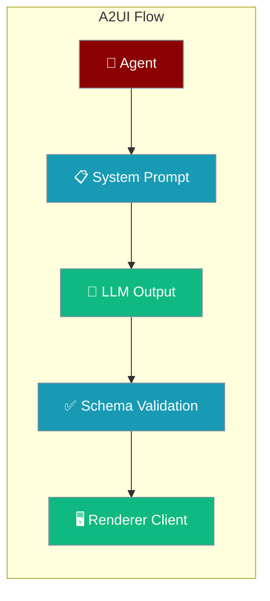
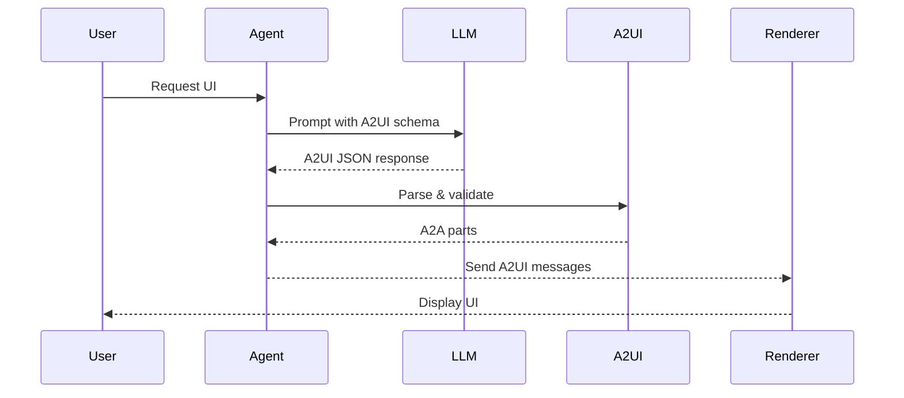

Declarative agent-generated UIs using Google's official A2UI SDK with schema validation and rendering support.



<Warning>
Install the A2UI extra and ensure a2a-sdk version compatibility:
```bash
pip install praisonaiagents[a2ui]
```
The a2a-sdk 1.x branch breaks DataPart API compatibility.
</Warning>

## Quick Start

<Steps>
<Step title="Install A2UI Extra">
Install the optional A2UI dependencies:

```bash
pip install praisonaiagents[a2ui]
```
</Step>

<Step title="Add A2UI System Prompt and Tool">
Create an agent with A2UI system prompt and the send_a2ui_messages tool:

```python
from praisonaiagents import Agent
from praisonaiagents.ui import A2UI
from praisonaiagents.tools.a2ui_tools import send_a2ui_messages

agent = Agent(
    name="UI Assistant",
    instructions="Reply with A2UI surfaces when the user asks for a UI.",
    system_prompt=A2UI.system_prompt(
        role_description="You generate user interfaces using A2UI.",
        ui_description="Use the basic catalog v0.9.",
    ),
    tools=[send_a2ui_messages],
)

agent.start("Show me a contact form for name and email")
```
</Step>

<Step title="Parse and Validate Output">
Parse LLM responses into validated A2A parts:

```python
from praisonaiagents.ui import A2UI

# Parse LLM text output into A2A parts
llm_output = '{"createSurface": {"surfaceId": "form"}}'
parts = A2UI.parse_response(llm_output)

# Create A2UI parts manually
a2ui_data = {"createSurface": {"surfaceId": "contact"}}
part = A2UI.create_part(a2ui_data)

# Check if a part contains A2UI data
if A2UI.is_part(part):
    print("Contains A2UI data")
```
</Step>
</Steps>

---

## How It Works



The A2UI integration provides a thin adapter over Google's official a2ui-agent-sdk:

| Step | Description |
|------|-------------|
| System Prompt | Embeds A2UI schema and examples in LLM context |
| LLM Generation | Model generates A2UI JSON following the schema |
| Parsing | `A2UI.parse_response` validates and splits text/A2UI parts |
| Transport | A2A DataPart wraps A2UI for client transmission |

---

## Configuration Options

### Schema Manager Options

Configure A2UI schema validation:

| Option | Type | Default | Description |
|--------|------|---------|-------------|
| `version` | `str` | `"0.9"` | A2UI version to use |
| `catalogs` | `List[Any]` | `None` | Component catalogs (uses basic catalog if None) |
| `accepts_inline_catalogs` | `bool` | `False` | Allow inline catalog definitions |

### System Prompt Options

Configure A2UI system prompt generation:

| Option | Type | Default | Description |
|--------|------|---------|-------------|
| `role_description` | `str` | Required | Role description for the agent |
| `workflow_description` | `str` | `""` | Optional workflow description |
| `ui_description` | `str` | `""` | Optional UI description |
| `version` | `str` | `"0.9"` | A2UI version |
| `include_schema` | `bool` | `True` | Include schema in prompt |
| `include_examples` | `bool` | `True` | Include examples in prompt |

---

## Standalone Validation Pattern

Use A2UI validation without an agent wrapper:

```python
from praisonaiagents.ui import A2UI

# Generate system prompt
prompt = A2UI.system_prompt(
    role_description="You create contact forms",
    ui_description="Generate simple forms with name and email fields",
    include_examples=True
)

# Parse LLM response
response = '{"createSurface": {"surfaceId": "contact"}}'
parts = A2UI.parse_response(response)

# Create and validate parts
for part in parts:
    if A2UI.is_part(part):
        print("Valid A2UI part")
        # Send to renderer client
```

---

## Migration from Previous A2UI Implementation

The PR #1702 refactor removed the custom A2UI implementation. Here are the changes:

<AccordionGroup>
<Accordion title="Removed Classes and What to Use Instead">
**Removed classes (no longer available):**

```python
# ALL OF THESE WERE REMOVED
from praisonaiagents.ui.a2ui import A2UIAgent            # removed
from praisonaiagents.ui.a2ui import Surface, PathBinding # removed  
from praisonaiagents.ui.a2ui import ChatTemplate         # removed
from praisonaiagents.ui.a2ui import ListTemplate         # removed
from praisonaiagents.ui.a2ui import FormTemplate         # removed
from praisonaiagents.ui.a2ui import DashboardTemplate    # removed
from praisonaiagents.ui.a2ui import (
    CreateSurfaceMessage, UpdateComponentsMessage,       # removed
    UpdateDataModelMessage, DeleteSurfaceMessage,        # removed
    TextComponent,                                       # removed
)
```

**New equivalent approach:**

```python
# Use the official SDK directly for complex UIs
from a2ui.agent import Agent as A2UISDKAgent
from a2ui.schema.manager import A2uiSchemaManager

# Or use PraisonAI's thin facade for simple cases
from praisonaiagents.ui import A2UI
from praisonaiagents.tools.a2ui_tools import send_a2ui_messages
```
</Accordion>

<Accordion title="Migration Strategy">
1. **Replace A2UIAgent** → Use `A2UI.system_prompt()` with `send_a2ui_messages` tool
2. **Replace Surface builders** → Use upstream `a2ui-agent-sdk` directly  
3. **Replace Templates** → Build JSON manually or use upstream SDK templates
4. **Replace Components** → Import from `a2ui.components` in upstream SDK
5. **Update imports** → All PraisonAI A2UI classes were removed, use Google's SDK
</Accordion>

<Accordion title="Benefits of the New Approach">
- **Maintenance**: Uses Google's official SDK instead of custom implementation
- **Features**: Access to latest A2UI features and bug fixes
- **Compatibility**: Standard A2UI JSON works across all clients
- **Size**: Removed ~3,400 lines of custom code from PraisonAI core
- **Optional**: A2UI is now truly optional via `pip install praisonaiagents[a2ui]`
</Accordion>
</AccordionGroup>

---

## Best Practices

<AccordionGroup>
<Accordion title="Pin a2a-sdk Version">
Always pin a2a-sdk to avoid breaking changes:

```bash
pip install "a2a-sdk>=0.3.0,<1.0.0"
```

The 1.x branch introduces breaking changes to the DataPart API.
</Accordion>

<Accordion title="Use Schema Validation">
Always parse and validate LLM output:

```python
# Don't send raw LLM output
# Do validate first
parts = A2UI.parse_response(llm_output)
validated_parts = [p for p in parts if A2UI.is_part(p)]
```
</Accordion>

<Accordion title="Prefer Official SDK for Complex UIs">
For complex UIs with multiple surfaces, use Google's SDK directly:

```python
from a2ui.agent import Agent as A2UIAgent
from a2ui.schema.manager import A2uiSchemaManager

# Direct SDK usage for complex scenarios
```
</Accordion>

<Accordion title="Include Examples in System Prompts">
Enable examples for better LLM output:

```python
A2UI.system_prompt(
    role_description="Create forms",
    include_examples=True,  # Better LLM output
    include_schema=True,    # Enable validation
)
```
</Accordion>
</AccordionGroup>

---

## Related

<CardGroup cols={2}>
<Card title="Generative UI" icon="display" href="/docs/features/generative-ui">
  Choose the right UI generation tier
</Card>
<Card title="AG-UI Server" icon="server" href="/docs/deploy/servers/agui">
  Deploy AG-UI with CopilotKit integration
</Card>
<Card title="A2A Protocol" icon="arrows-exchange" href="/docs/features/a2a">
  Agent-to-Agent communication
</Card>
<Card title="Streaming" icon="stream" href="/docs/features/streaming">
  Stream agent responses as markdown
</Card>
</CardGroup>