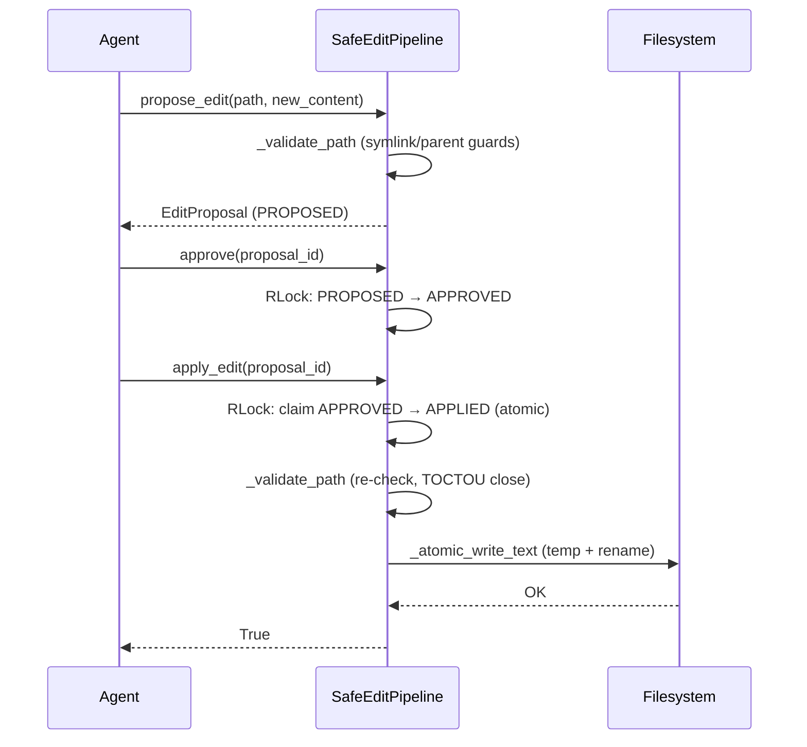

Let an ACP agent edit code with `--allow-write` while every write is validated, contained, and applied atomically.

```python
from praisonai.acp import ACPServer, ACPConfig
from praisonaiagents import Agent

agent = Agent(name="CodeAssistant", instructions="Help me edit code.")
# File writes go through the safe-edit pipeline
server = ACPServer(config=ACPConfig(workspace=".", allow_write=True), agent=agent)
```

The `SafeEditPipeline` runs a propose → approve → apply workflow: it confines writes to the workspace, rejects symlink escapes, claims the apply transition atomically, and writes via a temp-file rename.


## Quick Start

<Steps>
<Step title="Enable writes on the ACP server">

```bash
praisonai acp --allow-write
```

Writes are denied by default; `--allow-write` routes them through the safe-edit pipeline.

</Step>
<Step title="Propose, approve, apply from Python">

```python
from praisonai.acp.safe_edit import get_safe_edit_pipeline

pipeline = get_safe_edit_pipeline(workspace=".")
proposal = pipeline.propose_edit("notes.md", "# Notes\n", "Create notes file")
pipeline.approve(proposal.proposal_id)
pipeline.apply_edit(proposal.proposal_id)
```

</Step>
</Steps>

## Guarantees

### Workspace Confinement + Parent-Symlink Defence

`_validate_path()` rejects any target that escapes the workspace or traverses a symlink.

It raises `ValueError` with one of these exact messages (users grep for them):

- resolves outside the workspace — `Path {..} is outside workspace {..}`
- traverses a **symlinked parent** — `Refusing to write through symlinked parent {..} (possible containment bypass)`
- traverses a parent that exists but is not a directory — `Parent {..} is not a directory`
- **is itself a symlink** — `Refusing to write through symlinked target {..}`

The parent-symlink check defends against a propose→apply TOCTOU: even though `resolve()` follows symlinks, an attacker can swap an intermediate workspace-owned directory for a symlink between the two calls so a later pathname-based write escapes containment. Rejecting any symlinked parent means the only writable path is one made entirely of real directories the workspace owns.

```python
# Symlinked target is refused, not followed
pipeline.propose_edit("link-to-outside", "data", "edit")
# ValueError: Refusing to write through symlinked target /abs/path/link-to-outside
```

### Atomic APPROVED → APPLIED Transition

`apply_edit()` claims the APPROVED status atomically so two concurrent applies of the same proposal cannot both succeed.

The pipeline holds an `RLock` (`self._lock`) around `_proposals` mutations and status transitions. `apply_edit()` checks the proposal is `APPROVED` and flips it to `APPLIED` inside the lock (a tentative claim), then does the disk work outside the lock; a second concurrent `apply_edit()` finds the status is no longer `APPROVED` and returns `False`.

### Atomic File Write

The final write goes through `_atomic_write_text` (a sibling temp-file + fsync + rename), so an interrupted apply never leaves a half-written or truncated file.

### Per-Workspace Pipeline

`get_safe_edit_pipeline(workspace=...)` returns a **distinct** `SafeEditPipeline` per resolved workspace so concurrent agents cannot leak proposals across workspaces.

```python
def get_safe_edit_pipeline(workspace: Optional[Path] = None) -> SafeEditPipeline: ...
```

The factory caches instances in a module-level `_pipelines: Dict[Path, SafeEditPipeline]` keyed by the resolved workspace path. A previous single global silently bound every caller to the first caller's workspace; the per-workspace cache removes that cross-talk.

## Full Flow



## Error Taxonomy

| Error string | Trigger | Fix |
|---|---|---|
| `Path {..} is outside workspace {..}` | Target resolves outside the workspace root | Write inside the workspace, or start the server with a wider `--workspace` |
| `Refusing to write through symlinked parent {..} (possible containment bypass)` | An intermediate parent directory is a symlink | Replace the symlinked parent with a real directory the workspace owns |
| `Parent {..} is not a directory` | A parent path component exists but is a file | Remove or rename the conflicting file |
| `Refusing to write through symlinked target {..}` | The target file itself is a symlink | Delete the symlink and write a real file, or target the link's real destination inside the workspace |

## Best Practices

<AccordionGroup>
  <Accordion title="Scope the workspace tightly">
    Set `--workspace` (or `ACPConfig(workspace=...)`) to the smallest project root that covers your edits so `_validate_path()` rejects anything outside it.
  </Accordion>
  <Accordion title="Keep --allow-write opt-in">
    ACP is read-only by default. Add `--allow-write` only for sessions that need to edit files, and prefer manual approval for risky changes.
  </Accordion>
  <Accordion title="Do not pre-create symlinks in the workspace">
    Symlinked parents and targets are rejected by design. Use real directories so writes are not refused as possible containment bypasses.
  </Accordion>
  <Accordion title="Use one pipeline per workspace">
    Call `get_safe_edit_pipeline(workspace=...)` rather than sharing a single instance so concurrent agents keep separate proposal state.
  </Accordion>
</AccordionGroup>

## Related

<CardGroup cols={2}>
  <Card title="ACP" icon="plug" href="/acp">
    Connect IDEs and editors to PraisonAI agents.
  </Card>
  <Card title="Security Best Practices" icon="shield-halved" href="/best-practices/security">
    Injection defense, audit logging, and protected paths.
  </Card>
  <Card title="Auto-Generator Safety" icon="shield-check" href="/features/auto-generator-safety">
    Safe defaults for `praisonai --auto`.
  </Card>
  <Card title="Tools" icon="wrench" href="/tools">
    Add custom tools to your agent.
  </Card>
</CardGroup>
