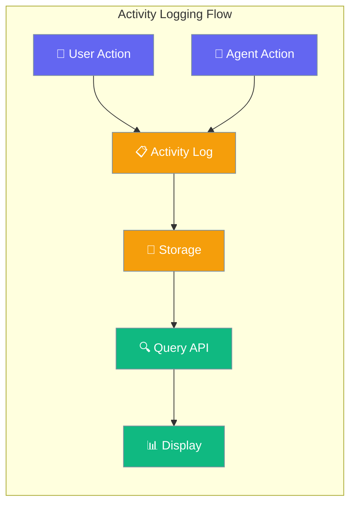
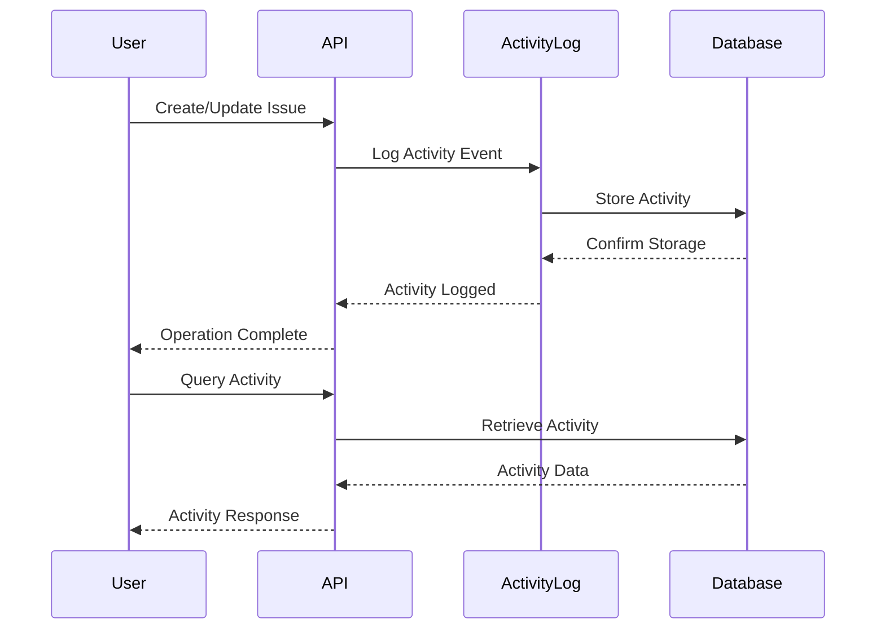

Activity Log provides a comprehensive audit trail of all actions performed in workspaces and on issues, automatically recording events as they occur.



## Quick Start

<Steps>
<Step title="List Workspace Activity">
```python
import asyncio
import httpx

async def get_workspace_activity():
    base = "http://localhost:8000/api/v1"
    headers = {"Authorization": "Bearer YOUR_TOKEN"}
    ws_id = "your-workspace-id"

    async with httpx.AsyncClient() as client:
        response = await client.get(
            f"{base}/workspaces/{ws_id}/activity",
            params={"limit": 20, "offset": 0},
            headers=headers
        )
        activities = response.json()
        
        for activity in activities:
            print(f"[{activity['action']}] by {activity['actor_type']}:{activity['actor_id']}")
            print(f"  Details: {activity['details']}")

asyncio.run(get_workspace_activity())
```
</Step>

<Step title="Get Issue Activity">
```python
import asyncio
import httpx

async def get_issue_activity():
    base = "http://localhost:8000/api/v1"
    headers = {"Authorization": "Bearer YOUR_TOKEN"}
    ws_id = "your-workspace-id"
    issue_id = "your-issue-id"

    async with httpx.AsyncClient() as client:
        response = await client.get(
            f"{base}/workspaces/{ws_id}/issues/{issue_id}/activity",
            params={"limit": 10},
            headers=headers
        )
        activities = response.json()
        
        for activity in activities:
            print(f"{activity['created_at']}: {activity['action']}")
            print(f"  Actor: {activity['actor_type']} {activity['actor_id']}")
            if activity.get('details'):
                print(f"  Details: {activity['details']}")

asyncio.run(get_issue_activity())
```
</Step>
</Steps>

---

## How It Works



| Component | Purpose |
|-----------|---------|
| Activity Logger | Automatically captures events |
| Storage Engine | Persists activity records |
| Query API | Provides paginated access |
| Audit Trail | Maintains complete history |

---

## API Endpoints

### Workspace Activity

| Method | Endpoint | Description |
|--------|----------|-------------|
| `GET` | `/api/v1/workspaces/{ws_id}/activity` | List all workspace activity |

### Issue Activity

| Method | Endpoint | Description |
|--------|----------|-------------|
| `GET` | `/api/v1/workspaces/{ws_id}/issues/{issue_id}/activity` | List activity for specific issue |

### Query Parameters

| Parameter | Type | Default | Description |
|-----------|------|---------|-------------|
| `limit` | `int` | 50 | Max results per page (1-200) |
| `offset` | `int` | 0 | Number of results to skip |

---

## Response Schema

Each activity entry follows this structure:

```json
{
  "id": "act-abc123",
  "workspace_id": "ws-abc123",
  "issue_id": "issue-abc123",
  "actor_type": "user",
  "actor_id": "user-abc123",
  "action": "issue.created",
  "details": {
    "title": "Fix login bug",
    "identifier": "ISS-1"
  },
  "created_at": "2025-01-01T00:00:00"
}
```

| Field | Type | Description |
|-------|------|-------------|
| `id` | `string` | Unique activity identifier |
| `workspace_id` | `string` | Workspace where activity occurred |
| `issue_id` | `string` | Issue ID (for issue activities) |
| `actor_type` | `string` | `"user"` or `"agent"` |
| `actor_id` | `string` | ID of the actor who performed action |
| `action` | `string` | Type of action performed |
| `details` | `object` | Action-specific contextual data |
| `created_at` | `string` | ISO timestamp of when action occurred |

---

## Tracked Actions

### Issue Actions

| Action | Trigger | Details Included |
|--------|---------|------------------|
| `issue.created` | Issue creation | `title`, `identifier` |
| `issue.updated` | Issue modification | Changed fields and their new values |

### Future Actions

The activity log system is designed to capture additional events as the platform grows:

- Workspace events (member added/removed)
- Agent executions and results
- File uploads and modifications
- Configuration changes

---

## Usage Examples

### Using curl

```bash
TOKEN="your-jwt-token"
WS_ID="workspace-id"
ISSUE_ID="issue-id"

# List workspace activity with pagination
curl -s "http://localhost:8000/api/v1/workspaces/$WS_ID/activity?limit=20&offset=0" \
  -H "Authorization: Bearer $TOKEN" \
  --max-time 10

# List activity for a specific issue
curl -s "http://localhost:8000/api/v1/workspaces/$WS_ID/issues/$ISSUE_ID/activity?limit=10" \
  -H "Authorization: Bearer $TOKEN" \
  --max-time 10
```

### Python with Filtering

```python
import asyncio
import httpx
from datetime import datetime, timedelta

async def filter_recent_activity():
    base = "http://localhost:8000/api/v1"
    headers = {"Authorization": "Bearer YOUR_TOKEN"}
    ws_id = "your-workspace-id"

    async with httpx.AsyncClient() as client:
        # Get all recent activity
        response = await client.get(
            f"{base}/workspaces/{ws_id}/activity",
            params={"limit": 100},
            headers=headers
        )
        activities = response.json()
        
        # Filter last 24 hours
        yesterday = datetime.now() - timedelta(days=1)
        recent_activities = [
            activity for activity in activities
            if datetime.fromisoformat(activity['created_at'].replace('Z', '+00:00')) > yesterday
        ]
        
        # Group by action type
        by_action = {}
        for activity in recent_activities:
            action = activity['action']
            if action not in by_action:
                by_action[action] = []
            by_action[action].append(activity)
        
        for action, items in by_action.items():
            print(f"{action}: {len(items)} events")

asyncio.run(filter_recent_activity())
```

---

## Best Practices

<AccordionGroup>
<Accordion title="Implement Pagination for Large Datasets">
Always use pagination when querying activity logs, especially for active workspaces. The default limit is 50, but you can adjust based on your needs.

```python
async def paginated_activity():
    all_activities = []
    offset = 0
    limit = 50
    
    while True:
        response = await client.get(
            f"{base}/workspaces/{ws_id}/activity",
            params={"limit": limit, "offset": offset}
        )
        activities = response.json()
        
        if not activities:
            break
            
        all_activities.extend(activities)
        offset += limit
```
</Accordion>

<Accordion title="Cache Activity Data for Performance">
For frequently accessed activity logs, implement client-side caching to reduce API calls and improve response times.

```python
from functools import lru_cache
from datetime import datetime, timedelta

@lru_cache(maxsize=128)
def get_cached_activity(ws_id, cache_key):
    # Cache for 5 minutes
    return fetch_activity(ws_id)
```
</Accordion>

<Accordion title="Filter by Actor Type for Specific Insights">
Use actor type filtering to separate human actions from automated agent actions for better analysis.

```python
# Filter for user actions only
user_actions = [
    activity for activity in activities 
    if activity['actor_type'] == 'user'
]

# Filter for agent actions only
agent_actions = [
    activity for activity in activities 
    if activity['actor_type'] == 'agent'
]
```
</Accordion>

<Accordion title="Monitor Activity Patterns for Anomalies">
Implement monitoring to detect unusual activity patterns that might indicate issues or security concerns.

```python
def detect_anomalies(activities):
    # Check for rapid succession of activities
    timestamps = [activity['created_at'] for activity in activities]
    # Check for unusual actor patterns
    actors = [activity['actor_id'] for activity in activities]
    # Implement your anomaly detection logic
```
</Accordion>
</AccordionGroup>

---

## Testing

Test the activity log functionality with these commands:

```bash
# Test workspace activity endpoint
pytest tests/test_services.py::TestActivityService -v

# Test pagination behavior
pytest tests/test_new_gaps.py::TestPagination::test_activity_pagination -v

# Test complete API integration
pytest tests/test_new_api_integration.py::TestActivityRoutes -v
```

---

## Related

<CardGroup cols={2}>
<Card title="Workspace Management" icon="building" href="/docs/features/sessions">
  Learn about workspace organization and management
</Card>
<Card title="API Authentication" icon="key" href="/docs/features/security-environment-variables">
  Configure secure API access with tokens
</Card>
</CardGroup>