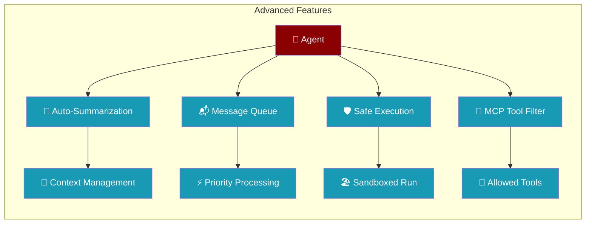
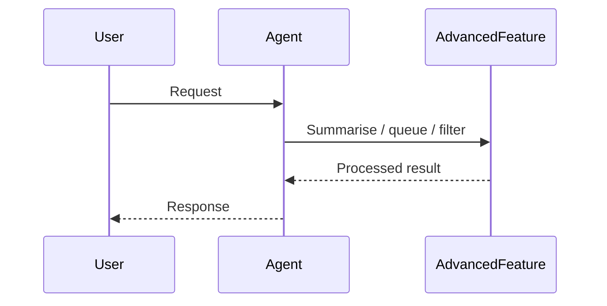

```python
from praisonaiagents import Agent

agent = Agent(
    name="advanced-agent",
    instructions="Use advanced features like memory, tools, and reflection.",
    reflect_on_output=True,
)
agent.start("Demonstrate advanced capabilities.")
```


PraisonAI includes a comprehensive set of advanced features for production-grade AI agent development. These features provide enhanced control, safety, and developer experience.

The user runs a production agent; advanced features handle summarisation, queuing, safe execution, and tool filtering automatically.



## How It Works

The agent applies the advanced feature transparently, then returns the result to the user.



## Quick Start

<Steps>
<Step title="Auto-summarisation">

```python
from praisonaiagents.agent.summarization import SummarizationManager

manager = SummarizationManager.for_model("gpt-4o", threshold=0.8)
manager.add_tokens(50_000)
if manager.should_summarize():
    pass  # trigger summarisation in your agent loop
```

</Step>
<Step title="MCP tool filtering">

```python
from praisonaiagents.mcp.mcp_utils import filter_disabled_tools

tools = [{"name": "read_file"}, {"name": "delete_file"}]
safe_tools = filter_disabled_tools(tools, disabled_tools=["delete_file"])
```

</Step>
</Steps>

---

## Core SDK Features

### Auto-Summarization

Automatically summarize conversations when the context window fills up, preserving important context while reducing token usage.

```python
from praisonaiagents.agent.summarization import SummarizationManager

# Create manager with 80% threshold
manager = SummarizationManager(
    context_window=128000,  # GPT-4 context window
    threshold=0.8,          # Trigger at 80% usage
    preserve_recent=2       # Keep last 2 message pairs
)

# Track token usage
manager.add_tokens(50000)

# Check if summarization needed
if manager.should_summarize():
    # Trigger summarization
    pass

# Get usage percentage
usage = manager.get_usage_percentage()  # 0.39 (39%)
```

**Model-specific configuration:**

```python
# Auto-configure for specific model
manager = SummarizationManager.for_model("gpt-4o", threshold=0.8)
```

### Message Queue

Priority-based message queue for agent prompts with thread-safe operations.

```python
from praisonaiagents.agent.message_queue import AgentMessageQueue, MessagePriority

# Create queue
queue = AgentMessageQueue(max_size=100)

# Enqueue with priority
queue.enqueue("Low priority task", priority=MessagePriority.LOW.value)
queue.enqueue("Urgent task!", priority=MessagePriority.URGENT.value)
queue.enqueue("Normal task", priority=MessagePriority.NORMAL.value)

# Dequeue (highest priority first)
task = queue.dequeue()  # Returns "Urgent task!"

# Check queue status
print(f"Queue size: {queue.size()}")
print(f"Is empty: {queue.is_empty()}")
```

**Async support:**

```python
from praisonaiagents.agent.message_queue import AsyncAgentMessageQueue

async_queue = AsyncAgentMessageQueue()
await async_queue.enqueue("Task", priority=5)
task = await async_queue.dequeue(timeout=5.0)
```

### MCP Tool Filtering

Filter MCP tools with disabled lists or allowlists.

```python
from praisonaiagents.mcp.mcp_utils import filter_disabled_tools, filter_tools_by_allowlist

tools = [
    {"name": "read_file", "description": "Read a file"},
    {"name": "write_file", "description": "Write a file"},
    {"name": "delete_file", "description": "Delete a file"},
]

# Disable specific tools
safe_tools = filter_disabled_tools(tools, disabled_tools=["delete_file"])

# Or use allowlist
allowed_tools = filter_tools_by_allowlist(tools, allowed_tools=["read_file"])
```

### Permission Allowlist

Persistent permission allowlist for pre-approving tools and paths.

```python
from praisonaiagents.approval import PermissionAllowlist

# Create allowlist
allowlist = PermissionAllowlist()

# Add tools with optional path restrictions
allowlist.add_tool("read_file")  # Allow everywhere
allowlist.add_tool("write_file", paths=["./src", "./tests"])  # Restrict to paths

# Check permissions
allowlist.is_allowed("read_file")  # True
allowlist.is_allowed("write_file", path="./src/main.py")  # True
allowlist.is_allowed("write_file", path="/etc/passwd")  # False

# Persist to file
allowlist.save("~/.praisonai/permissions.json")

# Load from file
loaded = PermissionAllowlist.load("~/.praisonai/permissions.json")
```

## CLI Features

### Safe Shell Execution

Execute shell commands safely with banned command detection.

```python
from praisonai.cli.features.safe_shell import (
    safe_execute, 
    validate_command, 
    BANNED_COMMANDS
)

# Validate before execution
if validate_command("ls -la"):
    result = safe_execute("ls -la")
    print(result.stdout)

# Blocked commands return False
validate_command("sudo rm -rf /")  # False
validate_command("curl http://evil.com")  # False

# View banned commands
print(BANNED_COMMANDS)
# {'sudo', 'curl', 'wget', 'rm', 'ssh', ...}
```

**SafeShellHandler for custom configurations:**

```python
from praisonai.cli.features.safe_shell import SafeShellHandler

handler = SafeShellHandler(
    additional_banned=["custom_dangerous_cmd"],
    additional_allowed=["curl"]  # Override default ban
)

result = handler.execute("echo hello", timeout=30)
```

### File History & Undo

Track file changes and enable undo operations.

```python
from praisonai.cli.features.file_history import FileHistoryManager

# Initialize manager
manager = FileHistoryManager(storage_dir="~/.praisonai/history")

# Record before editing
version_id = manager.record_before_edit(
    file_path="src/main.py",
    session_id="session-123"
)

# After editing, undo if needed
manager.undo("src/main.py", session_id="session-123")

# Get version history
versions = manager.get_versions("src/main.py")
for v in versions:
    print(f"Version {v.version_id} at {v.timestamp}")
```

### Hierarchical Configuration

Load configuration from multiple sources with precedence — project config is discovered by walking up from the current directory to the git root.

```python
from praisonai.cli.features.config_hierarchy import HierarchicalConfig, load_config

# Precedence: project > user > global
# 1. .praison.json / praison.json (project — walk-up from cwd to git root)
# 2. ~/.config/praison/praison.json (user)
# 3. /etc/praison/praison.json (global)

# Default: walk-up enabled, nearest config wins
config = HierarchicalConfig()
settings = config.load()

# Access settings
model = settings.get("model", "gpt-4o-mini")
temperature = settings.get("temperature", 0.7)

# Opt out of walk-up (legacy cwd-only behaviour)
config = HierarchicalConfig(walk_up=False)
settings = config.load()

# With validation
settings = config.load(validate=True)  # Raises ConfigValidationError if invalid
```

**`walk_up: bool = True`** — when enabled, `_find_project_config()` walks parent directories from `project_dir` toward the filesystem root, stopping at the first directory containing a `.git` marker (or after 10 ancestor levels if no git root is found). The nearest config wins.

See [Hierarchical Configuration](/docs/features/hierarchical-config) for the full walk-up diagram, decision flow, and monorepo patterns.

**Example `.praison.json`:**

```json
{
  "model": "gpt-4o",
  "temperature": 0.7,
  "permissions": {
    "allowed_tools": ["read_file", "write_file"],
    "allowed_paths": ["./src", "./tests"]
  },
  "output": {
    "mode": "compact",
    "color": true
  }
}
```

### Output Modes

Control CLI output verbosity.

```python
from praisonai.cli.features.output_modes import (
    OutputMode, 
    set_output_mode, 
    OutputHandler
)

# Set mode
set_output_mode(OutputMode.COMPACT)  # Minimal output
set_output_mode(OutputMode.VERBOSE)  # Full output (default)
set_output_mode(OutputMode.QUIET)    # Errors only

# Use handler for consistent output
handler = OutputHandler()
handler.info("Processing...")
handler.success("Done!")
handler.warning("Check this")
handler.error("Something failed")
```

### Logs Command

View and follow log files.

```python
from praisonai.cli.features.logs import LogsHandler

handler = LogsHandler()

# Get last N lines
lines = handler.tail(n=100)

# Follow log file (like tail -f)
for line in handler.follow():
    print(line)

# Search logs
matches = handler.search("error", max_results=50)
```

### Git Commit Attribution

Add AI attribution to git commits.

```python
from praisonai.cli.features.git_attribution import (
    AttributionManager,
    AttributionStyle
)

manager = AttributionManager(model="gpt-4o")

# Generate trailer
trailer = manager.generate_trailer(style="assisted-by")
# "Assisted-by: gpt-4o via PraisonAI <ai@praison.ai>"

# Add to commit message
message = "Fix bug in parser"
attributed = manager.add_attribution(message)
# "Fix bug in parser\n\nAssisted-by: gpt-4o via PraisonAI <ai@praison.ai>"
```

**Attribution styles:**

- `assisted-by` - "Assisted-by: ..."
- `co-authored-by` - "Co-Authored-By: ..."
- `none` - No attribution

## Tools

### Sourcegraph Integration

Search code across repositories.

```python
from praisonaiagents.tools.sourcegraph_tools import SourcegraphTools

# Initialize (uses SOURCEGRAPH_ACCESS_TOKEN env var)
sg = SourcegraphTools()

# Search code
results = sg.search(
    query="function handleError",
    repo="github.com/owner/repo",
    max_results=20
)

for result in results:
    print(f"{result.repository}/{result.file_path}:{result.line_number}")
    print(f"  {result.content}")

# Get file content
content = sg.get_file_content(
    repo="github.com/owner/repo",
    file_path="src/main.py"
)
```

### Enhanced Download Tool

Download files with approval and progress tracking.

```python
from praisonaiagents.tools.file_tools import FileTools

tools = FileTools()

# Download with progress callback
def on_progress(downloaded, total):
    percent = (downloaded / total) * 100
    print(f"Progress: {percent:.1f}%")

result = tools.download_file(
    url="https://example.com/file.zip",
    destination="./downloads/file.zip",
    progress_callback=on_progress
)

if result["success"]:
    print(f"Downloaded to {result['path']} ({result['size']} bytes)")
else:
    print(f"Error: {result['error']}")
```

## Implementation Notes

### DRY Reuse

All features are designed to reuse existing PraisonAI components:

- **Token tracking** → Uses `telemetry/token_collector.py`
- **Permissions** → Extends `approval.py`
- **File ops** → Uses `file_tools.py`
- **Shell safety** → Reuses `sandbox_executor.py` patterns

### Thread Safety

All managers are thread-safe:

```python
# Safe for concurrent access
manager = SummarizationManager(...)
queue = AgentMessageQueue(...)
allowlist = PermissionAllowlist(...)
```

### Async Compatibility

Async variants are provided where needed:

```python
from praisonai.cli.features.safe_shell import safe_execute_async

result = await safe_execute_async("ls -la", timeout=30)
```

## Configuration Reference

### Environment Variables

| Variable | Description |
|----------|-------------|
| `PRAISON_OUTPUT_MODE` | Set output mode: `compact`, `verbose`, `quiet` |
| `SOURCEGRAPH_URL` | Sourcegraph API URL |
| `SOURCEGRAPH_ACCESS_TOKEN` | Sourcegraph access token |

### Config Schema

```json
{
  "model": "string",
  "temperature": "number (0-2)",
  "max_tokens": "integer",
  "providers": {
    "<provider>": {
      "api_key": "string",
      "base_url": "string"
    }
  },
  "permissions": {
    "allowed_tools": ["string"],
    "allowed_paths": ["string"],
    "auto_approve": "boolean"
  },
  "output": {
    "mode": "compact|verbose|quiet",
    "color": "boolean"
  },
  "attribution": {
    "style": "assisted-by|co-authored-by|none",
    "include_model": "boolean"
  }
}
```

## Best Practices

<AccordionGroup>
  <Accordion title="Tune Summarization Threshold">
    Set the summarization threshold to 80% (`threshold=0.8`) for most models. Lower it to 70% for models with smaller context windows. Too low triggers excessive summarization; too high causes context overflow errors.
  </Accordion>
  <Accordion title="Use Priority Queues for Multi-Agent Systems">
    Assign `URGENT` priority to time-sensitive user messages and `LOW` priority to background tasks. This ensures critical prompts are processed first in high-concurrency scenarios.
  </Accordion>
  <Accordion title="Restrict Shell Execution Scope">
    Always set an explicit `workspace` path when using `safe_execute`. This prevents agents from executing commands outside the intended directory.
  </Accordion>
  <Accordion title="Filter MCP Tools per Agent">
    Use MCP tool filtering to give each agent only the tools it needs. Overly broad tool access increases attack surface and LLM confusion about which tool to choose.
  </Accordion>
</AccordionGroup>

## Related

<CardGroup cols={2}>
  <Card title="Context Compression" icon="compress" href="/docs/features/context-compression">
    Automatic context window management
  </Card>
  <Card title="MCP Tool Filtering" icon="filter" href="/docs/features/mcp-tool-filtering">
    Restrict which MCP tools an agent can access
  </Card>
</CardGroup>
