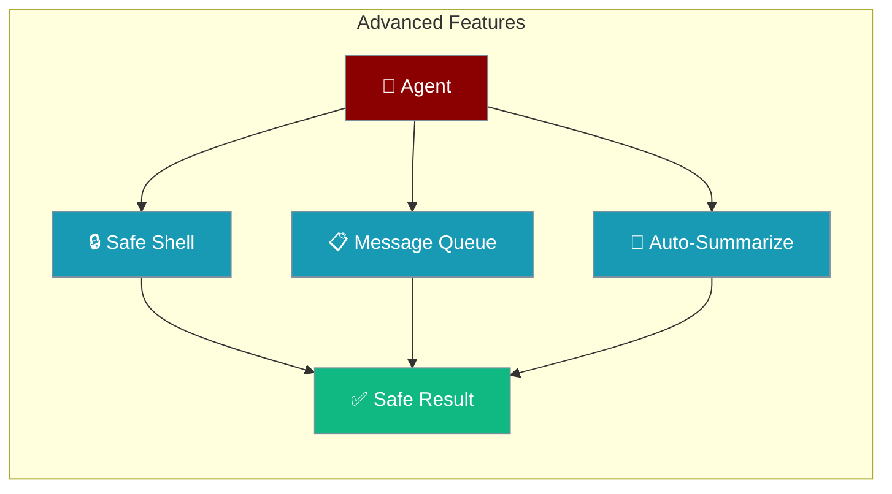
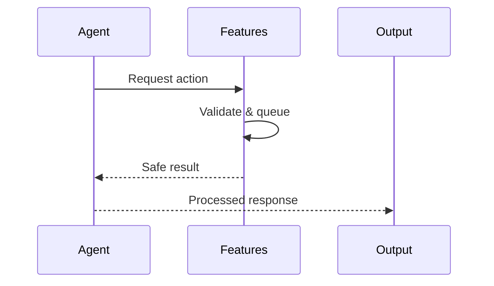

PraisonAI ships production-grade utilities for agents that need safe execution, token awareness, and file tracking.



## Quick Start

<Steps>
<Step title="Auto-Summarization">
Automatically compress conversations when context fills up.

```python
from praisonaiagents import Agent

agent = Agent(
    name="Assistant",
    instructions="You are a helpful assistant.",
    summarize=True
)

agent.start("Help me with a long research project")
```
</Step>

<Step title="Safe Shell Execution">
Execute shell commands with banned command detection.

```python
from praisonai.cli.features.safe_shell import safe_execute, validate_command

if validate_command("ls -la"):
    result = safe_execute("ls -la")
    print(result.stdout)
```
</Step>
</Steps>

---

## How It Works



---

## Auto-Summarization

Automatically summarize conversations when the context window fills up.

```python
from praisonaiagents.agent.summarization import SummarizationManager

manager = SummarizationManager(
    context_window=128000,
    threshold=0.8,
    preserve_recent=2
)

manager.add_tokens(50000)

if manager.should_summarize():
    pass

usage = manager.get_usage_percentage()
```

**Model-specific configuration:**

```python
manager = SummarizationManager.for_model("gpt-4o", threshold=0.8)
```

---

## Message Queue

Priority-based message queue for agent prompts.

```python
from praisonaiagents.agent.message_queue import AgentMessageQueue, MessagePriority

queue = AgentMessageQueue(max_size=100)

queue.enqueue("Low priority task", priority=MessagePriority.LOW.value)
queue.enqueue("Urgent task!", priority=MessagePriority.URGENT.value)

task = queue.dequeue()
```

**Async support:**

```python
from praisonaiagents.agent.message_queue import AsyncAgentMessageQueue

async_queue = AsyncAgentMessageQueue()
await async_queue.enqueue("Task", priority=5)
task = await async_queue.dequeue(timeout=5.0)
```

---

## MCP Tool Filtering

Filter MCP tools with disabled lists or allowlists.

```python
from praisonaiagents.mcp.mcp_utils import filter_disabled_tools, filter_tools_by_allowlist

tools = [
    {"name": "read_file", "description": "Read a file"},
    {"name": "write_file", "description": "Write a file"},
    {"name": "delete_file", "description": "Delete a file"},
]

safe_tools = filter_disabled_tools(tools, disabled_tools=["delete_file"])
allowed_tools = filter_tools_by_allowlist(tools, allowed_tools=["read_file"])
```

---

## Permission Allowlist

Pre-approve tools and paths persistently.

```python
from praisonaiagents.approval import PermissionAllowlist

allowlist = PermissionAllowlist()
allowlist.add_tool("read_file")
allowlist.add_tool("write_file", paths=["./src", "./tests"])

allowlist.is_allowed("read_file")
allowlist.is_allowed("write_file", path="./src/main.py")

allowlist.save("~/.praisonai/permissions.json")
```

---

## CLI Features

### Safe Shell Execution

```python
from praisonai.cli.features.safe_shell import SafeShellHandler

handler = SafeShellHandler(
    additional_banned=["custom_dangerous_cmd"],
    additional_allowed=["curl"]
)

result = handler.execute("echo hello", timeout=30)
```

### File History & Undo

```python
from praisonai.cli.features.file_history import FileHistoryManager

manager = FileHistoryManager(storage_dir="~/.praisonai/history")
version_id = manager.record_before_edit(
    file_path="src/main.py",
    session_id="session-123"
)
manager.undo("src/main.py", session_id="session-123")
```

### Hierarchical Configuration

```python
from praisonai.cli.features.config_hierarchy import HierarchicalConfig

config = HierarchicalConfig()
settings = config.load()
model = settings.get("model", "gpt-4o-mini")
```

---

## Configuration Reference

| Variable | Description |
|----------|-------------|
| `PRAISON_OUTPUT_MODE` | Set output mode: `compact`, `verbose`, `quiet` |
| `SOURCEGRAPH_URL` | Sourcegraph API URL |
| `SOURCEGRAPH_ACCESS_TOKEN` | Sourcegraph access token |

---

## Best Practices

<AccordionGroup>
<Accordion title="Use thread-safe managers for concurrent agents">
All managers (`SummarizationManager`, `AgentMessageQueue`, `PermissionAllowlist`) are thread-safe and safe for concurrent agent access.

```python
manager = SummarizationManager(context_window=128000, threshold=0.8)
queue = AgentMessageQueue(max_size=100)
```
</Accordion>

<Accordion title="Validate before executing shell commands">
Always call `validate_command()` before `safe_execute()` to prevent banned command execution.

```python
if validate_command("ls -la"):
    result = safe_execute("ls -la")
```
</Accordion>

<Accordion title="Set summarization threshold at 80%">
A threshold of 0.8 (80%) balances context preservation with token efficiency. Lower thresholds compress more aggressively.
</Accordion>

<Accordion title="Use async variants for non-blocking operations">
Use async shell execution and queue operations in async agent workflows to avoid blocking.

```python
result = await safe_execute_async("ls -la", timeout=30)
```
</Accordion>
</AccordionGroup>

---

## Related

<CardGroup cols={2}>
<Card title="Context Management" icon="layers" href="/features/context-api">
  Unified context budgeting and token management
</Card>
<Card title="Agent Server" icon="server" href="/features/agent-server">
  HTTP server with SSE streaming for real-time agents
</Card>
</CardGroup>
