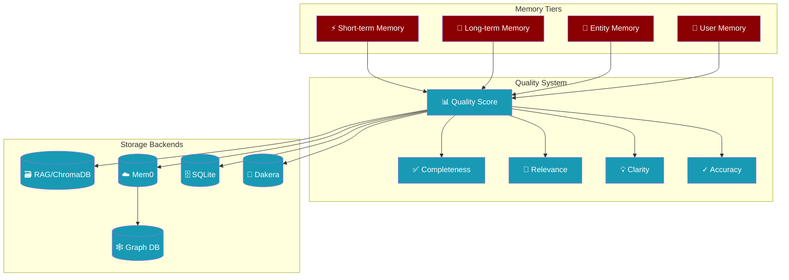
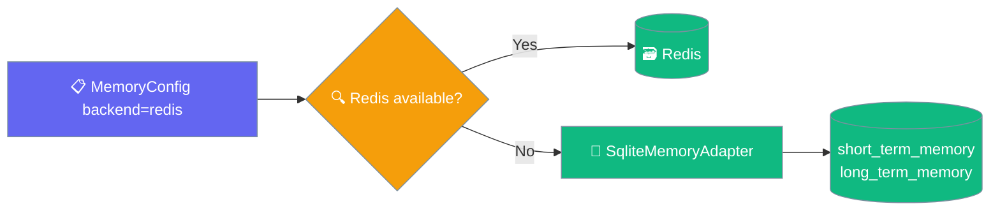

Multi-tiered memory with short-term, long-term, entity, and user-specific storage — enhanced by quality scoring and automatic extraction.

```python
from praisonaiagents import Agent, MemoryConfig

agent = Agent(
    name="memory-agent",
    instructions="Remember context across turns.",
    memory=MemoryConfig(use_long_term=True),
)
agent.start("What did we decide about the launch date?")
```

The user chats across turns; multi-tier memory stores and scores context for later retrieval.


```mermaid
graph TB
    subgraph Memory Tiers
        STM[⚡ Short-term Memory]
        LTM[💾 Long-term Memory]
        ENT[👤 Entity Memory]
        USR[🔐 User Memory]
    end
    
    subgraph Quality System
        SCORE[📊 Quality Score]
        COMP[✅ Completeness]
        REL[🎯 Relevance]
        CLR[💡 Clarity]
        ACC[✓ Accuracy]
    end
    
    subgraph Storage Backends
        RAG[(🗃️ RAG/ChromaDB)]
        MEM0[(☁️ Mem0)]
        SQL[(🗄️ SQLite)]
        GRAPH[(🕸️ Graph DB)]
        DAKERA[(🧠 Dakera)]
    end
    
    STM --> SCORE
    LTM --> SCORE
    ENT --> SCORE
    USR --> SCORE
    
    SCORE --> COMP
    SCORE --> REL
    SCORE --> CLR
    SCORE --> ACC
    
    SCORE --> RAG
    SCORE --> MEM0
    SCORE --> SQL
    SCORE --> DAKERA
    MEM0 --> GRAPH
    
    classDef agent fill:#8B0000,color:#fff
    classDef tool fill:#189AB4,color:#fff
    
    class STM,LTM,ENT,USR agent
    class SCORE,COMP,REL,CLR,ACC,RAG,MEM0,SQL,GRAPH,DAKERA tool
```

## Key Features

<CardGroup cols={2}>
  <Card icon="layer-group">
    Separate short-term and long-term memory systems
  </Card>
  <Card icon="star">
    4-metric quality assessment for stored memories
  </Card>
  <Card icon="users">
    User, agent, and run-specific memory scoping
  </Card>
  <Card icon="user-tag">
    Automatic entity extraction and storage
  </Card>
  <Card icon="project-diagram">
    Optional Neo4j/Memgraph for relationships
  </Card>
  <Card icon="filter">
    Quality-based filtering and relevance ranking
  </Card>
</CardGroup>

## Quick Start

<Steps>
<Step title="Simple — enable with True">

```python
from praisonaiagents import Agent

agent = Agent(
    name="Assistant",
    instructions="You are a helpful assistant with memory.",
    memory=True
)

agent.start("Remember that I prefer Python for data science")
```

</Step>

<Step title="With config">

```python
from praisonaiagents import Agent

agent = Agent(
    name="Assistant",
    instructions="You are a helpful assistant with memory.",
    memory={
        "backend": "rag",
        "user_id": "user123",
        "use_embedding": True
    }
)

```

</Step>
</Steps>

---

## Direct Memory Access

```python
from praisonaiagents import Memory

# Initialise memory
memory = Memory(
    config={
        "provider": "rag",
        "use_embedding": True,
        "short_db": ".praison/short_term.db",
        "long_db": ".praison/long_term.db"
    }
)

# Store memories with quality
memory.store_long_term(
    text="The user prefers technical explanations",
    memory={"user_id": "user123"},
    metadata={"type": "preference"},
    quality=0.9
)

# Search memories
results = memory.search_long_term(
    query="user preferences",
    memory={"user_id": "user123"},
    min_quality=0.7
)
```

```python
from praisonaiagents import Memory

memory = Memory(config={"provider": "rag"})

memory.store_long_term(
    text="Quantum computing uses qubits for computation",
    completeness=0.95,
    relevance=0.90,
    clarity=0.88,
    accuracy=0.92,
    memory={"user_id": "user123"}
)
```

## Memory Tiers

### Short-term Memory (STM)

Short-term memory is cleared between sessions and used for immediate context.

```python
# Store temporary context
memory.store_short_term(
    text="User is asking about Python programming",
    memory={"user_id": "user123"},
    metadata={"context": "current_conversation"}
)

# Search recent context
context = memory.search_short_term(
    query="Python",
    memory={"user_id": "user123"},
    limit=5
)
```

### Long-term Memory (LTM)

Long-term memory persists across sessions and stores important information.

```python
# Store persistent knowledge
memory.store_long_term(
    text="User works as a data scientist at TechCorp",
    memory={"user_id": "user123"},
    quality=0.95,
    metadata={"type": "user_info", "category": "professional"}
)

# Retrieve with quality filter
memories = memory.search_long_term(
    query="user profession",
    memory={"user_id": "user123"},
    min_quality=0.8
)
```

### Entity Memory

Entity memory stores information about specific people, places, or things.

```python
# Store entity information
memory.store_entity(
    name="TechCorp",
    text="TechCorp is a leading AI company founded in 2020",
    entity_type="organization",
    metadata={"industry": "technology", "size": "large"}
)

# Search entity information
entity_info = memory.search_entity(
    name="TechCorp",
    query="company details"
)
```

### User Memory

User memory stores personalised information and preferences.

```python
# Store user preferences
memory.store_user_memory(
    memory={"user_id": "user123"},
    text="Prefers concise explanations with code examples",
    extra={"preference_type": "communication_style"}
)

# Retrieve user context
user_context = memory.search_user_memory(
    memory={"user_id": "user123"},
    query="preferences",
    limit=3
)
```

## Configuration Options

<Card title="MemoryConfig SDK Reference" icon="code" href="/docs/sdk/reference/python/classes/MemoryConfig">
  Full parameter reference for MemoryConfig
</Card>

**MemoryBackend options:**

| Backend | Value | Description |
|---------|-------|-------------|
| File | `"file"` | JSON files (default, zero dependencies) |
| SQLite | `"sqlite"` | SQLite database |
| Redis | `"redis"` | Redis (requires `redis-py`) |
| Valkey | `"valkey"` | Valkey (Redis-compatible) |
| Postgres | `"postgres"` | PostgreSQL |
| Mem0 | `"mem0"` | Mem0 cloud service (requires `mem0ai`) |
| MongoDB | `"mongodb"` | MongoDB |
| Dakera | `"dakera"` | Self-hosted decay-weighted memory server (requires `praisonaiagents[dakera]`) |

**MemoryConfig parameters:**

| Option | Type | Default | Description |
|--------|------|---------|-------------|
| `backend` | `str` | `"file"` | Storage backend (see above) |
| `user_id` | `str \| None` | `None` | Scope memory to a specific user |
| `session_id` | `str \| None` | `None` | Scope memory to a specific session |
| `auto_memory` | `bool` | `False` | Auto-extract and store key facts |
| `claude_memory` | `bool` | `False` | Use Claude's native memory (Anthropic models) |
| `config` | `dict \| None` | `None` | Provider-specific configuration |
| `learn` | `bool \| LearnConfig \| None` | `None` | Enable continuous learning |
| `history` | `bool` | `False` | Auto-inject session history into context |
| `history_limit` | `int` | `10` | Max messages to inject from history |
| `auto_save` | `str \| None` | `None` | Auto-save session with this name |

### RAG Configuration (Default)

```python
memory_config = {
    "provider": "rag",
    "use_embedding": True,
    "short_db": ".praison/short_term.db",
    "long_db": ".praison/long_term.db",
    "entity_db": ".praison/entity.db",
    "rag_db_path": ".praison/chroma_db",
    "embedding_model": "text-embedding-3-small"
}
```

### Mem0 Configuration

> Requires the optional memory extras:
> ```bash
> pip install "praisonaiagents[memory]"
> ```
> If the package is missing, configuring `"provider": "mem0"` raises:
> ```
> ImportError: mem0ai is not installed. Run: pip install 'praisonaiagents[memory]'
> ```

```python
memory_config = {
    "provider": "mem0",
    "config": {
        "api_key": "your-mem0-api-key",
        "org_id": "your-org-id",
        "project_id": "your-project-id"
    }
}
```

### Dakera Configuration

> Requires the optional Dakera extra:
> ```bash
> pip install "praisonaiagents[dakera]"
> ```
> If the package is missing, configuring `"provider": "dakera"` raises:
> ```
> ImportError: dakera is required for the dakera adapter. Install with: pip install 'praisonaiagents[dakera]' (or: pip install dakera)
> ```

```python
memory_config = {
    "provider": "dakera",
    "config": {
        "url": "http://localhost:3000",
        "api_key": "dk-...",
        "agent_id": "my-agent",
        "short_term_type": "working",
        "long_term_type": "episodic",
        "default_importance": 0.5,
    }
}
```

### Graph Memory Configuration

> Requires the optional memory extras:
> ```bash
> pip install "praisonaiagents[memory]"
> ```

```python
memory_config = {
    "provider": "mem0",
    "config": {
        "graph_store": {
            "provider": "neo4j",
            "config": {
                "url": "bolt://localhost:7687",
                "username": "neo4j",
                "password": "password"
            }
        },
        "vector_store": {
            "provider": "qdrant",
            "config": {
                "host": "localhost",
                "port": 6333
            }
        },
        "version": "v1.1"
    }
}
```

## Backend Fallback

PraisonAI automatically falls back to SQLite when a configured backend (Redis, Valkey, Postgres) is unavailable, so your agent keeps working without crashing.

```python
from praisonaiagents import Agent, MemoryConfig

# Configure Redis — if redis-py isn't installed,
# PraisonAI falls back to SQLite automatically.
agent = Agent(
    name="Assistant",
    instructions="You remember user preferences.",
    memory=MemoryConfig(backend="redis", user_id="user_123")
)

agent.start("Remember I prefer dark mode")
```


```mermaid
graph LR
    Config[📋 MemoryConfig backend=redis] --> Try{🔍 Redis available?}
    Try -->|Yes| Redis[(🗃️ Redis)]
    Try -->|No| Adapter[💾 SqliteMemoryAdapter]
    Adapter --> Tables[(short_term_memory<br/>long_term_memory)]

    classDef config fill:#6366F1,stroke:#7C90A0,color:#fff
    classDef decision fill:#F59E0B,stroke:#7C90A0,color:#fff
    classDef storage fill:#10B981,stroke:#7C90A0,color:#fff

    class Config config
    class Try decision
    class Redis,Adapter,Tables storage
```

| Configured backend | Fallback when unavailable | Search/store path |
|---|---|---|
| `redis` | SQLite (adapter) | `memory_adapter.search_*` / `store_*` |
| `valkey` | SQLite (adapter) | `memory_adapter.search_*` / `store_*` |
| `postgres` | SQLite (adapter) | `memory_adapter.search_*` / `store_*` |
| `sqlite` | n/a (native) | `memory_adapter.*` (direct) |
| `file` | n/a (native) | FileMemory (direct) |
| `mem0` | raises `ImportError` | direct Mem0 client |
| `mongodb` | raises error | direct Mongo client |

<Note>
Before the fix in PraisonAI PR #2190, configuring `backend="redis"` without `redis-py` installed produced `sqlite3.OperationalError: no such table: short_mem` on the first memory call. The SQLite adapter now owns the correct schema (`short_term_memory` / `long_term_memory`), so fallback is transparent.
</Note>

<AccordionGroup>
<Accordion title="Symptom: sqlite3.OperationalError: no such table: short_mem">
**Cause:** You are running a version of PraisonAI before PR #2190. A non-default backend (e.g. `redis`) was configured but its dependency was not installed, causing a silent fallback to SQLite — which then queried the legacy `short_mem` table that no longer exists.

**Fix:** Upgrade PraisonAI to the release that includes PR #2190, or install the dependency for your configured backend (e.g. `pip install redis` for Redis).
</Accordion>
</AccordionGroup>

---

## Quality Scoring System

### Quality Metrics

<CardGroup cols={2}>
  <Card icon="check-square" title="Completeness">
    Measures how complete and comprehensive the information is
  </Card>
  <Card icon="bullseye" title="Relevance">
    Measures how relevant the information is to the context
  </Card>
  <Card icon="lightbulb" title="Clarity">
    Measures how clear and understandable the information is
  </Card>
  <Card icon="check" title="Accuracy">
    Measures the factual accuracy of the information
  </Card>
</CardGroup>

### Quality Calculation

```python
# Default weights
weights = {
    "completeness": 0.25,
    "relevance": 0.35,
    "clarity": 0.20,
    "accuracy": 0.20
}

# Overall quality = weighted average
quality = (
    completeness * weights["completeness"] +
    relevance * weights["relevance"] +
    clarity * weights["clarity"] +
    accuracy * weights["accuracy"]
)
```

## Advanced Features

### Cache-Optimised Context

Memory results are deterministically ordered for prompt caching effectiveness. Use `build_context_for_task()` with explicit output control for manual prompt assembly.

```python
from praisonaiagents import Memory

memory = Memory(config={"provider": "rag"})

context = memory.build_context_for_task(
    task_descr="Research the latest AI developments",
    user_id="user_123",
    max_items=3,
    include_in_output=True  # Force include for prompt assembly
)

# Construct cache-friendly prompt structure
system_prompt = f"System instructions and tools\n\n{context}\n\nUser message: {{user_input}}"
```

See [Prompt Caching](/features/prompt-caching) for the full guide.

### Context Building

Build comprehensive context for tasks:

```python
# Automatically merge relevant memories
context = memory.build_context_for_task(
    task_descr="Write a Python tutorial",
    memory={"user_id": "user123"},
    additional="Focus on data science applications",
    max_items=5
)

# Context includes:
# - Relevant long-term memories
# - User preferences
# - Recent short-term context
```

### Task Output Finalisation

Store task results with quality assessment:

```python
from praisonaiagents import TaskOutput

# Create task output
output = TaskOutput(
    raw="Tutorial content...",
    agent_name="Writer",
    task_description="Write Python tutorial"
)

# Finalise with quality scoring
memory.finalize_task_output(
    task_output=output,
    memory={"user_id": "user123"}
)
```

### Memory Citations

Automatically cite memory sources:

```python
# Memories include source information
result = memory.search_long_term("Python", memory={"user_id": "user123"})
# Returns: {
#     'text': 'Python is...',
#     'metadata': {'source': 'conversation_2024_01_15', ...}
# }
```

### Memory Reranking

Enhance search results with intelligent reranking based on relevance scores:

```python
from praisonaiagents import Agent, AgentTeam

# Create agent
agent = Agent(
    name="Researcher",
    role="Research assistant"
)

# Initialize with memory enabled
agents = AgentTeam(
    agents=[agent],
    tasks=[],
    memory=True
)

# Search with reranking for better relevance
if agents.shared_memory:
    results = agents.shared_memory.search_long_term(
        "quantum computing applications",
        limit=10,
        rerank=True,  # Enable reranking
        relevance_cutoff=0.7  # Minimum relevance score
    )
```

#### Reranking Features

1. **Semantic Reranking**: Re-scores results based on semantic similarity
2. **Context-Aware Ranking**: Considers current context when ranking
3. **Quality-Weighted Ranking**: Combines relevance with quality scores

```python
# Advanced reranking with multiple criteria
results = agents.shared_memory.search_long_term(
    query="machine learning frameworks",
    limit=20,  # Retrieve more initially
    rerank=True,  # Enable reranking
    relevance_cutoff=0.6,  # Minimum relevance
    rerank_config={
        "method": "semantic",  # or "hybrid", "quality-weighted"
        "top_k": 5,  # Return top 5 after reranking
        "consider_recency": True,  # Factor in timestamp
        "boost_user_memories": True  # Prioritize user-specific memories
    }
)
```

#### Custom Reranking Logic

Implement custom reranking strategies:

```python
from datetime import datetime
from praisonaiagents import RerankStrategy

class DomainSpecificReranker(RerankStrategy):
    def rerank(self, results, query, context=None):
        """Custom reranking based on domain knowledge"""
        scored_results = []
        
        for result in results:
            score = result['relevance']
            
            # Boost technical content
            if 'technical' in result.get('metadata', {}).get('tags', []):
                score *= 1.2
                
            # Boost recent memories
            if result.get('timestamp'):
                days_old = (datetime.now() - result['timestamp']).days
                recency_boost = 1.0 + (0.1 * max(0, 30 - days_old) / 30)
                score *= recency_boost
                
            scored_results.append((score, result))
        
        # Sort by score and return top results
        scored_results.sort(key=lambda x: x[0], reverse=True)
        return [result for score, result in scored_results]

# Use custom reranker
# Note: Assuming 'agents' is defined from previous examples
if agents.shared_memory:
    agents.shared_memory.set_rerank_strategy(DomainSpecificReranker())
```

#### Reranking Performance

Optimize reranking for large result sets:

```python
# Efficient two-stage retrieval and reranking
# Stage 1: Fast retrieval of candidates
candidates = agents.shared_memory.search_long_term(
    query="data analysis techniques",
    limit=50,  # Get more candidates
    rerank=False  # Skip reranking in first stage
)

# Stage 2: Precise reranking of top candidates
if len(candidates) > 10:
    reranked = agents.shared_memory.rerank_results(
        results=candidates[:20],  # Rerank top 20
        query="data analysis techniques",
        method="hybrid",
        relevance_cutoff=0.8
    )
else:
    reranked = candidates
```

## Performance Optimisation

<CodeGroup>
```python Batch Operations
# Batch store memories
memories = [
    ("Fact 1", 0.9),
    ("Fact 2", 0.85),
    ("Fact 3", 0.95)
]

for text, quality in memories:
    memory.store_long_term(
        text=text,
        quality=quality,
        memory={"user_id": "user123"}
    )
```

```python Quality Filtering
# Pre-filter by quality to reduce results
high_quality = memory.search_long_term(
    query="important facts",
    min_quality=0.8,  # Only high-quality memories
    limit=10
)
```

```python Scoped Search
# Scope search to improve performance
results = memory.search_long_term(
    query="project details",
    memory={"user_id": "user123"},
    agent_id="assistant",
    run_id="session_456"
)
```
</CodeGroup>

## Complete Example

<CodeGroup>
```python Personal Assistant with Memory
from praisonaiagents import Agent, Task, AgentTeam
from praisonaiagents import Memory

# Configure memory with quality scoring
memory_config = {
    "provider": "rag",
    "use_embedding": True,
    "embedding_model": "text-embedding-3-small"
}

# Create memory instance
memory = Memory(memory_config)

# Create assistant agent
assistant = Agent(
    name="Personal Assistant",
    instructions="""You are a personal assistant with perfect memory.
    Remember user preferences, important information, and context.
    Always use your memory to provide personalised responses.""",
    memory={"user_id": "john_doe"}  # Memory with user isolation
)

# Create task with memory integration
task = Task(
    description="Help me plan my day based on my preferences",
    agent=assistant,
    expected_output="Personalised daily schedule"
)

# Run the system
agents = AgentTeam(
    agents=[assistant],
    tasks=[task],
    memory=True  # Enable shared memory
)

# Memory automatically:
# 1. Retrieves user preferences
# 2. Searches relevant past interactions
# 3. Builds context for the task
# 4. Stores the interaction with quality score
result = agents.start()

# Store user feedback as high-quality memory
memory.store_long_term(
    text="User preferred morning schedule with exercise first",
    memory={"user_id": "john_doe"},
    completeness=0.9,
    relevance=1.0,
    clarity=0.95,
    accuracy=1.0
)
```
</CodeGroup>

## Best Practices

<AccordionGroup>
<Accordion title="Set quality thresholds for search">
Use `min_quality=0.8` for critical information retrieval. Use lower thresholds (0.5–0.7) for exploratory searches where recall is more important.
</Accordion>

<Accordion title="Scope memories per user and agent">
Always pass `user_id` for user-specific memories, `agent_id` for agent-scoped shared knowledge, and `run_id` for ephemeral session context.
</Accordion>

<Accordion title="Enable embeddings for semantic search">
Set `use_embedding=True` in the memory config for semantic (not just keyword) retrieval. Use `text-embedding-3-small` for cost efficiency.
</Accordion>

<Accordion title="Use AutoMemory for automatic extraction">
Enable `MemoryConfig(auto_memory=True)` to automatically extract preferences, facts, and entities from conversations without manual `store_*` calls.
</Accordion>
</AccordionGroup>

## AutoMemory

AutoMemory automatically extracts structured information from conversations using configurable patterns — no manual `store_*` calls needed.

### How It Works

AutoMemory wraps `FileMemory` with a pattern-based extraction engine. After each agent interaction, it scans the conversation for matching patterns (preferences, facts, dates, etc.) and stores them automatically.

### Quick Start

```python
from praisonaiagents import Agent, MemoryConfig

# Enable auto-memory extraction
agent = Agent(
    name="Assistant",
    instructions="You are a helpful assistant.",
    memory=MemoryConfig(auto_memory=True, user_id="user123")
)

# Patterns are extracted automatically from conversation
agent.start("I prefer Python for data science and I'm based in London")
# AutoMemory stores: preference="Python for data science", location="London"
```

### Custom Patterns

```python
from praisonaiagents import AutoMemory

# Create with custom patterns
auto_mem = AutoMemory(
    user_id="user123",
    patterns={
        "preference": r"(?:I prefer|I like|I love)\s+(.+)",
        "location": r"(?:I'm based in|I live in|I'm from)\s+(.+)",
        "name": r"(?:My name is|I'm called|call me)\s+(\w+)",
        "fact": r"(?:I work at|I study at|my job is)\s+(.+)",
    }
)

# Search extracted memories
results = auto_mem.search("user preferences")
```

### MemoryConfig Integration

Use `MemoryConfig.auto_memory` to enable AutoMemory as part of the consolidated memory parameter:

```python
from praisonaiagents import Agent, MemoryConfig

agent = Agent(
    instructions="You are a helpful assistant.",
    memory=MemoryConfig(
        backend="file",
        auto_memory=True,   # Enable pattern-based extraction
        user_id="user123",
        session_id="session456",
    )
)
```

| Parameter | Type | Default | Description |
|-----------|------|---------|-------------|
| `auto_memory` | `bool` | `False` | Enable automatic memory extraction |
| `backend` | `str` | `"file"` | Storage backend (`file`, `sqlite`, `redis`, etc.) |
| `user_id` | `str` | `None` | User ID for scoping memories |

---

## Related

<CardGroup cols={2}>
  <Card title="Knowledge" icon="book" href="/features/knowledge">
    Integrate with document knowledge bases
  </Card>
  <Card title="Prompt Caching" icon="database" href="/docs/features/prompt-caching">
    Optimise memory context for prompt caching
  </Card>
  <Card title="Vector Store" icon="database" href="/docs/features/vector-store">
    Store and query embeddings with a pluggable, namespace-aware backend
  </Card>
</CardGroup>