# Advanced Memory System

The advanced memory system provides sophisticated memory management with short-term, long-term, entity, and user-specific storage, enhanced by quality scoring and optional graph database support.

```mermaid
graph TB
    subgraph Memory Tiers
        STM[⚡ Short-term Memory]
        LTM[💾 Long-term Memory]
        ENT[👤 Entity Memory]
        USR[🔐 User Memory]
    end
    
    subgraph Quality System
        SCORE[📊 Quality Score]
        COMP[✅ Completeness]
        REL[🎯 Relevance]
        CLR[💡 Clarity]
        ACC[✓ Accuracy]
    end
    
    subgraph Storage Backends
        RAG[(🗃️ RAG/ChromaDB)]
        MEM0[(☁️ Mem0)]
        SQL[(🗄️ SQLite)]
        GRAPH[(🕸️ Graph DB)]
    end
    
    STM --> SCORE
    LTM --> SCORE
    ENT --> SCORE
    USR --> SCORE
    
    SCORE --> COMP
    SCORE --> REL
    SCORE --> CLR
    SCORE --> ACC
    
    SCORE --> RAG
    SCORE --> MEM0
    SCORE --> SQL
    MEM0 --> GRAPH
    
    classDef memory fill:#8B0000,stroke:#7C90A0,color:#fff
    classDef quality fill:#189AB4,stroke:#7C90A0,color:#fff
    classDef storage fill:#2E8B57,stroke:#7C90A0,color:#fff
    
    class STM,LTM,ENT,USR memory
    class SCORE,COMP,REL,CLR,ACC quality
    class RAG,MEM0,SQL,GRAPH storage
```



## Key Features

<CardGroup cols={2}>
  <Card icon="layer-group">
    Separate short-term and long-term memory systems
  </Card>
  <Card icon="star">
    4-metric quality assessment for stored memories
  </Card>
  <Card icon="users">
    User, agent, and run-specific memory scoping
  </Card>
  <Card icon="user-tag">
    Automatic entity extraction and storage
  </Card>
  <Card icon="project-diagram">
    Optional Neo4j/Memgraph for relationships
  </Card>
  <Card icon="filter">
    Quality-based filtering and relevance ranking
  </Card>
</CardGroup>

## Quick Start

<CodeGroup>
```python Agent with Memory
from praisonaiagents import Agent, Agents

# Single agent with memory (simplest)
agent = Agent(
    name="Assistant",
    instructions="You are a helpful assistant with memory.",
    memory=True  # Enable with defaults
)

# Agent with memory config
agent = Agent(
    name="Assistant",
    instructions="You are a helpful assistant with memory.",
    memory={
        "backend": "rag",
        "user_id": "user123",
        "use_embedding": True
    }
)

# Multi-agent with shared memory
agents = Agents(
    agents=[agent1, agent2],
    memory={
        "backend": "rag",
        "use_embedding": True
    }
)
```

```python Direct Memory Use
from praisonaiagents import Memory

# Initialise memory
memory = Memory(
    config={
        "provider": "rag",
        "use_embedding": True,
        "short_db": ".praison/short_term.db",
        "long_db": ".praison/long_term.db"
    }
)

# Store memories with quality
memory.store_long_term(
    text="The user prefers technical explanations",
    user_id="user123",
    metadata={"type": "preference"},
    quality=0.9
)

# Search memories
results = memory.search_long_term(
    query="user preferences",
    user_id="user123",
    min_quality=0.7
)
```

```python Quality Metrics
# Store with individual quality metrics
memory.store_long_term(
    text="Quantum computing uses qubits for computation",
    completeness=0.95,  # How complete is the information
    relevance=0.90,     # How relevant to the context
    clarity=0.88,       # How clear is the explanation
    accuracy=0.92,      # How accurate is the content
    user_id="user123"
)

# Quality score is automatically calculated
# Overall quality = weighted average of metrics
```
</CodeGroup>

## Memory Tiers

### Short-term Memory (STM)

Short-term memory is cleared between sessions and used for immediate context.

```python
# Store temporary context
memory.store_short_term(
    text="User is asking about Python programming",
    user_id="user123",
    metadata={"context": "current_conversation"}
)

# Search recent context
context = memory.search_short_term(
    query="Python",
    user_id="user123",
    limit=5
)
```

### Long-term Memory (LTM)

Long-term memory persists across sessions and stores important information.

```python
# Store persistent knowledge
memory.store_long_term(
    text="User works as a data scientist at TechCorp",
    user_id="user123",
    quality=0.95,
    metadata={"type": "user_info", "category": "professional"}
)

# Retrieve with quality filter
memories = memory.search_long_term(
    query="user profession",
    user_id="user123",
    min_quality=0.8
)
```

### Entity Memory

Entity memory stores information about specific people, places, or things.

```python
# Store entity information
memory.store_entity(
    name="TechCorp",
    text="TechCorp is a leading AI company founded in 2020",
    entity_type="organization",
    metadata={"industry": "technology", "size": "large"}
)

# Search entity information
entity_info = memory.search_entity(
    name="TechCorp",
    query="company details"
)
```

### User Memory

User memory stores personalised information and preferences.

```python
# Store user preferences
memory.store_user_memory(
    user_id="user123",
    text="Prefers concise explanations with code examples",
    extra={"preference_type": "communication_style"}
)

# Retrieve user context
user_context = memory.search_user_memory(
    user_id="user123",
    query="preferences",
    limit=3
)
```

## Configuration Options

### RAG Configuration (Default)

```python
memory_config = {
    "provider": "rag",
    "use_embedding": True,
    "short_db": ".praison/short_term.db",
    "long_db": ".praison/long_term.db",
    "entity_db": ".praison/entity.db",
    "rag_db_path": ".praison/chroma_db",
    "embedding_model": "text-embedding-3-small"
}
```

### Mem0 Configuration

```python
memory_config = {
    "provider": "mem0",
    "config": {
        "api_key": "your-mem0-api-key",
        "org_id": "your-org-id",
        "project_id": "your-project-id"
    }
}
```

### Graph Memory Configuration

```python
memory_config = {
    "provider": "mem0",
    "config": {
        "graph_store": {
            "provider": "neo4j",
            "config": {
                "url": "bolt://localhost:7687",
                "username": "neo4j",
                "password": "password"
            }
        },
        "vector_store": {
            "provider": "qdrant",
            "config": {
                "host": "localhost",
                "port": 6333
            }
        },
        "version": "v1.1"
    }
}
```

## Quality Scoring System

### Quality Metrics

<CardGroup cols={2}>
  <Card icon="check-square" title="Completeness">
    Measures how complete and comprehensive the information is
  </Card>
  <Card icon="bullseye" title="Relevance">
    Measures how relevant the information is to the context
  </Card>
  <Card icon="lightbulb" title="Clarity">
    Measures how clear and understandable the information is
  </Card>
  <Card icon="check" title="Accuracy">
    Measures the factual accuracy of the information
  </Card>
</CardGroup>

### Quality Calculation

```python
# Default weights
weights = {
    "completeness": 0.25,
    "relevance": 0.35,
    "clarity": 0.20,
    "accuracy": 0.20
}

# Overall quality = weighted average
quality = (
    completeness * weights["completeness"] +
    relevance * weights["relevance"] +
    clarity * weights["clarity"] +
    accuracy * weights["accuracy"]
)
```

## Advanced Features

### Context Building

Build comprehensive context for tasks:

```python
# Automatically merge relevant memories
context = memory.build_context_for_task(
    task_descr="Write a Python tutorial",
    user_id="user123",
    additional="Focus on data science applications",
    max_items=5
)

# Context includes:
# - Relevant long-term memories
# - User preferences
# - Recent short-term context
```

### Task Output Finalisation

Store task results with quality assessment:

```python
from praisonaiagents.agent.task import TaskOutput

# Create task output
output = TaskOutput(
    raw="Tutorial content...",
    agent_name="Writer",
    task_description="Write Python tutorial"
)

# Finalise with quality scoring
memory.finalize_task_output(
    task_output=output,
    user_id="user123"
)
```

### Memory Citations

Automatically cite memory sources:

```python
# Memories include source information
result = memory.search_long_term("Python", user_id="user123")
# Returns: {
#     'text': 'Python is...',
#     'metadata': {'source': 'conversation_2024_01_15', ...}
# }
```

### Memory Reranking

Enhance search results with intelligent reranking based on relevance scores:

```python
from praisonaiagents import Agent, Agents

# Create agent
agent = Agent(
    name="Researcher",
    role="Research assistant"
)

# Initialize with memory enabled
agents = Agents(
    agents=[agent],
    tasks=[],
    memory=True
)

# Search with reranking for better relevance
if agents.shared_memory:
    results = agents.shared_memory.search_long_term(
        "quantum computing applications",
        limit=10,
        rerank=True,  # Enable reranking
        relevance_cutoff=0.7  # Minimum relevance score
    )
```

#### Reranking Features

1. **Semantic Reranking**: Re-scores results based on semantic similarity
2. **Context-Aware Ranking**: Considers current context when ranking
3. **Quality-Weighted Ranking**: Combines relevance with quality scores

```python
# Advanced reranking with multiple criteria
results = agents.shared_memory.search_long_term(
    query="machine learning frameworks",
    limit=20,  # Retrieve more initially
    rerank=True,  # Enable reranking
    relevance_cutoff=0.6,  # Minimum relevance
    rerank_config={
        "method": "semantic",  # or "hybrid", "quality-weighted"
        "top_k": 5,  # Return top 5 after reranking
        "consider_recency": True,  # Factor in timestamp
        "boost_user_memories": True  # Prioritize user-specific memories
    }
)
```

#### Custom Reranking Logic

Implement custom reranking strategies:

```python
from datetime import datetime
from praisonaiagents import RerankStrategy

class DomainSpecificReranker(RerankStrategy):
    def rerank(self, results, query, context=None):
        """Custom reranking based on domain knowledge"""
        scored_results = []
        
        for result in results:
            score = result['relevance']
            
            # Boost technical content
            if 'technical' in result.get('metadata', {}).get('tags', []):
                score *= 1.2
                
            # Boost recent memories
            if result.get('timestamp'):
                days_old = (datetime.now() - result['timestamp']).days
                recency_boost = 1.0 + (0.1 * max(0, 30 - days_old) / 30)
                score *= recency_boost
                
            scored_results.append((score, result))
        
        # Sort by score and return top results
        scored_results.sort(key=lambda x: x[0], reverse=True)
        return [result for score, result in scored_results]

# Use custom reranker
# Note: Assuming 'agents' is defined from previous examples
if agents.shared_memory:
    agents.shared_memory.set_rerank_strategy(DomainSpecificReranker())
```

#### Reranking Performance

Optimize reranking for large result sets:

```python
# Efficient two-stage retrieval and reranking
# Stage 1: Fast retrieval of candidates
candidates = agents.shared_memory.search_long_term(
    query="data analysis techniques",
    limit=50,  # Get more candidates
    rerank=False  # Skip reranking in first stage
)

# Stage 2: Precise reranking of top candidates
if len(candidates) > 10:
    reranked = agents.shared_memory.rerank_results(
        results=candidates[:20],  # Rerank top 20
        query="data analysis techniques",
        method="hybrid",
        relevance_cutoff=0.8
    )
else:
    reranked = candidates
```

## Performance Optimisation

<CodeGroup>
```python Batch Operations
# Batch store memories
memories = [
    ("Fact 1", 0.9),
    ("Fact 2", 0.85),
    ("Fact 3", 0.95)
]

for text, quality in memories:
    memory.store_long_term(
        text=text,
        quality=quality,
        user_id="user123"
    )
```

```python Quality Filtering
# Pre-filter by quality to reduce results
high_quality = memory.search_long_term(
    query="important facts",
    min_quality=0.8,  # Only high-quality memories
    limit=10
)
```

```python Scoped Search
# Scope search to improve performance
results = memory.search_long_term(
    query="project details",
    user_id="user123",
    agent_id="assistant",
    run_id="session_456"
)
```
</CodeGroup>

## Complete Example

<CodeGroup>
```python Personal Assistant with Memory
from praisonaiagents import Agent, Task, Agents
from praisonaiagents import Memory

# Configure memory with quality scoring
memory_config = {
    "provider": "rag",
    "use_embedding": True,
    "embedding_model": "text-embedding-3-small"
}

# Create memory instance
memory = Memory(memory_config)

# Create assistant agent
assistant = Agent(
    name="Personal Assistant",
    instructions="""You are a personal assistant with perfect memory.
    Remember user preferences, important information, and context.
    Always use your memory to provide personalised responses.""",
    memory=memory,
    user_id="john_doe"
)

# Create task with memory integration
task = Task(
    description="Help me plan my day based on my preferences",
    agent=assistant,
    expected_output="Personalised daily schedule"
)

# Run the system
agents = Agents(
    agents=[assistant],
    tasks=[task],
    memory=memory
)

# Memory automatically:
# 1. Retrieves user preferences
# 2. Searches relevant past interactions
# 3. Builds context for the task
# 4. Stores the interaction with quality score
result = agents.start()

# Store user feedback as high-quality memory
memory.store_long_term(
    text="User preferred morning schedule with exercise first",
    user_id="john_doe",
    completeness=0.9,
    relevance=1.0,
    clarity=0.95,
    accuracy=1.0
)
```
</CodeGroup>

## Best Practices

<CardGroup cols={2}>
  <Card icon="filter">
    - Set minimum quality for critical information (0.8+)
    - Use lower thresholds for exploratory searches
    - Regular quality audits
  </Card>
  <Card icon="broom">
    - Periodically review and clean old memories
    - Update quality scores as information ages
    - Deduplicate similar memories
  </Card>
  <Card icon="crosshairs">
    - Use user_id for personalisation
    - Use agent_id for agent-specific knowledge
    - Use run_id for session isolation
  </Card>
  <Card icon="rocket">
    - Enable embeddings for semantic search
    - Use quality filters to reduce search space
    - Implement caching for frequent queries
  </Card>
</CardGroup>

## Next Steps

<CardGroup cols={2}>
  <Card icon="book" href="/features/knowledge">
    Integrate with document knowledge bases
  </Card>
  <Card icon="clock" href="/features/sessions">
    Learn about stateful sessions
  </Card>
</CardGroup>