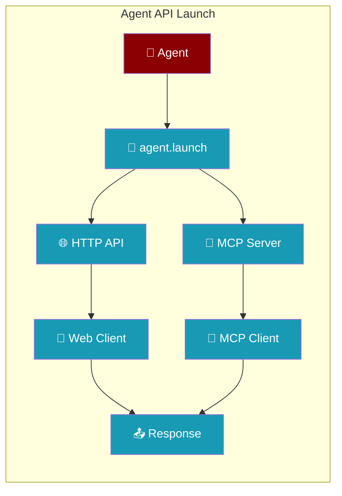
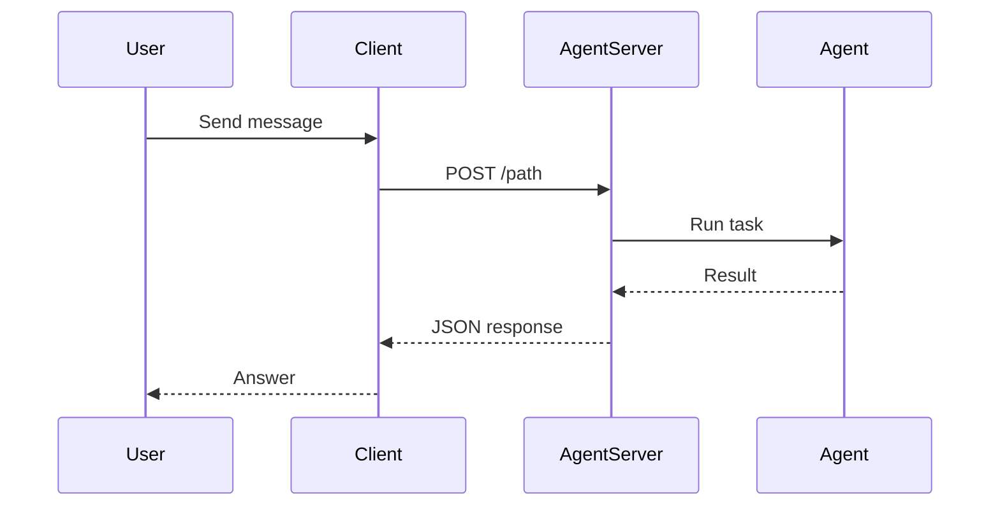
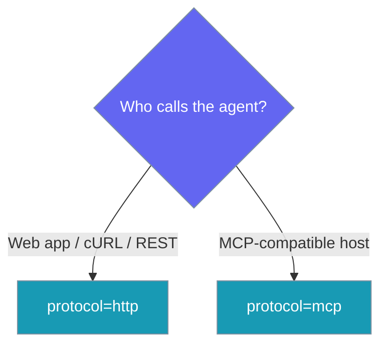

PraisonAI Agents can be deployed as HTTP APIs or MCP (Model Context Protocol) servers, enabling seamless integration with web applications, microservices, and other systems.

```python
from praisonaiagents import Agent

agent = Agent(name="api-agent", instructions="Answer HTTP API requests.")
agent.launch(port=8000)
```

The user deploys an agent as an HTTP or MCP service; external apps call the API instead of importing the SDK directly.



## How It Works

An external client calls the launched endpoint, and the agent runs the request before returning the response.



## Choose a Protocol

Pick the launch protocol that matches the caller.



## Quick Start

<Steps>
    <Step title="Install Package">
        Install PraisonAI Agents:
        ```bash
        pip install praisonaiagents
        ```
        
        For MCP support, also install:
        ```bash
        pip install praison-mcp
        ```
    </Step>

    <Step title="Create an Agent">
        Create an agent to deploy as an API:
        ```python
        from praisonaiagents import Agent

        # Create your agent
        agent = Agent(
            name="API Assistant",
            role="API helper",
            goal="Answer questions and perform tasks via API",
            backstory="An AI assistant accessible through HTTP endpoints",
            llm="gpt-4o-mini"
        )
        ```
    </Step>

    <Step title="Launch as API">
        Deploy the agent as an HTTP API:
        ```python
        # Launch as HTTP API
        agent.launch(
            protocol="http",  # Default protocol
            host="0.0.0.0",
            port=8000,
            path="/assistant"  # Available at http://localhost:8000/assistant
        )
        ```
    </Step>

    <Step title="Test the API">
        Test your deployed agent API:
        ```bash
        curl -X POST http://localhost:8000/assistant \
          -H "Content-Type: application/json" \
          -d '{"message": "Hello, how can you help me?"}'
        ```
    </Step>
</Steps>

## Launch Methods

### HTTP API Server

The most common deployment method is as an HTTP API server using FastAPI:

```python
from praisonaiagents import Agent

# Create agent
agent = Agent(
    name="Customer Support",
    role="Support specialist", 
    goal="Help customers with their inquiries",
    tools=["web_search", "knowledge_base"]  # Optional tools
)

# Launch as HTTP API
agent.launch(
    protocol="http",     # Protocol type (default: "http")
    host="0.0.0.0",      # Listen on all interfaces
    port=8000,           # Port number
    path="/support",     # API endpoint path
    debug=False          # Debug mode for development
)

# API will be available at:
# POST http://localhost:8000/support
```

### MCP Server

For Model Context Protocol integration:

```python
from praisonaiagents import Agent

# Create agent
agent = Agent(
    name="SearchAgent",
    instructions="Search the internet for information",
    llm="gpt-4o-mini"
)

# Launch as MCP server
agent.launch(
    protocol="mcp",      # MCP protocol
    port=8080,           # Port number
    host="0.0.0.0"       # Host address
)

# MCP server will create SSE endpoints
# Tool will be named: execute_SearchAgent_task
```

## API Usage

When launched as an HTTP API, agents expose a single endpoint that accepts POST requests:

### HTTP API Endpoint
`POST /path`

Send messages to the agent and receive responses.

```python
# Request
{
    "message": "What's the weather like?"
}

# Response
{
    "response": "I'd be happy to help with weather information..."
}
```

The endpoint also supports form data:
```bash
curl -X POST http://localhost:8000/assistant \
  -F "message=Hello, how are you?"
```

## Complete Examples

### Example 1: Single Agent HTTP API

```python
from praisonaiagents import Agent

# Create an agent with specific instructions
agent = Agent(
    name="Research Assistant",
    instructions="You are a helpful research assistant. Help users find and summarize information.",
    llm="gpt-4o-mini"
)

# Launch the agent
agent.launch(
    path="/research",
    port=3030,
    host="0.0.0.0"
)

# The agent is now available at http://localhost:3030/research
```

### Example 2: Multi-Agent HTTP API System

```python
from praisonaiagents import Agent, AgentTeam

# Create multiple specialized agents
research_agent = Agent(
    name="Research",
    instructions="Research and gather information on topics"
)

summarize_agent = Agent(
    name="Summarize", 
    instructions="Create concise summaries of provided information"
)

# Create an agents collection
agents = AgentTeam(
    name="ResearchTeam",
    agents=[research_agent, summarize_agent]
)

# Launch all agents on the same endpoint
agents.launch(
    path="/team",
    port=8000,
    host="0.0.0.0"
)

# All agents available at http://localhost:8000/team
```

### Example 3: MCP Server with Tools

```python
from praisonaiagents import Agent

# Create agent with tools
agent = Agent(
    name="TweetAgent",
    instructions="Create engaging tweets based on the topic provided",
    tools=["web_search"]  # Can include tools
)

# Launch as MCP server
agent.launch(
    protocol="mcp",
    port=8080,
    host="127.0.0.1"
)

# MCP tool available as: execute_TweetAgent_task
```

### Example 4: Multiple Endpoints on Same Port

```python
from praisonaiagents import Agent

# Create different agents
sales_agent = Agent(
    name="Sales",
    instructions="Help with product information and sales"
)

support_agent = Agent(
    name="Support",
    instructions="Provide technical support"
)

# Launch on different paths but same port
sales_agent.launch(
    path="/sales",
    port=8000
)

support_agent.launch(
    path="/support", 
    port=8000
)

# Both available on port 8000:
# - http://localhost:8000/sales
# - http://localhost:8000/support
```

<Note>
Multiple `Agent` / `Agents` instances may call `.launch(port=N)` concurrently from different threads — registration is atomic. If two launch calls use the same path on the same port, the second gets an auto-suffixed path (`/path_abc123`) and a warning is logged. Server readiness is signalled deterministically (no fixed sleep); `.launch()` returns only after the port is accepting connections. The wait defaults to **5 seconds** and is configurable via the `PRAISONAI_SERVER_READY_TIMEOUT` environment variable. If the server doesn't become ready in time, `.launch()` still returns and a warning is logged — check server logs for startup errors.
</Note>

### Example 5: Debug Mode for Development

```python
from praisonaiagents import Agent

# Create agent
agent = Agent(
    name="Dev Assistant",
    instructions="Help with development tasks",
    llm="gpt-4o-mini"
)

# Launch with debug mode enabled
agent.launch(
    path="/dev",
    port=8000,
    debug=True  # Enables auto-reload and detailed logging
)
```

## Launch Parameters

| Parameter | Type | Description | Default |
|-----------|------|-------------|---------|
| `protocol` | str | Launch protocol: "http" or "mcp" | "http" |
| `host` | str | Host to bind to | "0.0.0.0" |
| `port` | int | Port number | 8000 |
| `path` | str | API endpoint path (HTTP) or base path (MCP) | "/" |
| `debug` | bool | Enable debug mode with auto-reload | False |

### Environment Variables

| Variable | Default | Description |
|----------|---------|-------------|
| `PRAISONAI_SERVER_READY_TIMEOUT` | `5.0` | Seconds `.launch()` waits for the HTTP server to be ready. On timeout, a warning is logged and execution continues. |

## Client Integration

### Python Client

```python
import requests
from typing import Dict, Any

class AgentAPIClient:
    def __init__(self, base_url: str):
        self.base_url = base_url.rstrip('/')
        self.headers = {"Content-Type": "application/json"}
    
    def chat(self, message: str) -> Dict[str, Any]:
        response = requests.post(
            self.base_url,
            headers=self.headers,
            json={"message": message}
        )
        response.raise_for_status()
        return response.json()

# Usage
client = AgentAPIClient("http://localhost:8000/assistant")
response = client.chat("Hello!")
print(response["response"])
```

### JavaScript Client

```javascript
class AgentAPIClient {
    constructor(baseUrl) {
        this.baseUrl = baseUrl.replace(/\/$/, '');
    }
    
    async chat(message) {
        const response = await fetch(this.baseUrl, {
            method: 'POST',
            headers: {
                'Content-Type': 'application/json'
            },
            body: JSON.stringify({ message })
        });
        
        if (!response.ok) {
            throw new Error(`API error: ${response.statusText}`);
        }
        
        return response.json();
    }
}

// Usage
const client = new AgentAPIClient('http://localhost:8000/assistant');
const response = await client.chat('Hello!');
console.log(response.response);
```

### MCP Client Integration

For MCP servers, use an MCP-compatible client:

```python
from mcp import Client

# Connect to MCP server
client = Client("http://localhost:8080")

# Call the agent tool
result = await client.call_tool(
    "execute_TweetAgent_task",
    arguments={"input": "Create a tweet about AI"}
)
```

## Deployment Best Practices

<CardGroup cols={2}>
  <Card title="Performance" icon="gauge">
    - Use appropriate worker processes
    - Enable connection pooling
    - Monitor resource usage
    - Consider horizontal scaling for high load
  </Card>
  <Card title="Security" icon="shield">
    - Deploy behind a reverse proxy (nginx, Apache)
    - Implement authentication at proxy level
    - Use HTTPS in production
    - Validate and sanitize inputs
    - Set up rate limiting
  </Card>
</CardGroup>

## Production Deployment

### Docker Deployment

```dockerfile
# Dockerfile
FROM python:3.11-slim

WORKDIR /app

# Install dependencies
COPY requirements.txt .
RUN pip install praisonaiagents

# Copy agent code
COPY agent.py .

# Expose port
EXPOSE 8000

# Run agent API
CMD ["python", "agent.py"]
```

```yaml
# docker-compose.yml
version: '3.8'
services:
  agent-api:
    build: .
    ports:
      - "8000:8000"
    environment:
      - OPENAI_API_KEY=${OPENAI_API_KEY}
    restart: unless-stopped
```

### Systemd Service

```ini
# /etc/systemd/system/agent-api.service
[Unit]
Description=PraisonAI Agent API
After=network.target

[Service]
Type=simple
User=www-data
WorkingDirectory=/opt/agent-api
Environment="OPENAI_API_KEY=%OPENAI_API_KEY%"
ExecStart=/usr/bin/python3 /opt/agent-api/agent.py
Restart=always

[Install]
WantedBy=multi-user.target
```

### Nginx Reverse Proxy

```nginx
server {
    listen 80;
    server_name api.example.com;

    location / {
        proxy_pass http://localhost:8000;
        proxy_http_version 1.1;
        proxy_set_header Upgrade $http_upgrade;
        proxy_set_header Connection 'upgrade';
        proxy_set_header Host $host;
        proxy_cache_bypass $http_upgrade;
        proxy_set_header X-Real-IP $remote_addr;
        proxy_set_header X-Forwarded-For $proxy_add_x_forwarded_for;
        proxy_set_header X-Forwarded-Proto $scheme;
    }
}
```

## Important Notes

1. **Threading**: The launch() method uses threading to run servers in the background
2. **Blocking**: The last launch() call in your script will block the main thread
3. **Multiple Agents**: You can run multiple agents on the same port with different paths (HTTP mode only)
4. **Dependencies**: HTTP mode requires FastAPI and uvicorn, MCP mode requires praison-mcp
5. **API Documentation**: HTTP APIs automatically get FastAPI documentation at `/docs`

## Troubleshooting

<AccordionGroup>
  <Accordion title="Port already in use">
    - Check if another process is using the port: `lsof -i :8000`
    - Kill the process or use a different port
    - Ensure previous agent instances are properly stopped
</Accordion>

  <Accordion title="Missing dependencies">
    - For HTTP: `pip install fastapi uvicorn`
    - For MCP: `pip install praison-mcp mcp`
    - Check error messages for specific missing packages
</Accordion>

  <Accordion title="Agent not responding">
    - Check console for error messages
    - Verify API key is set correctly
    - Test with debug=True for more detailed logs
    - Ensure agent initialization is successful
</Accordion>

  <Accordion title="Connection refused">
    - Verify the host and port settings
    - Check firewall rules
    - Ensure the agent is actually running
    - Try connecting from localhost first
</Accordion>

  <Accordion title="Agent server slow to start">
    If you see `Agent server on port N did not become ready within 5.0s` in the logs, the FastAPI server took longer than the default 5s to come up. This is usually safe (`.launch()` still returns and the server keeps starting), but you can raise the wait:

    ```bash
    export PRAISONAI_SERVER_READY_TIMEOUT=15  # seconds
    ```

    Common causes: slow imports, cold-start on resource-constrained machines, blocking startup hooks.
</Accordion>
</AccordionGroup>

## Next Steps

<CardGroup cols={2}>
  <Card title="API Reference" icon="book" href="/api/praisonaiagents/agent/agent">
    Detailed Agent API documentation
  </Card>
  <Card title="MCP Integration" icon="plug" href="/integrations/mcp">
    Learn more about Model Context Protocol
  </Card>
</CardGroup>

## Best Practices

<AccordionGroup>
  <Accordion title="Pick the protocol that matches your caller">
    Use `protocol="http"` for web apps, cURL, and microservices that speak REST, and `protocol="mcp"` when the caller is an MCP-compatible agent host. HTTP is the default, so `agent.launch(port=8000)` gives you a POST endpoint with automatic FastAPI docs at `/docs`. Switch only when the consumer requires MCP tools.
  </Accordion>

  <Accordion title="Share a port with distinct paths, not duplicate ones">
    Multiple agents can run on the same port when each uses a unique `path`. Registration is atomic across threads, but if two `.launch()` calls reuse the same path on the same port the second is auto-suffixed (`/path_abc123`) and a warning is logged. Assign explicit, distinct paths (`/sales`, `/support`) so clients always hit the agent they expect.
  </Accordion>

  <Accordion title="Tune the readiness timeout for slow cold starts">
    `.launch()` returns only after the port accepts connections, waiting up to 5 seconds by default. On resource-constrained machines or with heavy imports, raise the wait so startup logs aren't misread as failures:

    ```bash
    export PRAISONAI_SERVER_READY_TIMEOUT=15
    ```

    A timeout logs a warning but does not abort — the server keeps starting in the background.
  </Accordion>

  <Accordion title="Terminate TLS and auth at the edge">
    The launch server is intentionally minimal. In production, place it behind a reverse proxy (nginx) that handles HTTPS, authentication, and rate limiting rather than exposing `0.0.0.0:8000` directly. Bind to `127.0.0.1` when the proxy runs on the same host.
  </Accordion>
</AccordionGroup>

## Related

<CardGroup cols={2}>
  <Card icon="server" href="/features/agent-server">
    Run a persistent multi-agent server with richer routing and lifecycle control.
  </Card>
  <Card icon="plug" href="/features/mcp">
    Connect agents to Model Context Protocol tools and servers.
  </Card>
</CardGroup>