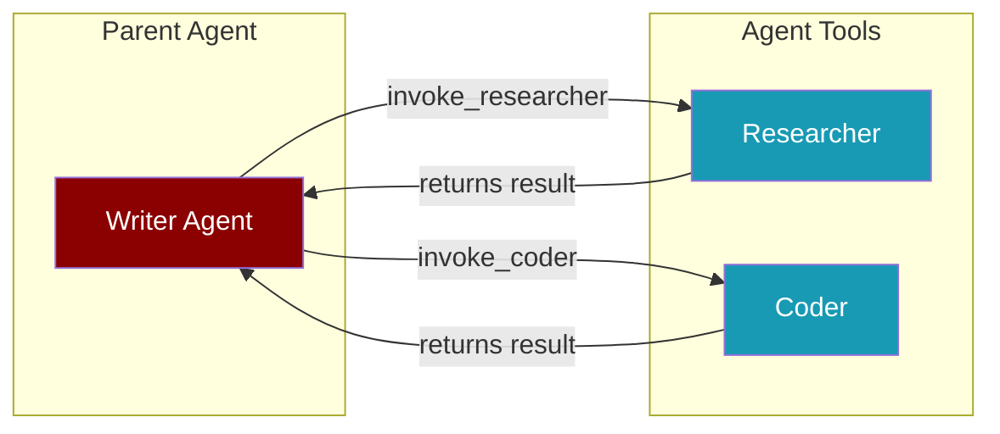
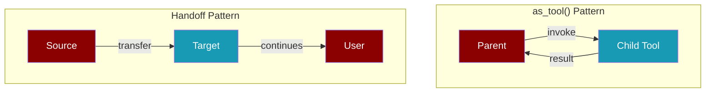

<Info>
**New in v2.x**: Convert any agent into a callable tool with `agent.as_tool()`.
</Info>

## Overview

The `as_tool()` method allows you to use one agent as a tool for another agent. This enables **hierarchical agent composition** where a parent agent can invoke specialist agents as subordinate tools.



## Quick Start

<CodeGroup>
```python Basic Usage
from praisonaiagents import Agent

# Create specialist agents
researcher = Agent(
    name="Researcher",
    instructions="Research topics thoroughly and return findings"
)

coder = Agent(
    name="Coder", 
    instructions="Write clean Python code"
)

# Parent agent uses specialists as tools
writer = Agent(
    name="Writer",
    instructions="Write technical articles using your tools",
    tools=[
        researcher.as_tool("Research a topic and return findings"),
        coder.as_tool("Write Python code for a given task"),
    ]
)

# Writer invokes researcher and coder as needed
result = writer.chat("Write an article about async Python patterns")
```

```python Custom Tool Names
from praisonaiagents import Agent

analyst = Agent(name="DataAnalyst", instructions="Analyze data")

# Custom tool name and description
tool = analyst.as_tool(
    description="Analyze dataset and return insights",
    tool_name="analyze_data"
)

coordinator = Agent(
    name="Coordinator",
    tools=[tool]
)
```
</CodeGroup>

## How It Works

<Steps>
<Step title="Create Specialist Agent">
Define an agent with specific expertise.
</Step>

<Step title="Convert to Tool">
Call `agent.as_tool(description)` to create a callable tool.
</Step>

<Step title="Add to Parent Agent">
Include the tool in another agent's `tools` list.
</Step>

<Step title="Automatic Invocation">
The parent agent's LLM decides when to invoke the specialist.
</Step>
</Steps>

## as_tool() vs Handoffs

<Tip>
**Key Difference**: With `as_tool()`, the parent agent **retains control** and receives results. With handoffs, control **transfers entirely** to the target agent.
</Tip>

| Feature | `as_tool()` | Handoffs |
|---------|-------------|----------|
| **Control** | Parent retains control | Control transfers to target |
| **Context** | No history passed (clean slate) | Context passed based on policy |
| **Use Case** | Hierarchical composition | Task delegation |
| **Return** | Result returned to parent | Target continues conversation |



## API Reference

### `Agent.as_tool()`

```python
def as_tool(
    self,
    description: Optional[str] = None,
    tool_name: Optional[str] = None,
) -> Handoff
```

<ParamField path="description" type="str" optional>
Tool description for the LLM. Describes what this agent does.
Default: `"Invoke {agent_name} to complete a subtask and return the result"`
</ParamField>

<ParamField path="tool_name" type="str" optional>
Custom tool name. Default: `invoke_{agent_name}` (snake_case)
</ParamField>

<ResponseField name="return" type="Handoff">
A Handoff configured with `ContextPolicy.NONE` (no history passed to child).
</ResponseField>

## Examples

<AccordionGroup>
<Accordion title="Research + Writing Pipeline">
```python
from praisonaiagents import Agent

# Specialist agents
researcher = Agent(
    name="Researcher",
    instructions="Search the web and compile research findings"
)

fact_checker = Agent(
    name="FactChecker", 
    instructions="Verify facts and cite sources"
)

# Writer uses both as tools
writer = Agent(
    name="Writer",
    instructions="""Write articles using your tools:
    - Use invoke_researcher for initial research
    - Use invoke_factchecker to verify claims""",
    tools=[
        researcher.as_tool("Research a topic"),
        fact_checker.as_tool("Verify facts and claims"),
    ]
)

result = writer.chat("Write about quantum computing breakthroughs in 2024")
```
</Accordion>

<Accordion title="Code Review Pipeline">
```python
from praisonaiagents import Agent

# Specialist agents
linter = Agent(
    name="Linter",
    instructions="Check code for style issues and bugs"
)

security_scanner = Agent(
    name="SecurityScanner",
    instructions="Scan code for security vulnerabilities"
)

# Reviewer orchestrates both
reviewer = Agent(
    name="CodeReviewer",
    instructions="Review code using your analysis tools",
    tools=[
        linter.as_tool("Lint code for issues"),
        security_scanner.as_tool("Scan for security vulnerabilities"),
    ]
)

code = """
def login(username, password):
    query = f"SELECT * FROM users WHERE name='{username}'"
    return db.execute(query)
"""

result = reviewer.chat(f"Review this code:\n{code}")
```
</Accordion>

<Accordion title="Multi-Step Analysis">
```python
from praisonaiagents import Agent

# Create a chain of specialists
data_fetcher = Agent(name="DataFetcher", instructions="Fetch data from APIs")
analyzer = Agent(name="Analyzer", instructions="Analyze data patterns")
visualizer = Agent(name="Visualizer", instructions="Create visualizations")

# Orchestrator uses all three
orchestrator = Agent(
    name="Orchestrator",
    instructions="Coordinate data analysis workflow",
    tools=[
        data_fetcher.as_tool("Fetch data from a source"),
        analyzer.as_tool("Analyze data and find patterns"),
        visualizer.as_tool("Create charts and visualizations"),
    ]
)

result = orchestrator.chat("Analyze sales trends for Q4 2024")
```
</Accordion>
</AccordionGroup>

## Best Practices

<CardGroup cols={2}>
<Card title="Clear Descriptions" icon="comment">
Provide clear tool descriptions so the LLM knows when to invoke each specialist.
</Card>

<Card title="Single Responsibility" icon="bullseye">
Each specialist agent should have one clear purpose.
</Card>

<Card title="Avoid Deep Nesting" icon="layer-group">
Keep hierarchies shallow (2-3 levels max) for clarity.
</Card>

<Card title="Test Individually" icon="flask">
Test each specialist agent independently before composing.
</Card>
</CardGroup>

## Related

- [Handoffs](/features/handoffs) - Transfer control between agents
- [Multi-Agent Workflows](/features/workflows) - Coordinate multiple agents
- [Tools](/concepts/tools) - Create custom tools
