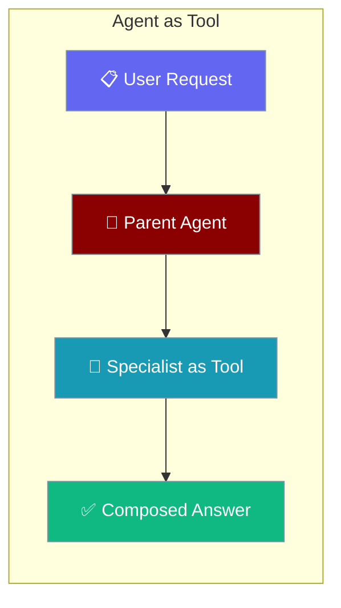
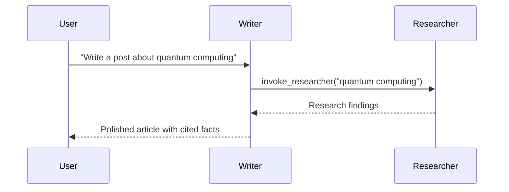
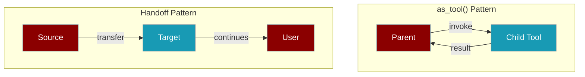

Agent as Tool turns any agent into a callable tool so a parent agent can invoke specialists and keep control of the result.

```python
from praisonaiagents import Agent

researcher = Agent(name="Researcher", instructions="Research topics thoroughly")
writer = Agent(
    name="Writer",
    instructions="Write polished copy using specialist tools",
    tools=[researcher.as_tool()],
)
writer.start("Write a short post about quantum computing with cited facts")
```

<Note>
`as_tool()` returns a `Handoff` object; passing it into `tools=[...]` (as the examples on this page do) works reliably as of PraisonAI PR [#4146](https://github.com/MervinPraison/PraisonAI/pull/4146). The parent agent's constructor converts every `Handoff` in `tools=` into a callable tool the LLM can see and `execute_tool` can dispatch. Before that fix the pattern silently produced an agent the model saw as having **no tools at all** — no error, only a subtly worse answer.
</Note>

The user asks for a polished article; the writer agent invokes the researcher as a tool and composes the answer.


```mermaid
graph LR
    subgraph "Agent as Tool"
        Req[📋 User Request] --> Parent[🤖 Parent Agent]
        Parent --> Tool[🔧 Specialist as Tool]
        Tool --> Result[✅ Composed Answer]
    end

    classDef input fill:#6366F1,stroke:#7C90A0,color:#fff
    classDef agent fill:#8B0000,stroke:#7C90A0,color:#fff
    classDef tool fill:#189AB4,stroke:#7C90A0,color:#fff
    classDef output fill:#10B981,stroke:#7C90A0,color:#fff

    class Req input
    class Parent agent
    class Tool tool
    class Result output
```

## Quick Start

<Steps>
<Step title="Simple Usage">
<CodeGroup>
```python Basic Usage
from praisonaiagents import Agent

# Create specialist agents
researcher = Agent(
    name="Researcher",
    instructions="Research topics thoroughly and return findings"
)

coder = Agent(
    name="Coder", 
    instructions="Write clean Python code"
)

# Parent agent uses specialists as tools
writer = Agent(
    name="Writer",
    instructions="Write technical articles using your tools",
    tools=[
        researcher.as_tool("Research a topic and return findings"),
        coder.as_tool("Write Python code for a given task"),
    ]
)

# Writer invokes researcher and coder as needed
result = writer.start("Write an article about async Python patterns")
```

```python Custom Tool Names
from praisonaiagents import Agent

analyst = Agent(name="DataAnalyst", instructions="Analyze data")

# Custom tool name and description
tool = analyst.as_tool(
    description="Analyze dataset and return insights",
    tool_name="analyze_data"
)

coordinator = Agent(
    name="Coordinator",
    tools=[tool]
)
```
</CodeGroup>
</Step>
<Step title="With Configuration">
Pass custom tool_name and description to as_tool() when the default labels are not clear enough for the parent LLM.
</Step>
</Steps>

## How It Works


```mermaid
sequenceDiagram
    participant User
    participant Writer
    participant Researcher

    User->>Writer: "Write a post about quantum computing"
    Writer->>Researcher: invoke_researcher("quantum computing")
    Researcher-->>Writer: Research findings
    Writer-->>User: Polished article with cited facts
```

| Step | What happens |
|---|---|
| 1. Request | User asks the parent agent for a result |
| 2. Invoke | Parent LLM decides to call the specialist as a tool |
| 3. Execute | Specialist agent runs with a clean context |
| 4. Return | Result is returned to the parent agent |
| 5. Respond | Parent composes the final response |

## as_tool() vs Handoffs

<Tip>
**Key Difference**: With `as_tool()`, the parent agent **retains control** and receives results. With handoffs, control **transfers entirely** to the target agent.
</Tip>

| Feature | `as_tool()` | Handoffs |
|---------|-------------|----------|
| **Control** | Parent retains control | Control transfers to target |
| **Context** | No history passed (clean slate) | Context passed based on policy |
| **Tool naming** | `invoke_{name}` | `transfer_to_{name}` |
| **Context policy** | `ContextPolicy.NONE` (clean slate) | Default policy (full context) |
| **Use Case** | Hierarchical composition | Task delegation |
| **Return** | Result returned to parent | Target continues conversation |

If you previously "worked around" the broken `as_tool()` by switching to `handoffs=`, note the workaround wasn't equivalent — `invoke_{name}` runs with `ContextPolicy.NONE` while `transfer_to_{name}` passes full context. Now that `as_tool()` works in `tools=[...]`, switch back if you want the clean-slate behaviour.


```mermaid
graph TB
    subgraph AsTool["as_tool() Pattern"]
        direction LR
        P1[Parent] -->|"invoke"| C1[Child Tool]
        C1 -->|"result"| P1
    end

    subgraph Handoff["Handoff Pattern"]
        direction LR
        P2[Source] -->|"transfer"| C2[Target]
        C2 -->|"continues"| U[User]
    end

    classDef agent fill:#8B0000,stroke:#7C90A0,color:#fff
    classDef tool fill:#189AB4,stroke:#7C90A0,color:#fff

    class P1,P2,U agent
    class C1,C2 tool
```

## API Reference

### `Agent.as_tool()`

```python
def as_tool(
    self,
    description: Optional[str] = None,
    tool_name: Optional[str] = None,
) -> Handoff
```

<ParamField path="description" type="str" optional>
Tool description for the LLM. Describes what this agent does.
Default: `"Invoke {agent_name} to complete a subtask and return the result"`
</ParamField>

<ParamField path="tool_name" type="str" optional>
Custom tool name. Default: `invoke_{agent_name}` (snake_case)
</ParamField>

<ResponseField name="return" type="Handoff">
A Handoff configured with `ContextPolicy.NONE` (no history passed to child).

The return type is `Handoff` (not a callable) because `to_tool_function()` needs the *parent* agent that will own this tool — and at `as_tool()` call time, that parent doesn't exist yet. Conversion happens automatically the moment you place the result inside a parent's `tools=[...]`.
</ResponseField>

## Examples

<AccordionGroup>
<Accordion title="Research + Writing Pipeline">
```python
from praisonaiagents import Agent

# Specialist agents
researcher = Agent(
    name="Researcher",
    instructions="Search the web and compile research findings"
)

fact_checker = Agent(
    name="FactChecker", 
    instructions="Verify facts and cite sources"
)

# Writer uses both as tools
writer = Agent(
    name="Writer",
    instructions="""Write articles using your tools:
    - Use invoke_researcher for initial research
    - Use invoke_factchecker to verify claims""",
    tools=[
        researcher.as_tool("Research a topic"),
        fact_checker.as_tool("Verify facts and claims"),
    ]
)

result = writer.start("Write about quantum computing breakthroughs in 2024")
```
</Accordion>

<Accordion title="Code Review Pipeline">
```python
from praisonaiagents import Agent

# Specialist agents
linter = Agent(
    name="Linter",
    instructions="Check code for style issues and bugs"
)

security_scanner = Agent(
    name="SecurityScanner",
    instructions="Scan code for security vulnerabilities"
)

# Reviewer orchestrates both
reviewer = Agent(
    name="CodeReviewer",
    instructions="Review code using your analysis tools",
    tools=[
        linter.as_tool("Lint code for issues"),
        security_scanner.as_tool("Scan for security vulnerabilities"),
    ]
)

code = """
def login(username, password):
    query = f"SELECT * FROM users WHERE name='{username}'"
    return db.execute(query)
"""

result = reviewer.start(f"Review this code:\n{code}")
```
</Accordion>

<Accordion title="Multi-Step Analysis">
```python
from praisonaiagents import Agent

# Create a chain of specialists
data_fetcher = Agent(name="DataFetcher", instructions="Fetch data from APIs")
analyzer = Agent(name="Analyzer", instructions="Analyze data patterns")
visualizer = Agent(name="Visualizer", instructions="Create visualizations")

# Orchestrator uses all three
orchestrator = Agent(
    name="Orchestrator",
    instructions="Coordinate data analysis workflow",
    tools=[
        data_fetcher.as_tool("Fetch data from a source"),
        analyzer.as_tool("Analyze data and find patterns"),
        visualizer.as_tool("Create charts and visualizations"),
    ]
)

result = orchestrator.start("Analyze sales trends for Q4 2024")
```
</Accordion>
</AccordionGroup>

## Best Practices

<AccordionGroup>
  <Accordion title="Clear Descriptions">
    Provide clear tool descriptions so the LLM knows when to invoke each specialist.
  </Accordion>
  <Accordion title="Single Responsibility">
    Each specialist agent should have one clear purpose.
  </Accordion>
  <Accordion title="Avoid Deep Nesting">
    Keep hierarchies shallow (2-3 levels max) for clarity.
  </Accordion>
  <Accordion title="Test Individually">
    Test each specialist agent independently before composing.
  </Accordion>
  <Accordion title="Cloning for channels rebinds handoffs">
    Each channel's clone rebinds the `as_tool()` handoff to itself, not the source agent. This means Discord and Telegram clones each get their own `invoke_researcher` bound to their own `chat_history` / `tools` / `memory` — no cross-channel leakage. You do not need to rebuild `tools=[...]` per channel; `clone_for_channel()` handles it.
  </Accordion>
</AccordionGroup>

## Troubleshooting

<Warning>
**Seeing `Tool  not recognized` in the logs and an empty tool schema?** You're on a PraisonAI version prior to PR [#4146](https://github.com/MervinPraison/PraisonAI/pull/4146). Upgrade to the fixed version, or as a temporary workaround move the entries from `tools=` to `handoffs=` (note the different naming and context policy — see the comparison table above).
</Warning>

## Related

<CardGroup cols={2}>
  <Card title="Handoffs" icon="arrow-right-arrow-left" href="/features/handoffs">
    Transfer control between agents
  </Card>
  <Card title="Multi-Agent Workflows" icon="diagram-project" href="/features/workflows">
    Coordinate multiple agents
  </Card>
  <Card title="Toolsets" icon="toolbox" href="/features/toolsets">
    Create custom tools
  </Card>
</CardGroup>
