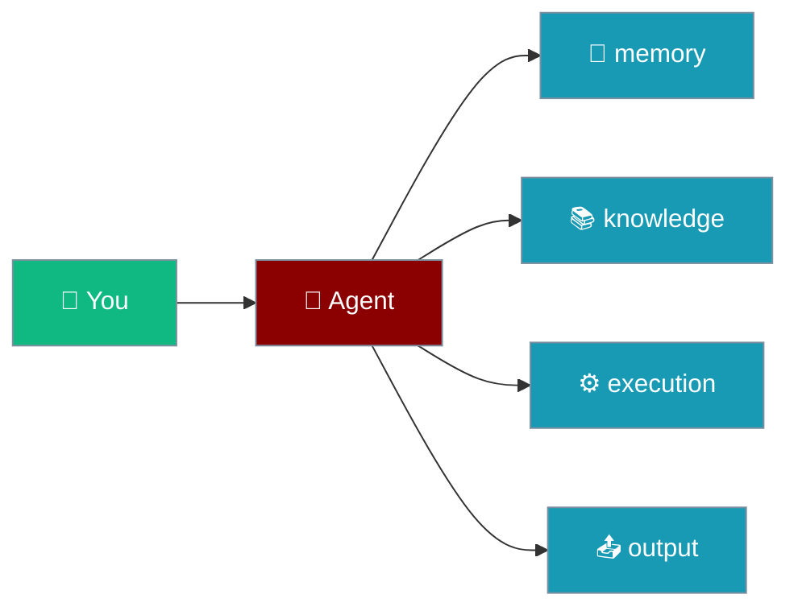

```python
from praisonaiagents import Agent, MemoryConfig, ExecutionConfig

agent = Agent(
    name="configured",
    instructions="Follow the consolidated config.",
    memory=True,
    execution=ExecutionConfig(code_execution=False),
)
agent.start("Explain how your features are configured.")
```

Configure every agent feature through one `Agent(...)` constructor — `False` disables, `True` uses safe defaults, and config objects give full control.

The user configures memory, execution, and output in one `Agent(...)` call; the agent runs with those settings on the next prompt.



Each feature follows a consistent pattern:

- **`False`** - Disabled (zero overhead)
- **`True`** - Enabled with safe defaults
- **`Config`** - Custom configuration object
- **`Instance`** - Power user: pass your own manager/engine

## Quick Start

<Steps>
<Step title="Minimal agent">

```python
from praisonaiagents import Agent

agent = Agent(instructions="You are a helpful assistant")
agent.start("Hello!")
```

</Step>
<Step title="With feature configs">

```python
from praisonaiagents import Agent, MemoryConfig, OutputConfig, ExecutionConfig

agent = Agent(
    instructions="You are a helpful assistant",
    memory=MemoryConfig(use_long_term=True),
    output=OutputConfig(verbose=True),
    execution=ExecutionConfig(code_execution=True),
)
agent.start("Summarise this document")
```

</Step>
</Steps>

## Feature Parameters

### Output Configuration

Controls verbosity, formatting, and display behavior.

```python
# Preset (string)
agent = Agent(instructions="...", output="verbose")

# Custom config
agent = Agent(
    instructions="...",
    output=OutputConfig(
        
        
        stream=False,
        metrics=True,
        reasoning_steps=True,
    ),
)
```

**Presets:**
- `"minimal"` - Quiet mode, no formatting
- `"normal"` - Default behavior
- `"verbose"` - Show metrics and reasoning
- `"debug"` - Maximum verbosity
- `"silent"` - No console output

### Execution Configuration

Controls iteration limits, rate limiting, and timeouts.

```python
# Preset (string)
agent = Agent(instructions="...", execution="thorough")

# Custom config
agent = Agent(
    instructions="...",
    execution=ExecutionConfig(
        max_iter=50,
        max_rpm=100,
        max_execution_time=300,
        max_retry_limit=5,
    ),
)

# Preferred modern form — max_steps is the unified budget honoured by both loops
agent = Agent(
    instructions="...",
    execution=ExecutionConfig(max_steps=50),
)
```

`max_steps` is the unified outer-loop step budget honoured identically by both execution loops. Detect truncation with `agent.last_stop_reason == "max_steps"`. See [Step Budget](/docs/features/max-steps).

**Presets:**
- `"fast"` - 10 iterations, 1 retry
- `"balanced"` - 20 iterations, 2 retries (default)
- `"thorough"` - 50 iterations, 5 retries
- `"unlimited"` - 1000 iterations, 10 retries

### Memory Configuration

Enables persistent memory across conversations.

```python
# Simple enable
agent = Agent(instructions="...", memory=True)

# Custom config
agent = Agent(
    instructions="...",
    memory=MemoryConfig(
        backend="file",
        user_id="user123",
        session_id="session456",
    ),
)
```

### Knowledge Configuration

Enables RAG (Retrieval-Augmented Generation) with documents.

```python
# List of sources
agent = Agent(
    instructions="...",
    knowledge=["docs/", "data.pdf"],
)

# Custom config
agent = Agent(
    instructions="...",
    knowledge=KnowledgeConfig(
        sources=["docs/"],
        embedder="openai",
        retrieval_k=5,
    ),
)
```

### Planning Configuration

Enables multi-step planning before execution.

```python
# Simple enable
agent = Agent(instructions="...", planning=True)

# Custom config
agent = Agent(
    instructions="...",
    planning=PlanningConfig(
        reasoning=True,
        tools=["search", "calculate"],
        read_only=False,
    ),
)
```

### Reflection Configuration

Enables self-reflection for improved responses.

```python
# Simple enable
agent = Agent(instructions="...", reflection=True)

# Custom config
agent = Agent(
    instructions="...",
    reflection=ReflectionConfig(
        min_iterations=1,
        max_iterations=3,
    ),
)
```

### Guardrails Configuration

Enables output validation and safety checks.

```python
# String preset (simplest)
agent = Agent(instructions="...", guardrails="strict")

# Available presets: "strict", "permissive", "safety"

# Preset with overrides
agent = Agent(instructions="...", guardrails=["strict", {"max_retries": 10}])

# Policy strings
agent = Agent(instructions="...", guardrails=["policy:strict", "pii:redact"])

# LLM validator prompt (long string)
agent = Agent(
    instructions="...",
    guardrails="Ensure response is helpful and does not contain harmful content."
)

# Validator function
def validate(output):
    if len(str(output.raw)) < 10:
        return False, "Too short"
    return True, output

agent = Agent(instructions="...", guardrails=validate)

# Full config
agent = Agent(
    instructions="...",
    guardrails=GuardrailConfig(
        validator=validate,
        max_retries=3,
        on_fail="retry",
        policies=["policy:strict", "pii:redact"],
    ),
)
```

### Web Configuration

Enables web search and fetch capabilities.

```python
# Simple enable
agent = Agent(instructions="...", web=True)

# Custom config
agent = Agent(
    instructions="...",
    web=WebConfig(
        search=True,
        fetch=True,
        search_provider="duckduckgo",
        max_results=5,
    ),
)
```

### Context Configuration

Enables unified context management.

```python
# Simple enable
agent = Agent(instructions="...", context=True)

# Custom config (using ManagerConfig)
from praisonaiagents import ManagerConfig

agent = Agent(
    instructions="...",
    context=ManagerConfig(
        max_tokens=8000,
        strategy="sliding_window",
    ),
)
```

### Autonomy Configuration

Controls agent autonomy, escalation, and doom-loop detection.

```python
# Simple enable
agent = Agent(instructions="...", autonomy=True)

# Custom config
agent = Agent(
    instructions="...",
    autonomy=AutonomyConfig(
        level="auto_edit",
        escalation_enabled=True,
        doom_loop_detection=True,
        max_consecutive_failures=3,
    ),
)
```

### Templates Configuration

Custom prompt templates.

```python
agent = Agent(
    instructions="...",
    templates=TemplateConfig(
        system="You are a professional assistant.",
        use_system_prompt=True,
    ),
)
```

### Caching Configuration

Controls response and prompt caching.

```python
# Simple enable/disable
agent = Agent(instructions="...", caching=True)

# Custom config
agent = Agent(
    instructions="...",
    caching=CachingConfig(
        enabled=True,
        caching=True,
    ),
)
```

### Hooks Configuration

Middleware and callbacks.

```python
def my_callback(step):
    print(f"Step: {step}")

agent = Agent(
    instructions="...",
    hooks=HooksConfig(
        on_step=my_callback,
        middleware=[my_middleware],
    ),
)
```

### Skills Configuration

Agent skills integration.

```python
# List of skill paths
agent = Agent(
    instructions="...",
    skills=["./my-skill", "code-review"],
)

# Custom config
agent = Agent(
    instructions="...",
    skills=SkillsConfig(
        paths=["./my-skill"],
        dirs=["~/.praisonai/skills/"],
        auto_discover=True,
    ),
)
```

## Backward Compatibility

All legacy flat parameters are still supported:

```python
# These still work
agent = Agent(
    instructions="...",
    
    max_iter=30,
    cache=True,
)
```

However, consolidated params take precedence when both are provided:

```python
# output="verbose" overrides output="silent"
agent = Agent(
    instructions="...",
    output="verbose",
    output="silent",  # Ignored
)
```

## Zero Overhead Design

All features use lazy initialization:

- **No imports** until feature is accessed
- **No memory** allocated for disabled features
- **No runtime cost** when `feature=False`

```python
# Zero overhead - knowledge module never imported
agent = Agent(instructions="...", knowledge=False)

# Knowledge only loaded when first accessed
agent = Agent(instructions="...", knowledge=["docs/"])
result = agent.chat("Search the docs")  # Now it loads
```

---

## Best Practices

<AccordionGroup>
  <Accordion title="Prefer config objects over legacy flat params">
    Use `execution=ExecutionConfig(...)` instead of deprecated standalone flags — consolidated params win when both are set.
  </Accordion>
  <Accordion title="Leave features disabled until needed">
    `memory=False`, `knowledge=False`, etc. add zero import cost; enable only what the agent actually uses.
  </Accordion>
  <Accordion title="Start with True, then tune">
    Enable a feature with `True`, observe behaviour, then swap in a config object for production limits.
  </Accordion>
  <Accordion title="Import configs from the package root">
    `from praisonaiagents import MemoryConfig, OutputConfig` keeps examples copy-paste friendly for non-developers.
  </Accordion>
</AccordionGroup>

---

## Related

<CardGroup cols={2}>
  <Card icon="book" href="/docs/configuration/agent-config" title="Agent Config">
    Full reference for consolidated configuration objects.
  </Card>
  <Card icon="brain" href="/features/memory" title="Memory">
    Short- and long-term memory wired through `memory=MemoryConfig(...)`.
  </Card>
</CardGroup>
