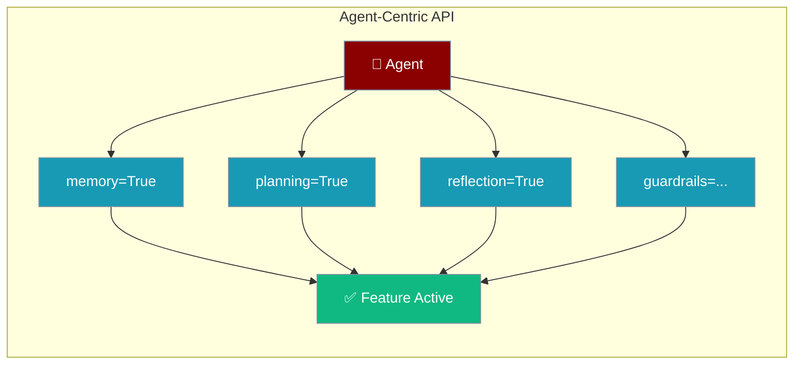
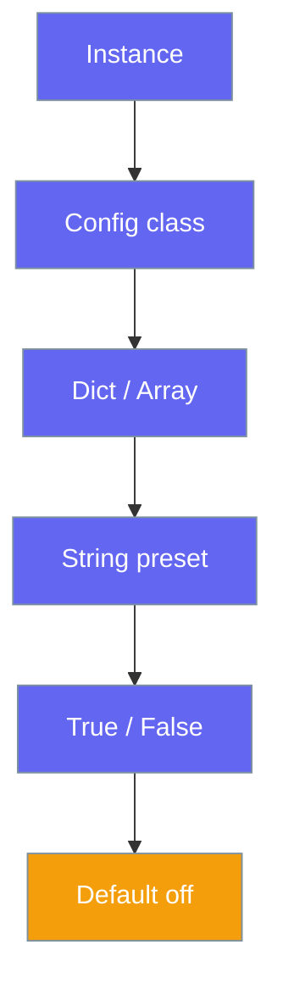

PraisonAI uses a single `Agent` class with a clean API — set any feature to `True`, a string preset, or a config object.



## Quick Start

<Steps>
<Step title="Enable a feature with True">
```python
from praisonaiagents import Agent

agent = Agent(
    instructions="You are a helpful assistant",
    memory=True,
    planning=True
)

agent.start("Research AI trends and remember what you find")
```
</Step>

<Step title="Use a config object for fine control">
```python
from praisonaiagents import Agent, MemoryConfig, PlanningConfig

agent = Agent(
    instructions="You are a helpful assistant",
    memory=MemoryConfig(backend="file", user_id="user123"),
    planning=PlanningConfig(reasoning=True)
)
```
</Step>
</Steps>

---

## How It Works

Every feature follows this precedence ladder:



---

## Feature Parameters

### Memory

Enables persistent memory across conversations.

```python
agent = Agent(instructions="...", memory=True)

agent = Agent(
    instructions="...",
    memory=MemoryConfig(
        backend="file",
        user_id="user123",
        session_id="session456",
    ),
)
```

### Planning

Enables multi-step planning before execution.

```python
agent = Agent(instructions="...", planning=True)

agent = Agent(
    instructions="...",
    planning=PlanningConfig(
        reasoning=True,
        tools=["search", "calculate"],
    ),
)
```

### Reflection

Enables self-reflection for improved responses.

```python
agent = Agent(instructions="...", reflection=True)

agent = Agent(
    instructions="...",
    reflection=ReflectionConfig(
        min_iterations=1,
        max_iterations=3,
    ),
)
```

### Guardrails

Validates output with safety checks.

```python
agent = Agent(instructions="...", guardrails="strict")

def validate(output):
    if len(str(output.raw)) < 10:
        return False, "Too short"
    return True, output

agent = Agent(instructions="...", guardrails=validate)
```

### Output

Controls verbosity and display behavior.

```python
agent = Agent(instructions="...", output="verbose")

agent = Agent(
    instructions="...",
    output=OutputConfig(
        stream=False,
        metrics=True,
        reasoning_steps=True,
    ),
)
```

**Presets:** `"minimal"`, `"normal"`, `"verbose"`, `"debug"`, `"silent"`

### Execution

Controls iteration limits and timeouts.

```python
agent = Agent(instructions="...", execution="thorough")

agent = Agent(
    instructions="...",
    execution=ExecutionConfig(
        max_iter=50,
        max_rpm=100,
        max_execution_time=300,
        max_retry_limit=5,
    ),
)
```

**Presets:** `"fast"`, `"balanced"`, `"thorough"`, `"unlimited"`

### Knowledge

Enables RAG with documents.

```python
agent = Agent(instructions="...", knowledge=["docs/", "data.pdf"])

agent = Agent(
    instructions="...",
    knowledge=KnowledgeConfig(
        sources=["docs/"],
        embedder="openai",
        retrieval_k=5,
    ),
)
```

### Web

Enables web search and fetch.

```python
agent = Agent(instructions="...", web=True)

agent = Agent(
    instructions="...",
    web=WebConfig(
        search=True,
        fetch=True,
        search_provider="duckduckgo",
        max_results=5,
    ),
)
```

### Autonomy

Controls agent autonomy and escalation.

```python
agent = Agent(instructions="...", autonomy=True)

agent = Agent(
    instructions="...",
    autonomy=AutonomyConfig(
        level="auto_edit",
        escalation_enabled=True,
        doom_loop_detection=True,
        max_consecutive_failures=3,
    ),
)
```

### Caching

Controls response caching.

```python
agent = Agent(instructions="...", caching=True)
```

### Skills

Agent skill integration.

```python
agent = Agent(instructions="...", skills=["./my-skill", "code-review"])

agent = Agent(
    instructions="...",
    skills=SkillsConfig(
        paths=["./my-skill"],
        auto_discover=True,
    ),
)
```

---

## Common Patterns

### Research Agent with Memory and Web

```python
from praisonaiagents import Agent

agent = Agent(
    instructions="You are a research assistant",
    memory=True,
    web=True,
    planning=True
)

agent.start("Research quantum computing trends and summarize key developments")
```

### Safe Code Agent with Guardrails

```python
from praisonaiagents import Agent

def check_safe(output):
    raw = str(output.raw)
    if "rm -rf" in raw:
        return False, "Unsafe command detected"
    return True, output

agent = Agent(
    instructions="You are a code assistant",
    guardrails=check_safe,
    execution="thorough"
)
```

### Zero Overhead Design

Features use lazy initialization — disabled features have no cost.

```python
agent = Agent(instructions="...", knowledge=False)
agent = Agent(instructions="...", knowledge=["docs/"])
```

---

## Best Practices

<AccordionGroup>
<Accordion title="Start with True, switch to config when needed">
Use `feature=True` for quick start. Only switch to a config class when you need to adjust specific parameters.

```python
agent = Agent(instructions="...", memory=True)
agent = Agent(instructions="...", memory=MemoryConfig(backend="redis"))
```
</Accordion>

<Accordion title="Combine features for powerful agents">
Features compose cleanly — combine memory, planning, and web for a capable research agent.

```python
agent = Agent(
    instructions="...",
    memory=True,
    planning=True,
    web=True,
)
```
</Accordion>

<Accordion title="Use string presets for common scenarios">
Presets like `execution="thorough"` set multiple parameters at once — less boilerplate.
</Accordion>

<Accordion title="Disabled features have zero overhead">
Setting a feature to `False` prevents all imports and memory allocation — safe for production.
</Accordion>
</AccordionGroup>

---

## Related

<CardGroup cols={2}>
<Card title="Memory" icon="brain" href="/features/memory">
  Persistent memory across agent conversations
</Card>
<Card title="Planning" icon="list-check" href="/features/planning">
  Multi-step planning before execution
</Card>
</CardGroup>
