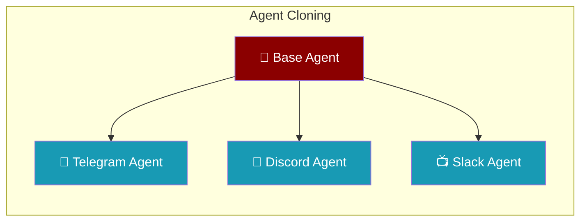
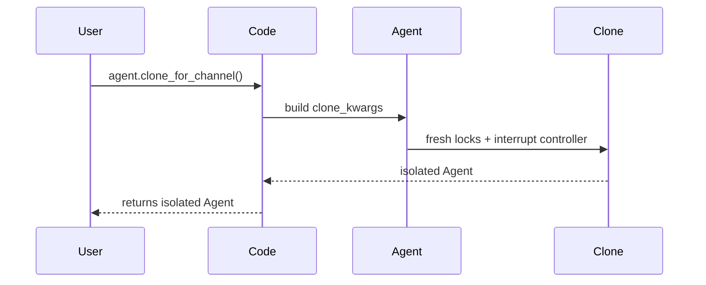

Clone agents to give each channel, tenant, or session its own isolated instance — without losing config or hitting `RLock` pickling errors.

The user deploys one base agent to several channels; each clone keeps the same instructions with isolated session state.



## Quick Start

<Steps>
<Step title="Single clone">
```python
from praisonaiagents import Agent

base = Agent(
    name="Support",
    instructions="You are a helpful support agent",
    llm="gpt-4o-mini",
)

# Get an isolated copy for one channel
telegram_agent = base.clone_for_channel()
```
</Step>

<Step title="Multiple clones for multi-channel deployment">
```python
from praisonaiagents import Agent

base = Agent(
    name="Support",
    instructions="You are a helpful support agent",
    llm="gpt-4o-mini",
    tools=["internet_search"],
    memory=True,
)

# Create isolated agents for each channel
telegram_agent = base.clone_for_channel()
discord_agent  = base.clone_for_channel()
slack_agent    = base.clone_for_channel()
```
</Step>
</Steps>

---

## How It Works



Agent cloning creates a fresh instance with the same configuration but isolated state.

---

## What gets cloned vs. what's reset

| Attribute | Behaviour in clone |
|---|---|
| `name`, `role`, `goal`, `backstory`, `instructions` | Copied as-is |
| `llm`, `base_url`, `api_key`, `auth` | Copied as-is |
| `tools` | Shallow-copied (`list(self.tools)`) |
| `handoffs` | Reset to `None` (channels should not share handoffs) |
| All feature configs: `memory`, `knowledge`, `planning`, `reflection`, `guardrails`, `web`, `context`, `autonomy`, `output`, `execution`, `templates`, `caching`, `hooks`, `skills`, `approval`, `learn`, `sandbox` | Forwarded from the stored `_<name>_config` attributes |
| `tool_config` (which holds `timeout`, `retry_policy`, `parallel`), `runtime` / `_runtime_config` | Forwarded |
| `cli_backend` | Forwarded (**deprecated** — use `runtime` instead) |
| `interrupt_controller` | **Fresh instance** (no cross-channel interference) |
| `__cache_lock` (`threading.RLock`) | **Fresh instance** |
| `_cost_lock` (`threading.Lock`) | **Fresh instance** |

---

## Common Patterns

### Per-channel clone in a custom gateway

```python
from praisonaiagents import Agent

def create_channel_agents(base_config):
    base = Agent(**base_config)
    
    return {
        'telegram': base.clone_for_channel(),
        'discord': base.clone_for_channel(),
        'slack': base.clone_for_channel()
    }

agents = create_channel_agents({
    'name': 'Support',
    'instructions': 'You are a helpful support agent',
    'llm': 'gpt-4o-mini'
})
```

### Per-tenant clone in a multi-tenant API

```python
from praisonaiagents import Agent

class TenantAgentManager:
    def __init__(self, base_agent):
        self.base = base_agent
        self.tenant_agents = {}
    
    def get_agent_for_tenant(self, tenant_id):
        if tenant_id not in self.tenant_agents:
            self.tenant_agents[tenant_id] = self.base.clone_for_channel()
        return self.tenant_agents[tenant_id]

base = Agent(name="Assistant", instructions="You are helpful")
manager = TenantAgentManager(base)

# Each tenant gets isolated agent
agent_a = manager.get_agent_for_tenant("tenant_a")
agent_b = manager.get_agent_for_tenant("tenant_b")
```

### Use with copy.deepcopy

```python
import copy
from praisonaiagents import Agent

agent = Agent(name="Test", instructions="You are a test agent")

# Both methods work - agent supports deepcopy now
clone1 = agent.clone_for_channel()  # Preferred for channels
clone2 = copy.deepcopy(agent)       # General Python compatibility
```

---

## Best Practices

<AccordionGroup>
<Accordion title="Prefer clone_for_channel() over copy.deepcopy() for channels">
`clone_for_channel()` is the supported path for creating channel-safe clones. It's optimized for multi-channel scenarios and properly handles handoffs. `__deepcopy__` is provided for general Python compatibility but isn't specifically designed for channel isolation.
</Accordion>

<Accordion title="Don't share handoffs across channels">
Clone drops `handoffs` by design. Each channel should have independent routing logic. If you need cross-channel handoffs, implement them at the gateway level rather than the agent level.
</Accordion>

<Accordion title="Tools are shallow-copied">
If a tool holds mutable per-channel state, wrap it in a factory function or use instance-based tools. The clone shares tool instances with the original agent, which is usually fine for stateless tools.
</Accordion>
</AccordionGroup>

---

## Related

<CardGroup cols={2}>
<Card title="Bot Gateway" icon="server" href="/docs/features/bot-gateway">
  Multi-channel gateway using agent cloning
</Card>
<Card title="Thread Safety" icon="shield" href="/docs/features/thread-safety">
  Agent thread safety and concurrency
</Card>
</CardGroup>