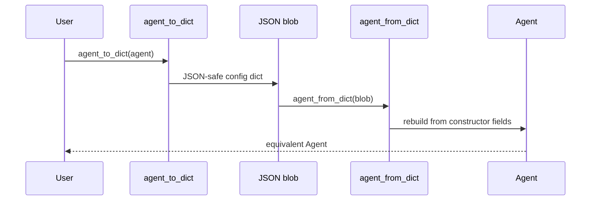

Export any Agent or team to a JSON-safe config dict, and rebuild an equivalent one on the other end.

```python
from praisonaiagents import Agent
from praisonaiagents.agent.serialize import agent_to_dict, agent_from_dict

agent = Agent(name="Researcher", role="Analyst", instructions="be thorough", llm="gpt-4o")
blob = agent_to_dict(agent)
same = agent_from_dict(blob)
# same.name == "Researcher", same.role == "Analyst", same.llm == "gpt-4o"
```

<Note>
**Reference:** [PraisonAI PR #4985](https://github.com/MervinPraison/PraisonAI/pull/4985) — introduces `agent_to_dict` / `agent_from_dict` / `team_to_dict` and defines `AGENT_CONFIG_VERSION = 1`.
</Note>


## Quick Start

<Steps>
<Step title="Round-trip a tool-less agent">
```python
from praisonaiagents import Agent
from praisonaiagents.agent.serialize import agent_to_dict, agent_from_dict

agent = Agent(name="Researcher", role="Analyst", instructions="be thorough", llm="gpt-4o")
blob = agent_to_dict(agent)
same = agent_from_dict(blob)
```
</Step>

<Step title="Round-trip with tools">
```python
from praisonaiagents import Agent
from praisonaiagents.agent.serialize import agent_to_dict, agent_from_dict

def search(q: str) -> str:
    """Search the web."""
    return "..."

agent = Agent(name="R", instructions="x", llm="gpt-4o", tools=[search])
blob = agent_to_dict(agent)
# blob["tools"] == ["search"], blob["tools_resolvable"] is True

rebuilt = agent_from_dict(blob, tool_registry={"search": search})
```
</Step>
</Steps>

---

## How It Works

A tool exports by name because a callable cannot survive JSON, so import re-binds those names through a `tool_registry`.



---

## What gets exported vs. reset

The exporter derives its field set from the live `Agent.__init__` signature, so an attribute that moved into a grouped config never leaks into a config that cannot be imported.

| Field | Behaviour |
|---|---|
| `name`, `role`, `goal`, `backstory`, `instructions` | Exported when set |
| `llm` | Exported as the model string (client is dropped) |
| `reasoning_effort`, `reasoning_steps` | Exported when set |
| `self_reflect`, `max_reflect`, `min_reflect` | Exported when set |
| `respect_context_window`, `max_iter` | Exported when set |
| `markdown`, `stream`, `verbose` | Exported when set |
| `version` | Always `AGENT_CONFIG_VERSION` (`1`) |
| `tools` | Exported as a list of tool **names** |
| `tools_resolvable` | `True` if every tool exported as a name, else `False` |
| `chat_history`, `_session`, `memory`, `knowledge` | **Not exported** (runtime state) |
| Resolved LLM client, caches | **Not exported** (runtime state) |
| Grouped configs (`output=`, `reflection=`, `execution=`, `caching=`, `hooks=`, `skills=`, `planning=`, `web=`, `context=`, `autonomy=`, `templates=`, `learn=`, `sandbox=`, `knowledge=`, `guardrails=`, `approval=`) | **Not exported in v1** (see limits below) |

---

## The `tools_resolvable` flag

Tools export by name because a callable cannot survive JSON, and the flag reports whether every name could be captured.

`tools_resolvable` is `False` when a tool has no usable `name`/`__name__` — that config cannot round-trip cleanly, and refusing is safer than silently dropping the tool.

```python
blob = agent_to_dict(agent)
if not blob["tools_resolvable"]:
    raise ValueError("this config can't round-trip its tools")
```

---

## Refusals (fail-loud)

Import refuses loudly rather than rebuilding a subtly-wrong agent.

| Refused | Otherwise… |
|---|---|
| Config declares `tools` but no `tool_registry` passed | It would rebuild a tool-less agent that looks like it *chose* not to act |
| `tool_registry` missing a declared tool by name | It would silently drop that tool |
| `version` in config ≠ `AGENT_CONFIG_VERSION` | It would half-import into an incompatible build |
| `config` isn't a dict, or is `None` | Wrong input type |

```python
from praisonaiagents.agent.serialize import agent_from_dict, SerializationError

try:
    agent_from_dict(blob)  # no tool_registry
except SerializationError as e:
    print(e)  # "This config declares tools ['search'] but no tool_registry was given, …"
```

---

## Common Patterns

### Diff two team configs

```python
import json, difflib
from praisonaiagents import Agent
from praisonaiagents.agent.serialize import agent_to_dict

a = agent_to_dict(Agent(name="R", instructions="research", llm="gpt-4o"))
b = agent_to_dict(Agent(name="R", instructions="research deeply", llm="gpt-4o"))

diff = difflib.unified_diff(
    json.dumps(a, sort_keys=True, indent=2).splitlines(),
    json.dumps(b, sort_keys=True, indent=2).splitlines(),
)
print("\n".join(diff))
```

### Persist a team to a file, reload it

```python
import json
from praisonaiagents import Agent
from praisonaiagents.agent.serialize import agent_to_dict, agent_from_dict

agent = Agent(name="R", instructions="x", llm="gpt-4o")
with open("agent.json", "w") as f:
    json.dump(agent_to_dict(agent), f, indent=2)

with open("agent.json") as f:
    rebuilt = agent_from_dict(json.load(f))
```

### Hand a Python-built team to the visual builder

```python
import json
from praisonaiagents import Agent, PraisonAIAgents
from praisonaiagents.agent.serialize import team_to_dict

team = PraisonAIAgents(
    agents=[
        Agent(name="Researcher", instructions="research", llm="gpt-4o"),
        Agent(name="Writer",     instructions="write",    llm="gpt-4o"),
    ],
    process="sequential",
)
config_blob = json.dumps(team_to_dict(team), indent=2)  # feed to the builder
```

---

## When to use `team_to_dict` vs. `agent_to_dict`

`team_to_dict` dumps every member's config in one call, so reach for it whenever more than one agent is involved.

```python
from praisonaiagents import Agent, PraisonAIAgents
from praisonaiagents.agent.serialize import team_to_dict

team = PraisonAIAgents(
    agents=[
        Agent(name="Researcher", instructions="research", llm="gpt-4o"),
        Agent(name="Writer",     instructions="write",    llm="gpt-4o"),
    ],
    process="sequential",
)
blob = team_to_dict(team)
# blob == {"version": 1, "name": ..., "process": "sequential",
#          "agents": [ {...}, {...} ], "tasks_included": False}
```

A `tasks_included: False` value is the caller's signal that the team had tasks whose graph did not come across.

---

## Known limits (v1)

<Warning>
Grouped feature configs (`output=`, `reflection=`, `execution=`, `caching=`, `hooks=`, `skills=`, `planning=`, `web=`, `context=`, `autonomy=`, `templates=`, `learn=`, `sandbox=`, `knowledge=`, `guardrails=`, `approval=`) are **not yet serialised**. An agent relying on a customised grouped config round-trips to one carrying that config's *defaults*, not the original. The team **task graph** is also not serialised — `tasks_included: False` reports when tasks were dropped.
</Warning>

---

## Best Practices

<AccordionGroup>
<Accordion title="Always pass tool_registry= when the config declares tools">
Import refuses a tools-declaring config without a `tool_registry`. That fail-loud path is a feature — it stops you rebuilding a tool-less agent that looks like it chose not to act. Pass `tool_registry={name: callable}` with every declared tool.
</Accordion>

<Accordion title="Check tools_resolvable before persisting">
A config with `tools_resolvable=False` cannot round-trip its tools. Check the flag right after `agent_to_dict` and fix the tool's name before saving the blob.
</Accordion>

<Accordion title="Don't hand-edit the version field">
Round-trip only works when `version` matches `AGENT_CONFIG_VERSION`. Leave it alone — it bumps only when the schema changes, and a mismatch refuses on import by design.
</Accordion>

<Accordion title="Use team_to_dict for members, keep task orchestration in code (v1)">
`team_to_dict` exports every member, but the task graph is not serialised in v1. Keep task wiring in Python until task-graph serialisation lands; `tasks_included: False` tells you when tasks were dropped.
</Accordion>
</AccordionGroup>

---

## Related

<CardGroup cols={2}>
<Card title="Agent Cloning" icon="copy" href="/features/agent-cloning">
  Produce a second agent from a first, with isolated state
</Card>
<Card title="YAML Configuration Reference" icon="file-code" href="/features/yaml-configuration-reference">
  The reverse direction — config file to agent
</Card>
</CardGroup>
